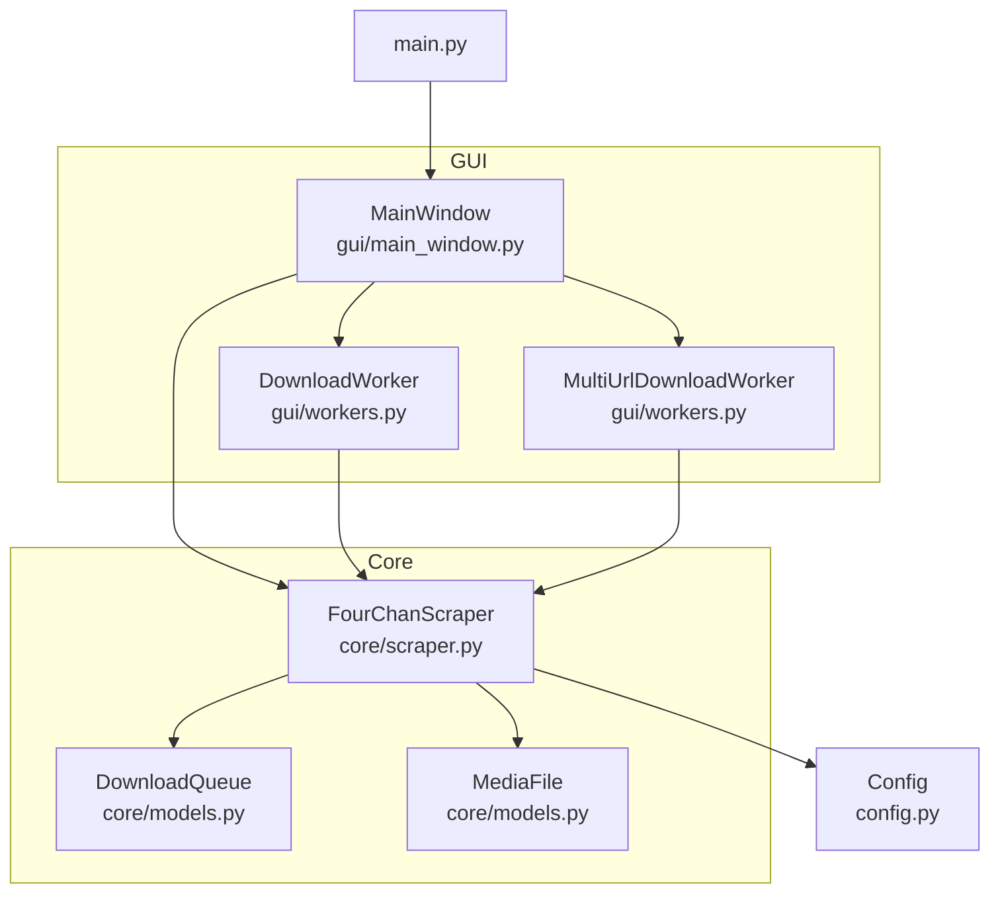
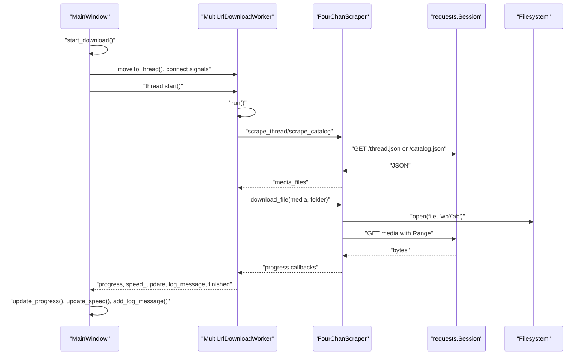
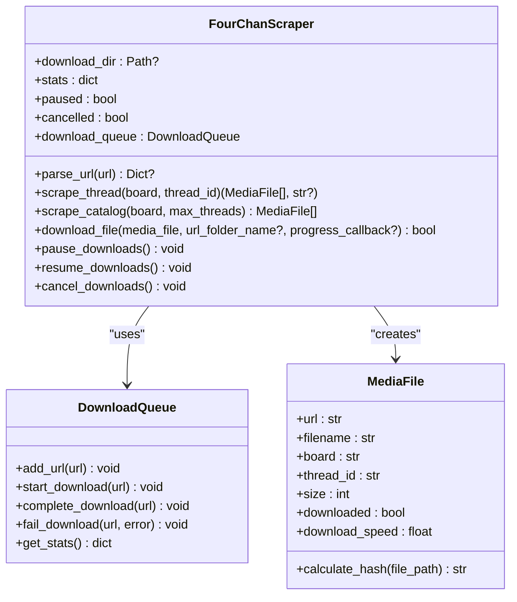
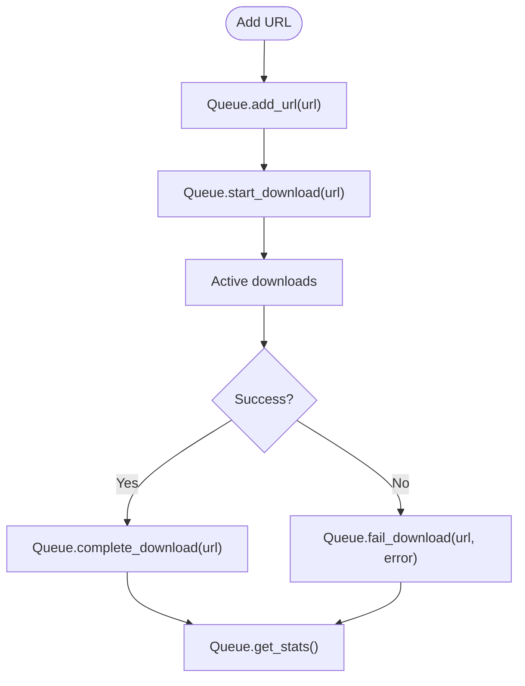
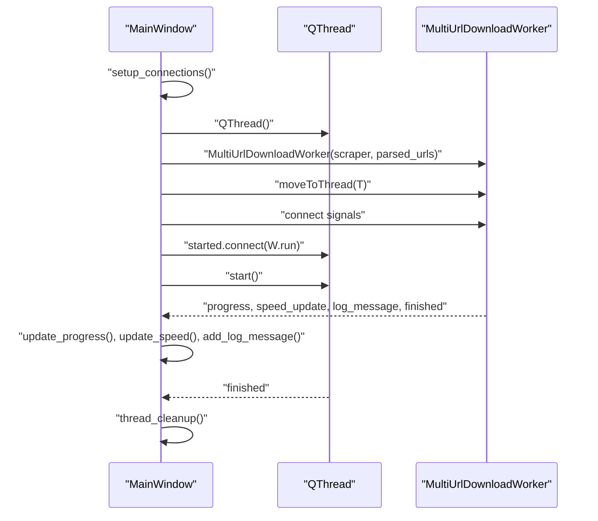
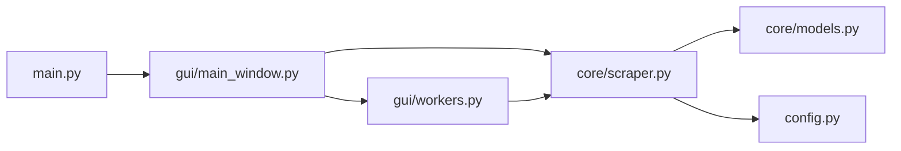

# API Reference

<cite>
**Referenced Files in This Document**
- [main.py](file://4Charm/src/four_charm/main.py)
- [config.py](file://4Charm/src/four_charm/config.py)
- [scraper.py](file://4Charm/src/four_charm/core/scraper.py)
- [models.py](file://4Charm/src/four_charm/core/models.py)
- [main_window.py](file://4Charm/src/four_charm/gui/main_window.py)
- [workers.py](file://4Charm/src/four_charm/gui/workers.py)
- [pyproject.toml](file://4Charm/pyproject.toml)
</cite>

## Table of Contents
1. [Introduction](#introduction)
2. [Project Structure](#project-structure)
3. [Core Components](#core-components)
4. [Architecture Overview](#architecture-overview)
5. [Detailed Component Analysis](#detailed-component-analysis)
6. [Dependency Analysis](#dependency-analysis)
7. [Performance Considerations](#performance-considerations)
8. [Troubleshooting Guide](#troubleshooting-guide)
9. [Conclusion](#conclusion)
10. [Appendices](#appendices)

## Introduction
This API reference documents the public interfaces of 4Charm’s core components for programmatic usage. It covers:
- FourChanScraper: public methods, parameters, return values, exceptions, and usage patterns
- DownloadQueue and MediaFile: properties, methods, and lifecycle events
- Config: configuration properties and defaults
- MainWindow: public API including signals, slots, and interaction methods
- Worker classes: threading interface and progress reporting
- Versioning, deprecation, backwards compatibility, and client extension guidelines
- Performance and error handling strategies

## Project Structure
The application is organized into:
- core: scraping engine and data models
- gui: Qt-based UI and worker threads
- utils: logging setup
- config: global configuration constants
- main entry point for the desktop app

**Diagram sources**
- [main.py](file://4Charm/src/four_charm/main.py#L1-L55)
- [main_window.py](file://4Charm/src/four_charm/gui/main_window.py#L1-L120)
- [workers.py](file://4Charm/src/four_charm/gui/workers.py#L1-L120)
- [scraper.py](file://4Charm/src/four_charm/core/scraper.py#L1-L120)
- [models.py](file://4Charm/src/four_charm/core/models.py#L1-L113)
- [config.py](file://4Charm/src/four_charm/config.py#L1-L48)

**Section sources**
- [main.py](file://4Charm/src/four_charm/main.py#L1-L55)
- [main_window.py](file://4Charm/src/four_charm/gui/main_window.py#L1-L120)
- [workers.py](file://4Charm/src/four_charm/gui/workers.py#L1-L120)
- [scraper.py](file://4Charm/src/four_charm/core/scraper.py#L1-L120)
- [models.py](file://4Charm/src/four_charm/core/models.py#L1-L113)
- [config.py](file://4Charm/src/four_charm/config.py#L1-L48)

## Core Components

### FourChanScraper
Public methods and responsibilities:
- Session and configuration
  - Initializes a requests.Session with connection pooling and retries
  - Sets headers including User-Agent and Accept
  - Uses Config for timeouts, retries, chunk sizes, and limits
- URL parsing and validation
  - parse_url(url): returns a parsed dictionary with board, type, and thread_id or None
- Data extraction
  - get_thread_data(board, thread_id): fetches thread JSON with adaptive rate limiting
  - get_catalog_data(board): fetches catalog JSON with adaptive rate limiting
  - extract_media_from_posts(posts, board, thread_id): builds MediaFile list
  - scrape_thread(board, thread_id): returns (media_files, thread_title)
  - scrape_catalog(board, max_threads): returns media_files from recent threads
- File handling and download
  - sanitize_filename(filename): returns a safe filename respecting OS constraints and length limits
  - build_session_base_name(parsed_url): constructs a base folder name for sessions
  - build_thread_folder_name(thread_title, thread_id, board): constructs a thread-specific folder name
  - check_disk_space(required_mb): checks available disk space against configured minimum
  - download_file(media_file, url_folder_name, progress_callback): performs download with resume, deduplication, and stats updates
- Control and concurrency
  - pause_downloads(), resume_downloads(), cancel_downloads(): manage lifecycle
  - adaptive_delay(success=True): adjusts internal delay based on success/failure
  - handle_network_error(error, url, context): categorizes and adapts to network errors
- State and synchronization
  - stats: dictionary of counters and metrics
  - stats_mutex: QMutex protecting shared stats
  - downloaded_hashes: set of seen file hashes for deduplication
  - paused, cancelled flags
  - download_queue: DownloadQueue instance

Exceptions and error handling:
- Network errors are categorized and handled via handle_network_error; adaptive_delay is used to adjust rate limiting
- Exceptions during download_file are caught, logged, and recorded in stats and queue
- Empty files are treated as failures and removed

Usage examples (paths only):
- Instantiate and configure: [FourChanScraper.__init__](file://4Charm/src/four_charm/core/scraper.py#L22-L64)
- Parse a URL: [FourChanScraper.parse_url](file://4Charm/src/four_charm/core/scraper.py#L222-L247)
- Scrape a thread: [FourChanScraper.scrape_thread](file://4Charm/src/four_charm/core/scraper.py#L330-L342)
- Scrape a catalog: [FourChanScraper.scrape_catalog](file://4Charm/src/four_charm/core/scraper.py#L343-L364)
- Download a file: [FourChanScraper.download_file](file://4Charm/src/four_charm/core/scraper.py#L365-L547)
- Pause/resume/cancel: [FourChanScraper.pause_downloads](file://4Charm/src/four_charm/core/scraper.py#L548-L557), [FourChanScraper.resume_downloads](file://4Charm/src/four_charm/core/scraper.py#L548-L557), [FourChanScraper.cancel_downloads](file://4Charm/src/four_charm/core/scraper.py#L548-L557)

**Section sources**
- [scraper.py](file://4Charm/src/four_charm/core/scraper.py#L1-L557)
- [config.py](file://4Charm/src/four_charm/config.py#L1-L48)

### DownloadQueue
Purpose:
- Tracks queued, active, completed, and failed downloads without UI concerns

Public methods:
- add_url(url): adds a URL if not already queued or active
- remove_url(index): removes a URL by index from the queue
- start_download(url): moves URL from queue to active
- complete_download(url): marks URL as completed and records history
- fail_download(url, error): marks URL as failed with error and records history
- get_stats(): returns counts for queued, active, completed, failed, and total
- clear_completed(): clears completed and failed lists
- clear_all(): clears all queues and history

Lifecycle events:
- Emits completion/failure transitions suitable for worker progress reporting

Usage examples (paths only):
- Initialize and enqueue: [DownloadQueue.__init__](file://4Charm/src/four_charm/core/models.py#L11-L20), [DownloadQueue.add_url](file://4Charm/src/four_charm/core/models.py#L21-L26)
- Track progress: [DownloadQueue.start_download](file://4Charm/src/four_charm/core/models.py#L33-L39), [DownloadQueue.complete_download](file://4Charm/src/four_charm/core/models.py#L40-L49), [DownloadQueue.fail_download](file://4Charm/src/four_charm/core/models.py#L50-L63)
- Inspect stats: [DownloadQueue.get_stats](file://4Charm/src/four_charm/core/models.py#L65-L77)

**Section sources**
- [models.py](file://4Charm/src/four_charm/core/models.py#L1-L113)

### MediaFile
Purpose:
- Represents a downloadable media asset

Properties:
- url: source URL
- filename: target filename
- board: board identifier
- thread_id: thread identifier
- size: bytes written
- downloaded: boolean flag
- download_speed: MB/s observed during download
- start_time: timestamp when download started
- hash: SHA-256 hash for deduplication

Methods:
- calculate_hash(file_path): computes SHA-256 over chunks sized by Config.CHUNK_SIZE

Usage examples (paths only):
- Construct a MediaFile: [MediaFile.__init__](file://4Charm/src/four_charm/core/models.py#L92-L105)
- Compute hash: [MediaFile.calculate_hash](file://4Charm/src/four_charm/core/models.py#L106-L113)

**Section sources**
- [models.py](file://4Charm/src/four_charm/core/models.py#L92-L113)

### Config
Purpose:
- Centralized configuration for network, concurrency, and filesystem behavior

Default values:
- MAX_WORKERS: min(5, cpu_count)
- DOWNLOAD_TIMEOUT: (10, 60) seconds tuple
- RATE_LIMIT_DELAY: 0.3
- MAX_RETRIES: 3
- CHUNK_SIZE: 8192
- MAX_FILENAME_LENGTH: 200
- MIN_FREE_SPACE_MB: 100
- PROGRESS_UPDATE_INTERVAL: 0.1
- MAX_FOLDER_NAME_LENGTH: 60
- API_TIMEOUT: 30 seconds
- RETRY_DELAY: 2.0 seconds
- CATALOG_SCRAPE_DELAY: 0.5 seconds
- BASE_DELAY: 0.3
- BACKOFF_MULTIPLIER: 1.5
- MAX_DELAY: 5.0
- MEDIA_EXTENSIONS: set of supported extensions
- PHOTO_EXTENSIONS: subset of images
- VIDEO_EXTENSIONS: subset of videos
- USER_AGENT: browser-like header string

Usage examples (paths only):
- Access defaults: [Config class](file://4Charm/src/four_charm/config.py#L4-L48)

**Section sources**
- [config.py](file://4Charm/src/four_charm/config.py#L1-L48)

### MainWindow Public API
Purpose:
- Qt-based UI orchestrating scraping and downloads

Public methods:
- __init__(): initializes UI, connects signals, sets up state
- setup_ui(): builds the UI layout and widgets
- setup_connections(): binds UI actions to handlers
- clear_urls(): clears URL input and re-validates
- choose_download_folder(): opens a folder picker and sets download_dir
- validate_urls(): parses and validates URLs, enforces max count, updates UI
- handle_start_cancel_click(): toggles start/cancel based on current state
- start_download(): parses URLs, ensures download_dir, starts worker thread
- cancel_download(): requests cancellation from worker
- download_finished(stats): updates UI after completion
- thread_cleanup(): releases thread and worker references
- toggle_pause_resume(): toggles pause/resume state
- update_progress(current, total, filename, speed, thread_name, thread_index): updates progress bar and label
- update_speed(speed): updates instantaneous speed display
- add_log_message(message): appends timestamped log messages and triggers stats update
- update_download_stats(): computes folders, files, and size using external tools or fallback
- paste_from_clipboard(): extracts and pastes valid 4chan URLs from clipboard
- cancel_or_close(): cancels running download or closes window
- dragEnterEvent(event), dropEvent(event): handles URL drops
- Internal helpers: _update_ui_for_state(state), _update_url_status(text, state), _scroll_url_input_to_end(), _do_scroll_to_end()

Signals and slots (Qt):
- Signals emitted by workers and used by MainWindow:
  - progress: int, int, str, float, str, int
  - speed_update: float
  - log_message: str
  - finished: dict
- Slots connected to UI:
  - textChanged -> validate_urls
  - clicked -> handle_start_cancel_click, toggle_pause_resume, clear_urls, choose_download_folder
  - shortcuts -> paste_from_clipboard, start_download, cancel_or_close

Usage examples (paths only):
- Initialize and show: [MainWindow.__init__](file://4Charm/src/four_charm/gui/main_window.py#L40-L120)
- Start download workflow: [MainWindow.start_download](file://4Charm/src/four_charm/gui/main_window.py#L488-L550)
- Connect signals: [MainWindow.setup_connections](file://4Charm/src/four_charm/gui/main_window.py#L362-L385)
- Progress updates: [MainWindow.update_progress](file://4Charm/src/four_charm/gui/main_window.py#L627-L649)

**Section sources**
- [main_window.py](file://4Charm/src/four_charm/gui/main_window.py#L1-L787)

### Worker Classes Public API
Purpose:
- Encapsulate concurrent download logic and report progress via Qt signals

DownloadWorker:
- Signals:
  - progress(int, int, str, float, str, int)
  - log_message(str)
  - finished(dict)
  - speed_update(float)
- Methods:
  - __init__(scraper, parsed_url)
  - run(): scrapes and downloads media for a single URL using ThreadPoolExecutor
  - cancel(), pause(), resume(): delegate to scraper

MultiUrlDownloadWorker:
- Signals:
  - progress(int, int, str, float, str, int)
  - log_message(str)
  - finished(dict)
  - speed_update(float)
- Methods:
  - __init__(scraper, parsed_urls)
  - run(): first pass to count files, second pass to download concurrently across multiple URLs
  - cancel(), pause(), resume(): delegate to scraper

Threading interface:
- Workers are constructed on the main thread and moved to a QThread
- Signals are connected to MainWindow for UI updates
- Worker.run() executes on the worker thread; cleanup disconnects and deletes the thread

Usage examples (paths only):
- Single URL worker: [DownloadWorker.__init__](file://4Charm/src/four_charm/gui/workers.py#L14-L21), [DownloadWorker.run](file://4Charm/src/four_charm/gui/workers.py#L27-L120)
- Multi-URL worker: [MultiUrlDownloadWorker.__init__](file://4Charm/src/four_charm/gui/workers.py#L143-L152), [MultiUrlDownloadWorker.run](file://4Charm/src/four_charm/gui/workers.py#L158-L309)
- Lifecycle and signals: [MultiUrlDownloadWorker.run](file://4Charm/src/four_charm/gui/workers.py#L234-L309)

**Section sources**
- [workers.py](file://4Charm/src/four_charm/gui/workers.py#L1-L330)

## Architecture Overview
The application follows a layered architecture:
- Core layer: FourChanScraper encapsulates networking, parsing, scraping, and downloading
- Data model layer: DownloadQueue and MediaFile represent state and assets
- GUI layer: MainWindow coordinates UI and delegates work to workers
- Worker layer: DownloadWorker and MultiUrlDownloadWorker offload concurrent downloads and emit progress

**Diagram sources**
- [main_window.py](file://4Charm/src/four_charm/gui/main_window.py#L488-L550)
- [workers.py](file://4Charm/src/four_charm/gui/workers.py#L158-L309)
- [scraper.py](file://4Charm/src/four_charm/core/scraper.py#L248-L364)
- [scraper.py](file://4Charm/src/four_charm/core/scraper.py#L365-L547)

## Detailed Component Analysis

### FourChanScraper Analysis
Key implementation patterns:
- Adaptive rate limiting: adjust internal delay based on success/failure and HTTP 429 handling
- Duplicate detection: SHA-256 hashing and a set of seen hashes
- Resume support: Range requests and partial file handling
- Concurrency: ThreadPoolExecutor with Config.MAX_WORKERS
- Robust error handling: categorized exceptions and retries

Data structures and complexity:
- stats: O(1) updates guarded by mutex
- downloaded_hashes: O(1) average-time membership checks
- ThreadPoolExecutor: parallelism bounded by Config.MAX_WORKERS

Error handling:
- handle_network_error categorizes errors and adjusts delay
- download_file retries with exponential backoff and marks failures in queue

Usage patterns:
- Programmatic scraping: call scrape_thread or scrape_catalog, then download_file for each MediaFile
- Batch downloads: construct MultiUrlDownloadWorker with parsed URLs and connect signals

**Diagram sources**
- [scraper.py](file://4Charm/src/four_charm/core/scraper.py#L19-L120)
- [models.py](file://4Charm/src/four_charm/core/models.py#L11-L113)

**Section sources**
- [scraper.py](file://4Charm/src/four_charm/core/scraper.py#L1-L557)
- [models.py](file://4Charm/src/four_charm/core/models.py#L1-L113)

### DownloadQueue and MediaFile Analysis
Lifecycle events:
- Enqueue: add_url
- Start: start_download
- Complete/Fail: complete_download/fail_download with history recording
- Inspect: get_stats

MediaFile lifecycle:
- Construct with URL and filename
- Optionally compute hash after download
- Track size and speed

**Diagram sources**
- [models.py](file://4Charm/src/four_charm/core/models.py#L21-L63)

**Section sources**
- [models.py](file://4Charm/src/four_charm/core/models.py#L1-L113)

### MainWindow and Worker Threading Analysis
Threading interface:
- MainWindow creates a QThread and a MultiUrlDownloadWorker
- Moves worker to thread and connects signals
- Starts thread and cleans up references on finish

Progress reporting:
- Worker emits progress, speed_update, log_message, finished
- MainWindow updates UI and stats

**Diagram sources**
- [main_window.py](file://4Charm/src/four_charm/gui/main_window.py#L532-L550)
- [workers.py](file://4Charm/src/four_charm/gui/workers.py#L143-L152)

**Section sources**
- [main_window.py](file://4Charm/src/four_charm/gui/main_window.py#L488-L550)
- [workers.py](file://4Charm/src/four_charm/gui/workers.py#L143-L152)

## Dependency Analysis
Internal dependencies:
- MainWindow depends on FourChanScraper and workers
- Workers depend on FourChanScraper and Config
- FourChanScraper depends on DownloadQueue, MediaFile, and Config
- main.py depends on MainWindow and logging setup

External dependencies:
- requests for HTTP
- PySide6 for Qt
- concurrent.futures for ThreadPoolExecutor
- QMutex for thread-safe stats

**Diagram sources**
- [main.py](file://4Charm/src/four_charm/main.py#L1-L55)
- [main_window.py](file://4Charm/src/four_charm/gui/main_window.py#L1-L120)
- [workers.py](file://4Charm/src/four_charm/gui/workers.py#L1-L120)
- [scraper.py](file://4Charm/src/four_charm/core/scraper.py#L1-L120)
- [models.py](file://4Charm/src/four_charm/core/models.py#L1-L113)
- [config.py](file://4Charm/src/four_charm/config.py#L1-L48)

**Section sources**
- [main.py](file://4Charm/src/four_charm/main.py#L1-L55)
- [main_window.py](file://4Charm/src/four_charm/gui/main_window.py#L1-L120)
- [workers.py](file://4Charm/src/four_charm/gui/workers.py#L1-L120)
- [scraper.py](file://4Charm/src/four_charm/core/scraper.py#L1-L120)
- [models.py](file://4Charm/src/four_charm/core/models.py#L1-L113)
- [config.py](file://4Charm/src/four_charm/config.py#L1-L48)

## Performance Considerations
- Concurrency: Config.MAX_WORKERS controls pool size; ensure it aligns with CPU and network capacity
- Rate limiting: FourChanScraper uses adaptive_delay and handles 429 responses; tune BASE_DELAY, BACKOFF_MULTIPLIER, and MAX_DELAY for stability
- Disk I/O: CHUNK_SIZE affects memory and throughput; larger chunks improve throughput but increase memory usage
- Deduplication: SHA-256 hashing is efficient; keep downloaded_hashes set bounded by reuse patterns
- UI updates: PROGRESS_UPDATE_INTERVAL balances responsiveness and overhead
- Network timeouts: API_TIMEOUT and DOWNLOAD_TIMEOUT protect against slow/unresponsive servers

[No sources needed since this section provides general guidance]

## Troubleshooting Guide
Common issues and strategies:
- Rate limiting: FourChanScraper increases delay on 429 and retries; monitor logs for “rate limited”
- Disk space: check_disk_space prevents writes below threshold; ensure MIN_FREE_SPACE_MB is adequate
- Empty files: download_file removes zero-byte files and marks failure; verify URLs and network conditions
- Duplicate detection: if a file exists and hash matches, it is skipped; verify hashes and filenames
- Cancellation and pause: cancel_downloads stops new work; pause_downloads suspends active downloads until resumed

**Section sources**
- [scraper.py](file://4Charm/src/four_charm/core/scraper.py#L210-L221)
- [scraper.py](file://4Charm/src/four_charm/core/scraper.py#L431-L440)
- [scraper.py](file://4Charm/src/four_charm/core/scraper.py#L504-L510)
- [scraper.py](file://4Charm/src/four_charm/core/scraper.py#L548-L557)

## Conclusion
4Charm exposes a cohesive public API centered around FourChanScraper for scraping and downloading, complemented by DownloadQueue and MediaFile for state and asset representation. The GUI integrates these components via workers and Qt signals, enabling robust, concurrent, and user-friendly downloads. Clients can programmatically instantiate and control these components, leveraging configuration and lifecycle controls for reliable integrations.

[No sources needed since this section summarizes without analyzing specific files]

## Appendices

### Versioning and Backwards Compatibility
- Version source: The application reads version from pyproject.toml at runtime; falls back to a default if unavailable
- Backwards compatibility: No explicit deprecations were identified in the referenced files; maintainers should annotate breaking changes and provide migration notes

**Section sources**
- [main.py](file://4Charm/src/four_charm/main.py#L19-L35)
- [pyproject.toml](file://4Charm/pyproject.toml#L1-L13)

### Client Implementation Guidelines
- Instantiate FourChanScraper and set download_dir
- Use parse_url to validate inputs; scrape_thread or scrape_catalog to discover media
- For batch downloads, construct MultiUrlDownloadWorker with parsed URLs and connect progress signals
- Respect rate limiting and disk space checks
- Handle cancellation and pause via FourChanScraper methods
- Use MediaFile.calculate_hash for custom deduplication logic if needed

Example paths:
- Create and configure scraper: [FourChanScraper.__init__](file://4Charm/src/four_charm/core/scraper.py#L22-L64)
- Parse and scrape: [FourChanScraper.parse_url](file://4Charm/src/four_charm/core/scraper.py#L222-L247), [FourChanScraper.scrape_thread](file://4Charm/src/four_charm/core/scraper.py#L330-L342), [FourChanScraper.scrape_catalog](file://4Charm/src/four_charm/core/scraper.py#L343-L364)
- Download files: [FourChanScraper.download_file](file://4Charm/src/four_charm/core/scraper.py#L365-L547)
- Worker orchestration: [MultiUrlDownloadWorker.run](file://4Charm/src/four_charm/gui/workers.py#L158-L309)

**Section sources**
- [scraper.py](file://4Charm/src/four_charm/core/scraper.py#L22-L547)
- [workers.py](file://4Charm/src/four_charm/gui/workers.py#L158-L309)