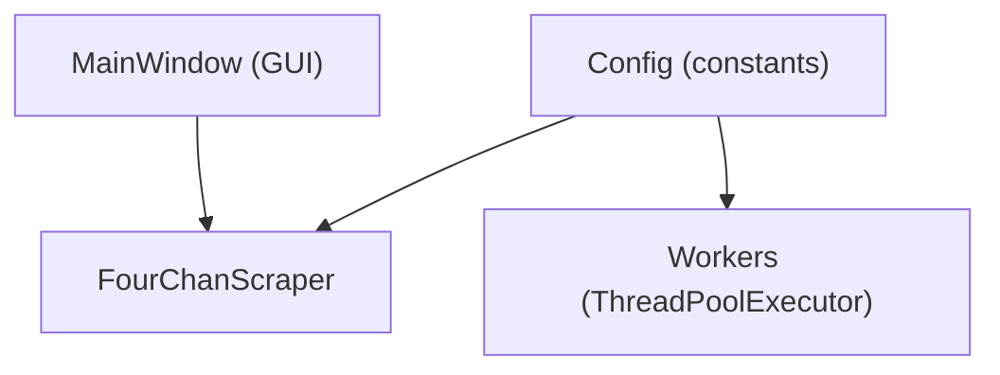
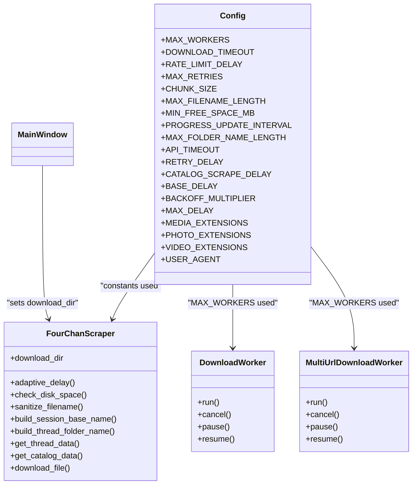
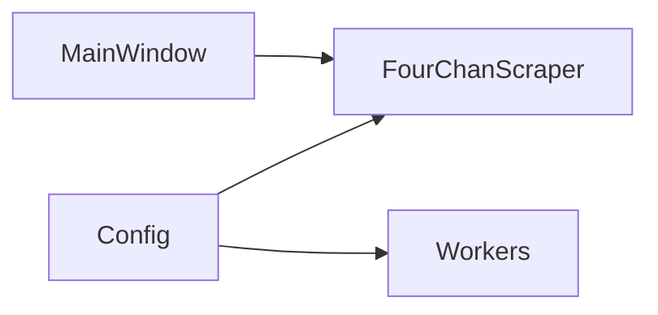

# Configuration API

<cite>
**Referenced Files in This Document**
- [config.py](file://4Charm/src/four_charm/config.py)
- [scraper.py](file://4Charm/src/four_charm/core/scraper.py)
- [workers.py](file://4Charm/src/four_charm/gui/workers.py)
- [main_window.py](file://4Charm/src/four_charm/gui/main_window.py)
- [models.py](file://4Charm/src/four_charm/core/models.py)
</cite>

## Table of Contents
1. [Introduction](#introduction)
2. [Project Structure](#project-structure)
3. [Core Components](#core-components)
4. [Architecture Overview](#architecture-overview)
5. [Detailed Component Analysis](#detailed-component-analysis)
6. [Dependency Analysis](#dependency-analysis)
7. [Performance Considerations](#performance-considerations)
8. [Troubleshooting Guide](#troubleshooting-guide)
9. [Conclusion](#conclusion)

## Introduction
This document provides comprehensive API documentation for the configuration system used by the application. It focuses on the Config class, detailing all configuration properties, their default values, data types, and usage across the system. It also explains how configuration values are consumed by the scraper and workers, how runtime changes are propagated, and how validation and error handling are implemented. Guidance is included for extending the configuration safely and maintaining backwards compatibility.

## Project Structure
The configuration system is centralized in a single module and consumed by core and GUI components:
- Config class defines global defaults and constants.
- FourChanScraper reads configuration values for network behavior, rate limiting, timeouts, and filesystem checks.
- Workers consume configuration for concurrency limits and thread pools.
- The GUI allows users to change the download directory at runtime; other settings are not exposed in the GUI in this codebase.

**Diagram sources**
- [config.py](file://4Charm/src/four_charm/config.py#L1-L47)
- [scraper.py](file://4Charm/src/four_charm/core/scraper.py#L19-L64)
- [workers.py](file://4Charm/src/four_charm/gui/workers.py#L55-L62)
- [main_window.py](file://4Charm/src/four_charm/gui/main_window.py#L391-L403)

**Section sources**
- [config.py](file://4Charm/src/four_charm/config.py#L1-L47)
- [scraper.py](file://4Charm/src/four_charm/core/scraper.py#L19-L64)
- [workers.py](file://4Charm/src/four_charm/gui/workers.py#L55-L62)
- [main_window.py](file://4Charm/src/four_charm/gui/main_window.py#L391-L403)

## Core Components
This section documents the Config class and its properties. It also explains how configuration values are used across the system and how runtime changes are handled.

- Static property implementation and thread-safety
  - The Config class defines class-level constants. These are accessed as class attributes and are inherently immutable in Python. There is no explicit locking mechanism because Python’s class attributes are not modified at runtime in this codebase.
  - Thread-safety: Since the values are constant and not mutated, no synchronization primitives are required. The workers and scraper read these values directly from the class.

- Runtime modification and propagation
  - The GUI allows changing the download directory at runtime via the main window. The scraper stores the directory as an instance attribute and uses it immediately for subsequent operations. Other configuration values are not changed at runtime in this codebase.
  - Because configuration is read as class attributes, any runtime change would require replacing the class attribute globally, which is not implemented here. Therefore, runtime changes to configuration values are not supported.

- Configuration loading and persistence
  - There is no explicit configuration file loading or persistence mechanism in the codebase. The Config class serves as a centralized constants store. The download directory is managed by the GUI and stored in the scraper instance.

- Validation and error handling
  - Validation occurs implicitly through usage of configuration values:
    - Disk space checks compare free space against a configured minimum.
    - Filename and folder name length limits enforce safe filesystem usage.
    - Timeout values are passed to network operations and retries.
  - Error handling is integrated into the scraper’s network error handling and retry logic.

**Section sources**
- [config.py](file://4Charm/src/four_charm/config.py#L1-L47)
- [scraper.py](file://4Charm/src/four_charm/core/scraper.py#L210-L221)
- [scraper.py](file://4Charm/src/four_charm/core/scraper.py#L133-L171)
- [scraper.py](file://4Charm/src/four_charm/core/scraper.py#L178-L209)
- [scraper.py](file://4Charm/src/four_charm/core/scraper.py#L248-L306)
- [scraper.py](file://4Charm/src/four_charm/core/scraper.py#L365-L547)
- [main_window.py](file://4Charm/src/four_charm/gui/main_window.py#L391-L403)

## Architecture Overview
The configuration architecture is straightforward: a single Config class provides constants that are consumed by the scraper and workers. The GUI interacts with the scraper to change the download directory at runtime.

**Diagram sources**
- [config.py](file://4Charm/src/four_charm/config.py#L1-L47)
- [scraper.py](file://4Charm/src/four_charm/core/scraper.py#L19-L64)
- [workers.py](file://4Charm/src/four_charm/gui/workers.py#L55-L62)
- [main_window.py](file://4Charm/src/four_charm/gui/main_window.py#L391-L403)

## Detailed Component Analysis

### Config Class API
The Config class defines all configurable constants used by the application. Below are the documented properties with their default values and data types. Properties are accessed as class attributes.

- MAX_WORKERS
  - Type: integer
  - Default: min(5, cpu_count)
  - Purpose: Controls the maximum number of concurrent downloads and HTTP connection pool sizes.
  - Usage locations:
    - Worker thread pool sizing
    - HTTPAdapter pool connections and maxsize
  - Notes: The value is derived from CPU count and capped at 5.

- DOWNLOAD_TIMEOUT
  - Type: tuple of integers
  - Default: (10, 60)
  - Purpose: Defines the connect and read timeout bounds for downloads.
  - Usage location: Download requests use this tuple for timeout configuration.

- RATE_LIMIT_DELAY
  - Type: float
  - Default: 0.3
  - Purpose: Base delay used by adaptive rate limiting.
  - Usage location: Not directly used in this codebase; BASE_DELAY is used instead.

- MAX_RETRIES
  - Type: integer
  - Default: 3
  - Purpose: Maximum number of retry attempts for failed downloads.
  - Usage location: Used in download loops and retry logic.

- CHUNK_SIZE
  - Type: integer
  - Default: 8192
  - Purpose: Size of chunks streamed during file downloads.
  - Usage location: Used for hashing and streaming.

- MAX_FILENAME_LENGTH
  - Type: integer
  - Default: 200
  - Purpose: Maximum allowed filename length after sanitization.
  - Usage location: Filename truncation logic.

- MIN_FREE_SPACE_MB
  - Type: integer
  - Default: 100
  - Purpose: Minimum free space threshold before downloading.
  - Usage location: Disk space check.

- PROGRESS_UPDATE_INTERVAL
  - Type: float
  - Default: 0.1
  - Purpose: Interval for progress updates.
  - Usage location: Not directly used in the codebase.

- MAX_FOLDER_NAME_LENGTH
  - Type: integer
  - Default: 60
  - Purpose: Maximum allowed folder name length after sanitization.
  - Usage location: Folder name truncation logic.

- API_TIMEOUT
  - Type: integer
  - Default: 30
  - Purpose: Timeout for API requests to the 4chan JSON endpoints.
  - Usage location: Requests to thread and catalog APIs.

- RETRY_DELAY
  - Type: float
  - Default: 2.0
  - Purpose: Delay before retrying failed API requests.
  - Usage location: Retry logic after network errors.

- CATALOG_SCRAPE_DELAY
  - Type: float
  - Default: 0.5
  - Purpose: Delay between catalog thread scrapes.
  - Usage location: Catalog scraping loop.

- BASE_DELAY
  - Type: float
  - Default: 0.3
  - Purpose: Base delay for adaptive rate limiting.
  - Usage location: Adaptive delay calculations.

- BACKOFF_MULTIPLIER
  - Type: float
  - Default: 1.5
  - Purpose: Multiplier for increasing delay on failures.
  - Usage location: Adaptive delay calculations.

- MAX_DELAY
  - Type: float
  - Default: 5.0
  - Purpose: Upper bound for adaptive delay.
  - Usage location: Adaptive delay calculations.

- MEDIA_EXTENSIONS
  - Type: set of strings
  - Default: predefined set of supported extensions
  - Purpose: Whitelist of media extensions considered for download.
  - Usage location: Filtering media from posts.

- PHOTO_EXTENSIONS
  - Type: set of strings
  - Default: subset of photo extensions
  - Purpose: Subset of MEDIA_EXTENSIONS for photos.
  - Usage location: Not directly used in code; included for completeness.

- VIDEO_EXTENSIONS
  - Type: set of strings
  - Default: subset of video extensions
  - Purpose: Subset of MEDIA_EXTENSIONS for videos.
  - Usage location: Not directly used in code; included for completeness.

- USER_AGENT
  - Type: string
  - Default: a browser-like user agent
  - Purpose: User-Agent header for HTTP requests.
  - Usage location: Session headers.

Notes on DOWNLOAD_DIR:
- The codebase does not define DOWNLOAD_DIR in Config.
- The download directory is stored as an instance attribute on the scraper and can be set at runtime via the GUI.

**Section sources**
- [config.py](file://4Charm/src/four_charm/config.py#L1-L47)
- [scraper.py](file://4Charm/src/four_charm/core/scraper.py#L22-L46)
- [scraper.py](file://4Charm/src/four_charm/core/scraper.py#L365-L547)
- [workers.py](file://4Charm/src/four_charm/gui/workers.py#L55-L62)
- [main_window.py](file://4Charm/src/four_charm/gui/main_window.py#L391-L403)

### How Configuration Values Are Consumed
- Workers
  - MAX_WORKERS controls the size of the ThreadPoolExecutor used for concurrent downloads.
  - This affects throughput and resource usage.

- Scraper
  - HTTPAdapter pool sizes and max_retries are set from MAX_WORKERS and MAX_RETRIES.
  - API_TIMEOUT and RETRY_DELAY are used for fetching thread and catalog data.
  - DOWNLOAD_TIMEOUT is used for download requests.
  - CHUNK_SIZE is used for streaming and hashing.
  - MAX_FILENAME_LENGTH and MAX_FOLDER_NAME_LENGTH are used for filename and folder sanitization.
  - MIN_FREE_SPACE_MB is used for disk space checks.
  - BASE_DELAY, BACKOFF_MULTIPLIER, and MAX_DELAY are used for adaptive rate limiting.

- GUI
  - The GUI sets the download directory on the scraper instance. Other configuration values are not exposed in the GUI.

**Section sources**
- [workers.py](file://4Charm/src/four_charm/gui/workers.py#L55-L62)
- [scraper.py](file://4Charm/src/four_charm/core/scraper.py#L22-L46)
- [scraper.py](file://4Charm/src/four_charm/core/scraper.py#L248-L306)
- [scraper.py](file://4Charm/src/four_charm/core/scraper.py#L365-L547)
- [main_window.py](file://4Charm/src/four_charm/gui/main_window.py#L391-L403)

### Runtime Modification and Propagation
- Programmatic modification
  - The download directory can be changed at runtime by setting the scraper’s download_dir attribute from the GUI.
  - Example path: [choose_download_folder](file://4Charm/src/four_charm/gui/main_window.py#L391-L403)
- Propagation
  - Changes to download_dir take effect immediately for subsequent operations.
  - Other configuration values are not changed at runtime in this codebase.

- Thread-safety
  - Since the Config class attributes are not modified, no locks are required.
  - The scraper’s download_dir is an instance attribute and is not shared across threads in a way that would require synchronization.

**Section sources**
- [main_window.py](file://4Charm/src/four_charm/gui/main_window.py#L391-L403)
- [config.py](file://4Charm/src/four_charm/config.py#L1-L47)

### Validation Rules and Error Handling
- Disk space validation
  - The scraper checks available disk space before downloading and compares it to MIN_FREE_SPACE_MB plus any required space.
  - If insufficient, the download is marked as failed.

- Filename and folder name validation
  - Filenames and folder names are sanitized and truncated to MAX_FILENAME_LENGTH and MAX_FOLDER_NAME_LENGTH respectively.

- Network error handling
  - The scraper adapts delay based on success or failure and handles various error categories (connection, timeout, HTTP status codes, too many redirects).
  - On 429 (rate limited), the delay is increased and optionally retried after RETRY_DELAY.

- Retry logic
  - MAX_RETRIES determines the number of attempts for downloads and API calls.

**Section sources**
- [scraper.py](file://4Charm/src/four_charm/core/scraper.py#L210-L221)
- [scraper.py](file://4Charm/src/four_charm/core/scraper.py#L133-L171)
- [scraper.py](file://4Charm/src/four_charm/core/scraper.py#L178-L209)
- [scraper.py](file://4Charm/src/four_charm/core/scraper.py#L248-L306)
- [scraper.py](file://4Charm/src/four_charm/core/scraper.py#L365-L547)

### Adding New Configuration Options and Backwards Compatibility
- Adding new options
  - Define a new class attribute in Config with a sensible default.
  - Import Config in the consuming modules and use the new constant.
  - Ensure defaults are platform-independent and reasonable.
- Backwards compatibility
  - Keep existing defaults unchanged.
  - Avoid removing or renaming existing constants.
  - Provide sensible defaults for new options to minimize impact on existing installations.

[No sources needed since this section provides general guidance]

## Dependency Analysis
The following diagram shows how configuration constants are used across modules.

**Diagram sources**
- [config.py](file://4Charm/src/four_charm/config.py#L1-L47)
- [scraper.py](file://4Charm/src/four_charm/core/scraper.py#L19-L64)
- [workers.py](file://4Charm/src/four_charm/gui/workers.py#L55-L62)
- [main_window.py](file://4Charm/src/four_charm/gui/main_window.py#L391-L403)

**Section sources**
- [config.py](file://4Charm/src/four_charm/config.py#L1-L47)
- [scraper.py](file://4Charm/src/four_charm/core/scraper.py#L19-L64)
- [workers.py](file://4Charm/src/four_charm/gui/workers.py#L55-L62)
- [main_window.py](file://4Charm/src/four_charm/gui/main_window.py#L391-L403)

## Performance Considerations
- MAX_WORKERS
  - Increasing this value increases concurrency and throughput but also memory and network usage. The default caps CPU-bound workloads to a safe level.
- CHUNK_SIZE
  - Larger chunks reduce overhead but increase memory usage. The default balances throughput and memory footprint.
- BASE_DELAY, BACKOFF_MULTIPLIER, MAX_DELAY
  - Adaptive rate limiting reduces server load and improves reliability under pressure. Tune these to balance speed and stability.
- API_TIMEOUT and RETRY_DELAY
  - Appropriate timeouts and retry delays improve resilience to transient network issues.
- MIN_FREE_SPACE_MB
  - Ensures sufficient disk space to avoid partial downloads and filesystem errors.

[No sources needed since this section provides general guidance]

## Troubleshooting Guide
- Downloads fail due to insufficient disk space
  - Verify free space meets MIN_FREE_SPACE_MB plus required size.
  - Adjust download directory to a location with more space.
- Frequent rate limiting
  - The adaptive delay increases on failures. Consider reducing MAX_WORKERS or increasing BASE_DELAY.
- Slow downloads
  - Increase MAX_WORKERS cautiously; monitor system resources.
  - Ensure network conditions permit higher concurrency.
- Filename or folder name issues
  - Filenames and folder names are truncated to configured lengths. If names appear truncated, adjust MAX_FILENAME_LENGTH or MAX_FOLDER_NAME_LENGTH.

**Section sources**
- [scraper.py](file://4Charm/src/four_charm/core/scraper.py#L210-L221)
- [scraper.py](file://4Charm/src/four_charm/core/scraper.py#L133-L171)
- [scraper.py](file://4Charm/src/four_charm/core/scraper.py#L178-L209)

## Conclusion
The configuration system centers around a simple, immutable Config class that provides defaults for all major behaviors. The scraper and workers consume these values directly, and the GUI exposes a single runtime-changeable setting: the download directory. Validation and error handling are integrated into the core logic, and performance tuning primarily involves adjusting concurrency and rate-limiting parameters. Extending the configuration should be done carefully to preserve backwards compatibility.