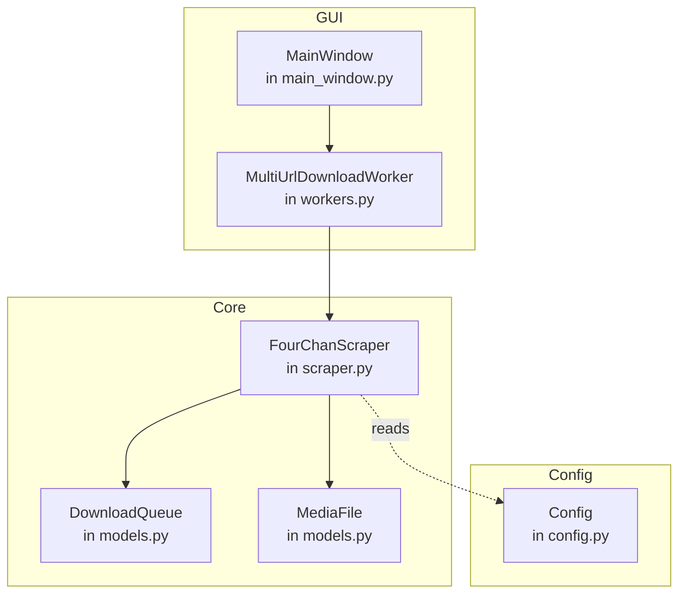
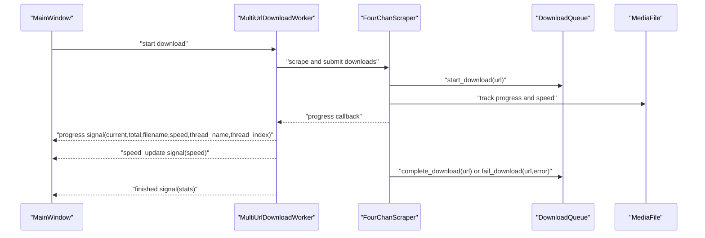
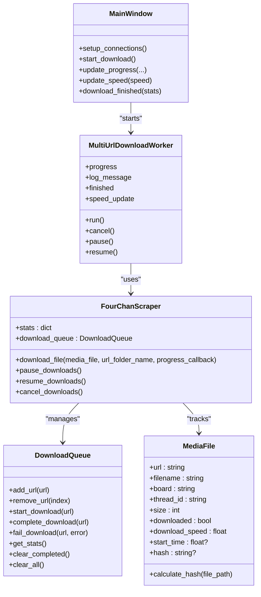

# DownloadQueue API

<cite>
**Referenced Files in This Document**
- [models.py](file://4Charm/src/four_charm/core/models.py)
- [scraper.py](file://4Charm/src/four_charm/core/scraper.py)
- [workers.py](file://4Charm/src/four_charm/gui/workers.py)
- [main_window.py](file://4Charm/src/four_charm/gui/main_window.py)
- [config.py](file://4Charm/src/four_charm/config.py)
</cite>

## Table of Contents
1. [Introduction](#introduction)
2. [Project Structure](#project-structure)
3. [Core Components](#core-components)
4. [Architecture Overview](#architecture-overview)
5. [Detailed Component Analysis](#detailed-component-analysis)
6. [Dependency Analysis](#dependency-analysis)
7. [Performance Considerations](#performance-considerations)
8. [Troubleshooting Guide](#troubleshooting-guide)
9. [Conclusion](#conclusion)

## Introduction
This document provides detailed API documentation for the DownloadQueue class used in the 4Charm project. It explains the queue’s properties, methods for queue management, thread-safety mechanisms, event-driven integration with Qt signals, and how progress and completion are reported. It also covers the relationship between DownloadQueue and MediaFile entities, concurrency considerations, and guidance for extending the queue with custom filtering or prioritization logic.

## Project Structure
The DownloadQueue resides in the core module alongside the scraper and worker implementations. The GUI integrates with the worker to drive concurrent downloads and receive progress updates via Qt signals.

**Diagram sources**
- [models.py](file://4Charm/src/four_charm/core/models.py#L11-L113)
- [scraper.py](file://4Charm/src/four_charm/core/scraper.py#L19-L63)
- [workers.py](file://4Charm/src/four_charm/gui/workers.py#L143-L330)
- [main_window.py](file://4Charm/src/four_charm/gui/main_window.py#L40-L120)
- [config.py](file://4Charm/src/four_charm/config.py#L1-L48)

**Section sources**
- [models.py](file://4Charm/src/four_charm/core/models.py#L11-L113)
- [scraper.py](file://4Charm/src/four_charm/core/scraper.py#L19-L63)
- [workers.py](file://4Charm/src/four_charm/gui/workers.py#L143-L330)
- [main_window.py](file://4Charm/src/four_charm/gui/main_window.py#L40-L120)
- [config.py](file://4Charm/src/four_charm/config.py#L1-L48)

## Core Components
- DownloadQueue: Manages URL-based download queues and maintains lifecycle states for each URL.
- MediaFile: Represents a downloadable media entity with metadata and progress metrics.
- FourChanScraper: Orchestrates scraping, downloading, and queue state transitions.
- MultiUrlDownloadWorker: Drives concurrent downloads from multiple URLs and emits progress and completion signals.
- MainWindow: UI that connects to the worker and displays progress and speed.

**Section sources**
- [models.py](file://4Charm/src/four_charm/core/models.py#L11-L113)
- [scraper.py](file://4Charm/src/four_charm/core/scraper.py#L365-L547)
- [workers.py](file://4Charm/src/four_charm/gui/workers.py#L143-L330)
- [main_window.py](file://4Charm/src/four_charm/gui/main_window.py#L488-L560)

## Architecture Overview
The system uses a Qt-based event-driven architecture. The GUI starts a worker thread that performs concurrent downloads. During each download, the scraper updates the DownloadQueue and MediaFile state, and the worker emits signals for progress, speed updates, and completion. The UI listens to these signals to update the progress bar, speed label, and logs.

**Diagram sources**
- [main_window.py](file://4Charm/src/four_charm/gui/main_window.py#L528-L560)
- [workers.py](file://4Charm/src/four_charm/gui/workers.py#L143-L330)
- [scraper.py](file://4Charm/src/four_charm/core/scraper.py#L365-L547)
- [models.py](file://4Charm/src/four_charm/core/models.py#L33-L64)

## Detailed Component Analysis

### DownloadQueue API
The DownloadQueue class manages URL-based download states and provides statistics. It does not expose properties like total_files, completed_files, or download_speed directly; instead, these are computed via methods and maintained by the scraper.

- Purpose: Manage URL lifecycle and provide queue statistics.
- Internal state:
  - queue: Pending URLs awaiting download.
  - history: Completed/failed entries with timestamps.
  - active_downloads: URLs currently being downloaded.
  - completed: URLs successfully downloaded.
  - failed: URLs that failed.

Methods:
- add_url(url: str) -> None
  - Adds a URL if not already queued or active.
  - Complexity: O(n) due to membership checks against queue and active_downloads.
- remove_url(index: int) -> None
  - Removes a URL by index from the queue.
  - Complexity: O(n) for pop operation.
- start_download(url: str) -> None
  - Moves a URL from queue to active_downloads.
  - Complexity: O(n) for removal from queue and append to active_downloads.
- complete_download(url: str) -> None
  - Marks a URL as completed and records it in history.
  - Complexity: O(n) for removal from active_downloads and append to completed.
- fail_download(url: str, error: Optional[Exception] = None) -> None
  - Marks a URL as failed and records it in history with error details.
  - Complexity: O(n) for removal from active_downloads and append to failed.
- get_stats() -> dict[str, int]
  - Returns counts for queued, active, completed, failed, and total.
  - Complexity: O(1) time; O(1) space.
- clear_completed() -> None
  - Clears completed and failed lists.
  - Complexity: O(1) time; O(1) space.
- clear_all() -> None
  - Clears all queues and history.
  - Complexity: O(1) time; O(1) space.

Notes:
- The class does not define properties total_files, completed_files, or download_speed. These are computed by the scraper and exposed via stats dictionaries and signals.

Thread-safety:
- The DownloadQueue itself is not guarded by locks. Thread-safety is handled by the scraper’s stats_mutex and by Qt signals used in the worker.

Integration with MediaFile:
- The scraper tracks per-file progress and speed on MediaFile instances and updates queue state accordingly.

**Section sources**
- [models.py](file://4Charm/src/four_charm/core/models.py#L11-L113)

### MediaFile API
MediaFile represents a downloadable media entity and holds per-file metrics used during progress reporting.

Properties:
- url: str
- filename: str
- board: str
- thread_id: str
- size: int
- downloaded: bool
- download_speed: float
- start_time: Optional[float]
- hash: Optional[str]

Methods:
- calculate_hash(file_path: Path) -> str
  - Computes SHA256 hash of the file for duplicate detection.
  - Complexity: O(n) where n is file size.

Usage:
- The scraper creates MediaFile instances and updates download_speed and size during downloads.

**Section sources**
- [models.py](file://4Charm/src/four_charm/core/models.py#L92-L113)
- [scraper.py](file://4Charm/src/four_charm/core/scraper.py#L365-L547)

### FourChanScraper Integration
The scraper coordinates queue state transitions and maintains global stats. It uses a QMutex to protect shared stats and exposes average speed via signals.

Key responsibilities:
- Maintains stats dictionary with keys: total, downloaded, failed, skipped, size_mb, download_speed, start_time, duplicates, current_speed.
- Uses stats_mutex to guard access to stats.
- Calls DownloadQueue methods to move URLs between states.
- Emits progress and speed updates during downloads.

Concurrency:
- stats_mutex protects stats updates.
- The worker runs in a separate QThread and emits signals safely to the UI thread.

**Section sources**
- [scraper.py](file://4Charm/src/four_charm/core/scraper.py#L47-L63)
- [scraper.py](file://4Charm/src/four_charm/core/scraper.py#L365-L547)

### MultiUrlDownloadWorker Integration
The worker drives concurrent downloads and emits signals for progress, speed updates, and completion. It receives the scraper instance and parsed URLs, then submits downloads to the scraper.

Signals:
- progress: int, int, str, float, str, int
  - Emitted with current, total, filename, average speed, thread_name, thread_index.
- speed_update: float
  - Emitted with current average speed.
- log_message: str
  - Emitted for informational messages.
- finished: dict
  - Emitted with final stats.

The worker calculates average speed using the scraper’s stats and stats_mutex.

**Section sources**
- [workers.py](file://4Charm/src/four_charm/gui/workers.py#L143-L330)

### Event-Driven Monitoring and Completion
The UI connects to worker signals to monitor queue state changes and handle completion events.

- MainWindow connects:
  - progress -> update_progress
  - speed_update -> update_speed
  - log_message -> add_log_message
  - finished -> download_finished
- On completion, the UI updates status bar and cleans up thread references.

**Section sources**
- [main_window.py](file://4Charm/src/four_charm/gui/main_window.py#L528-L560)

### Queue Management Methods
- add_url(url: str): Add a URL to the queue.
- remove_url(index: int): Remove a URL by index.
- start_download(url: str): Move URL from queue to active.
- complete_download(url: str): Mark URL as completed.
- fail_download(url: str, error: Optional[Exception] = None): Mark URL as failed.
- get_stats(): dict[str, int]: Returns queued, active, completed, failed, total.
- clear_completed(): Clear completed and failed lists.
- clear_all(): Clear all queues and history.

These methods manage the lifecycle of URLs in the queue and provide statistics for monitoring.

**Section sources**
- [models.py](file://4Charm/src/four_charm/core/models.py#L21-L90)

### Thread-Safe Implementation
- stats_mutex: Protects access to the stats dictionary in the scraper.
- QMutex is used around stats reads/writes in the worker’s speed calculation and in the downloader.
- Qt signals are used to communicate from worker to UI thread safely.

**Section sources**
- [scraper.py](file://4Charm/src/four_charm/core/scraper.py#L47-L63)
- [workers.py](file://4Charm/src/four_charm/gui/workers.py#L121-L141)
- [workers.py](file://4Charm/src/four_charm/gui/workers.py#L310-L330)

### Progress Reporting Through the System
- Per-file progress callback updates MediaFile.download_speed and size.
- Worker emits progress and speed_update signals with aggregated stats.
- UI updates progress bar and speed label.

**Section sources**
- [scraper.py](file://4Charm/src/four_charm/core/scraper.py#L441-L501)
- [workers.py](file://4Charm/src/four_charm/gui/workers.py#L277-L287)
- [main_window.py](file://4Charm/src/four_charm/gui/main_window.py#L627-L649)

### Extending the Queue with Custom Filtering or Prioritization
To extend the queue with custom filtering or prioritization logic:
- Filtering: Pre-validate URLs before adding them to the queue. Use the scraper’s parse_url to validate and reject unsupported URLs.
- Prioritization: Maintain a priority queue structure (e.g., a heap or sorted list) and modify add_url to insert according to priority. Ensure thread-safety by guarding queue mutations with stats_mutex or by performing queue operations on the UI thread and communicating via signals.

Guidance:
- Keep queue operations O(log n) or O(n) depending on insertion strategy.
- Avoid blocking the UI thread; perform heavy computations off the UI thread and emit signals for updates.

**Section sources**
- [scraper.py](file://4Charm/src/four_charm/core/scraper.py#L222-L247)
- [models.py](file://4Charm/src/four_charm/core/models.py#L21-L32)

## Dependency Analysis

**Diagram sources**
- [models.py](file://4Charm/src/four_charm/core/models.py#L11-L113)
- [scraper.py](file://4Charm/src/four_charm/core/scraper.py#L19-L63)
- [workers.py](file://4Charm/src/four_charm/gui/workers.py#L143-L330)
- [main_window.py](file://4Charm/src/four_charm/gui/main_window.py#L40-L120)

**Section sources**
- [models.py](file://4Charm/src/four_charm/core/models.py#L11-L113)
- [scraper.py](file://4Charm/src/four_charm/core/scraper.py#L19-L63)
- [workers.py](file://4Charm/src/four_charm/gui/workers.py#L143-L330)
- [main_window.py](file://4Charm/src/four_charm/gui/main_window.py#L40-L120)

## Performance Considerations
- Queue operations:
  - Membership checks and removals are O(n); consider using a set for O(1) lookups if frequent lookups are required.
- Concurrency:
  - stats_mutex protects shared stats; keep critical sections small to minimize contention.
- Worker thread:
  - ThreadPoolExecutor limits concurrency via Config.MAX_WORKERS; tune based on CPU and network capacity.
- Progress reporting:
  - Frequent progress updates can be expensive; batch updates or throttle signal emissions if needed.

[No sources needed since this section provides general guidance]

## Troubleshooting Guide
Common issues and resolutions:
- Duplicate files:
  - The scraper detects duplicates by hashing and increments stats.duplicates. Verify hashes and ensure file paths are correct.
- Insufficient disk space:
  - The downloader checks available space and marks failures appropriately. Ensure sufficient free space before starting downloads.
- Pausing and resuming:
  - The worker respects pause/resume flags; ensure the UI toggles state correctly and worker receives the commands.
- Cancellation:
  - The worker cancels downloads when cancelled flag is set; ensure the UI sets the flag and waits for thread cleanup.

**Section sources**
- [scraper.py](file://4Charm/src/four_charm/core/scraper.py#L411-L439)
- [scraper.py](file://4Charm/src/four_charm/core/scraper.py#L548-L557)
- [workers.py](file://4Charm/src/four_charm/gui/workers.py#L322-L329)
- [main_window.py](file://4Charm/src/four_charm/gui/main_window.py#L551-L557)

## Conclusion
The DownloadQueue class provides a lightweight mechanism for managing URL-based download lifecycles. While it does not expose properties like total_files, completed_files, or download_speed directly, the scraper and worker coordinate to compute and report these metrics via stats and signals. The system is designed with thread-safety in mind using QMutex and Qt signals, enabling responsive UI updates during concurrent downloads. Extensibility can be achieved through custom filtering and prioritization strategies, keeping performance and thread-safety considerations in mind.