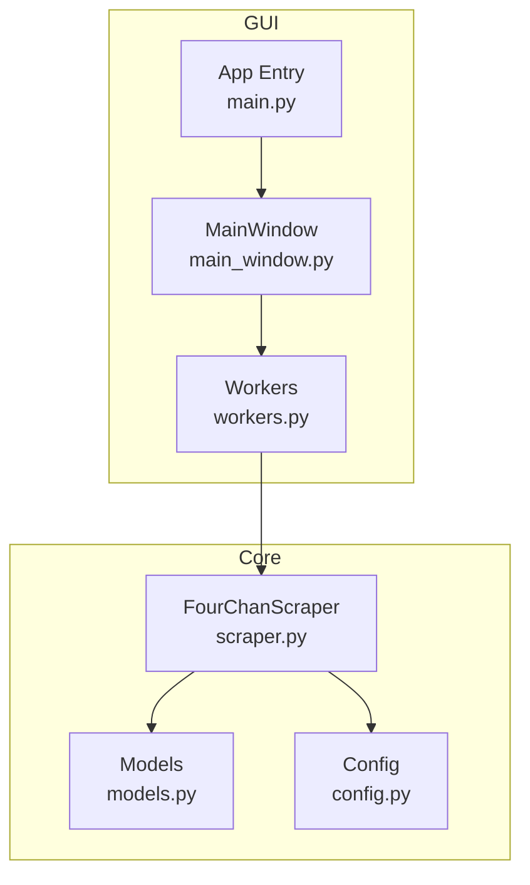
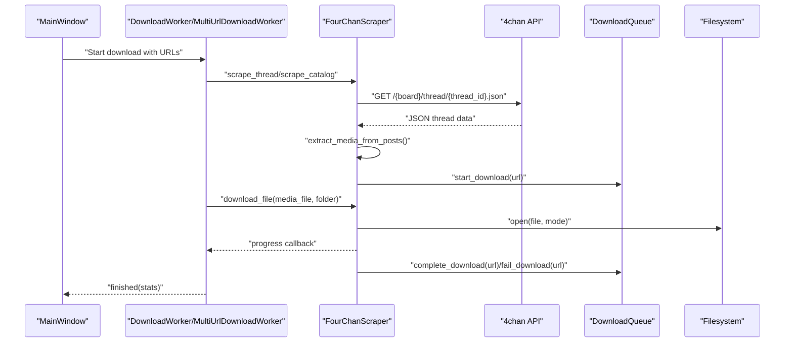
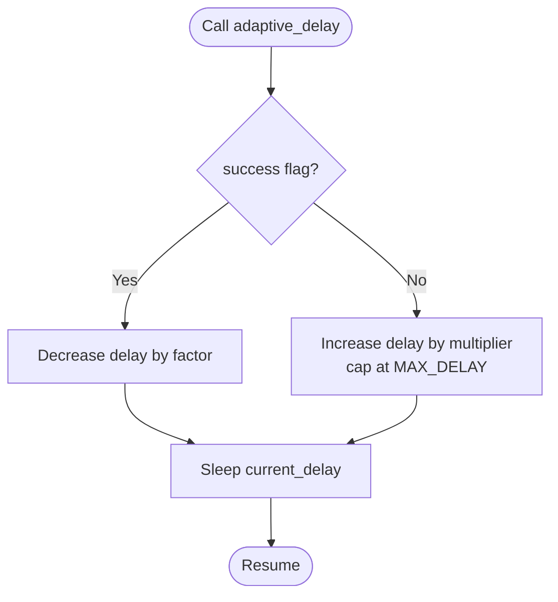
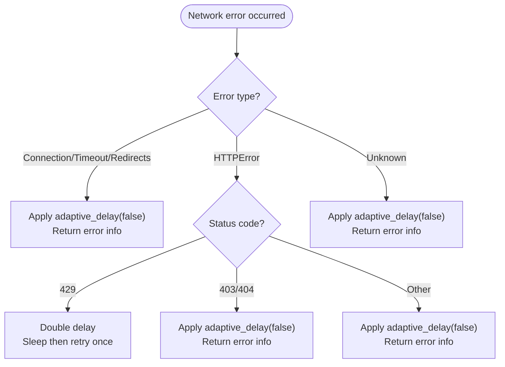
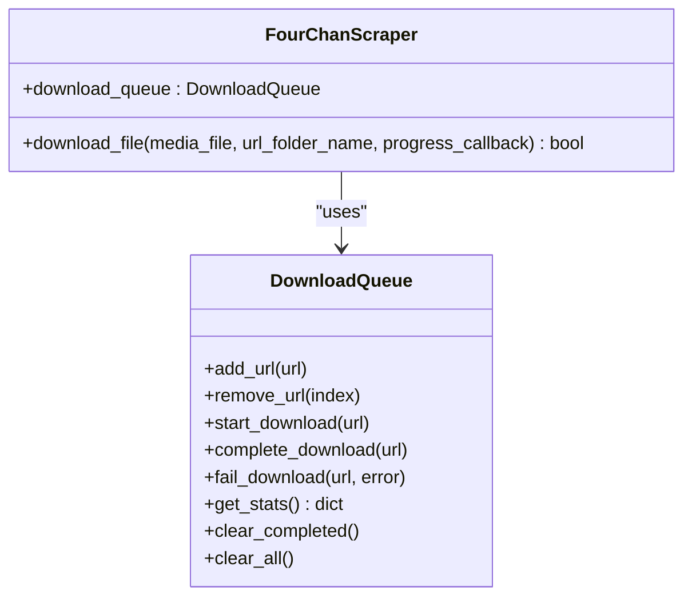
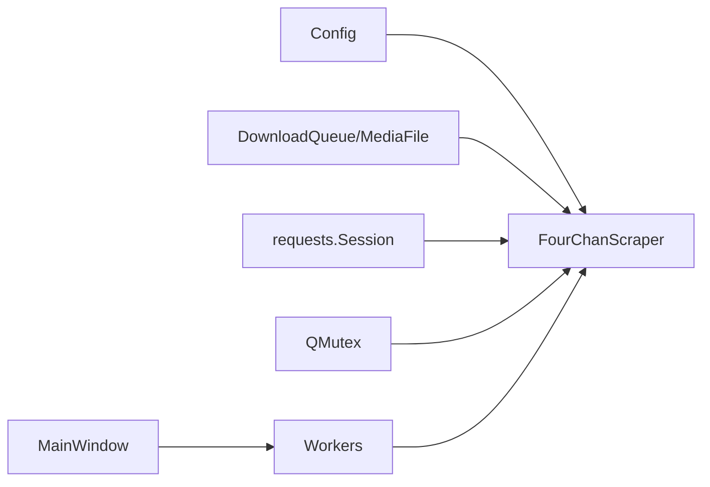

# FourChanScraper API

<cite>
**Referenced Files in This Document**
- [scraper.py](file://4Charm/src/four_charm/core/scraper.py)
- [models.py](file://4Charm/src/four_charm/core/models.py)
- [config.py](file://4Charm/src/four_charm/config.py)
- [workers.py](file://4Charm/src/four_charm/gui/workers.py)
- [main_window.py](file://4Charm/src/four_charm/gui/main_window.py)
- [main.py](file://4Charm/src/four_charm/main.py)
- [README.md](file://4Charm/README.md)
</cite>

## Table of Contents
1. [Introduction](#introduction)
2. [Project Structure](#project-structure)
3. [Core Components](#core-components)
4. [Architecture Overview](#architecture-overview)
5. [Detailed Component Analysis](#detailed-component-analysis)
6. [Dependency Analysis](#dependency-analysis)
7. [Performance Considerations](#performance-considerations)
8. [Troubleshooting Guide](#troubleshooting-guide)
9. [Conclusion](#conclusion)
10. [Appendices](#appendices)

## Introduction
This document provides comprehensive API documentation for the FourChanScraper class, focusing on its public methods, configuration, error handling, rate limiting, retry mechanisms, and integration with the DownloadQueue. It also covers usage patterns, thread safety, performance characteristics, and guidance for extending the scraper to other 4chan-like sites.

## Project Structure
The FourChanScraper resides in the core module alongside data models and configuration. The GUI workers orchestrate scraping and downloading, while the main window integrates the scraper into the application lifecycle.

**Diagram sources**
- [scraper.py](file://4Charm/src/four_charm/core/scraper.py#L1-L60)
- [models.py](file://4Charm/src/four_charm/core/models.py#L1-L40)
- [config.py](file://4Charm/src/four_charm/config.py#L1-L48)
- [workers.py](file://4Charm/src/four_charm/gui/workers.py#L1-L40)
- [main_window.py](file://4Charm/src/four_charm/gui/main_window.py#L70-L90)
- [main.py](file://4Charm/src/four_charm/main.py#L37-L55)

**Section sources**
- [scraper.py](file://4Charm/src/four_charm/core/scraper.py#L1-L60)
- [models.py](file://4Charm/src/four_charm/core/models.py#L1-L40)
- [config.py](file://4Charm/src/four_charm/config.py#L1-L48)
- [workers.py](file://4Charm/src/four_charm/gui/workers.py#L1-L40)
- [main_window.py](file://4Charm/src/four_charm/gui/main_window.py#L70-L90)
- [main.py](file://4Charm/src/four_charm/main.py#L37-L55)

## Core Components
- FourChanScraper: Central scraping and downloading engine with adaptive rate limiting, error handling, and duplicate detection.
- DownloadQueue: Lightweight queue manager for tracking downloads without UI dependencies.
- MediaFile: Represents a downloadable media item with metadata and hashing support.
- Config: Centralized configuration for timeouts, retries, delays, and supported extensions.

Key responsibilities:
- Parse 4chan URLs and extract board/thread identifiers.
- Fetch thread and catalog JSON via 4chan’s public API.
- Extract media URLs from posts and sanitize filenames.
- Concurrently download media with resume, duplicate detection, and progress reporting.
- Manage adaptive rate limiting and backoff strategies.

**Section sources**
- [scraper.py](file://4Charm/src/four_charm/core/scraper.py#L19-L64)
- [models.py](file://4Charm/src/four_charm/core/models.py#L11-L113)
- [config.py](file://4Charm/src/four_charm/config.py#L1-L48)

## Architecture Overview
The scraper orchestrates scraping and downloading through workers. The GUI initializes a FourChanScraper instance, parses URLs, and delegates to workers that submit downloads to the scraper. The scraper maintains a DownloadQueue and uses a shared session with configured retries and headers.

**Diagram sources**
- [workers.py](file://4Charm/src/four_charm/gui/workers.py#L27-L120)
- [scraper.py](file://4Charm/src/four_charm/core/scraper.py#L330-L557)
- [models.py](file://4Charm/src/four_charm/core/models.py#L11-L90)

## Detailed Component Analysis

### FourChanScraper Public API

#### Constructor and Initialization
- Purpose: Initializes HTTP session with retry policy, sets default headers, creates a DownloadQueue, and prepares statistics and synchronization primitives.
- Key attributes:
  - session: requests.Session configured with HTTPAdapter and retry settings.
  - download_dir: Optional Path for saving files.
  - download_queue: DownloadQueue instance.
  - stats: Dictionary tracking totals and performance metrics.
  - stats_mutex: QMutex for thread-safe stats updates.
  - current_delay: Adaptive delay for rate limiting.
  - paused/cancelled: Control flags for pausing and cancellation.

Behavior highlights:
- Session pools connections proportional to Config.MAX_WORKERS.
- Headers include a modern User-Agent and standard browser-like accept headers.
- Stats include total, downloaded, failed, skipped, duplicates, size in MB, and current/average speeds.

**Section sources**
- [scraper.py](file://4Charm/src/four_charm/core/scraper.py#L22-L64)
- [config.py](file://4Charm/src/four_charm/config.py#L1-L24)

#### scrape_thread(board: str, thread_id: str) -> Tuple[List[MediaFile], Optional[str]]
- Purpose: Retrieve all media files from a specific thread and return the thread title if available.
- Parameters:
  - board: 4chan board identifier (e.g., g, v).
  - thread_id: Numeric thread identifier.
- Returns:
  - Tuple of:
    - List[MediaFile]: Extracted media items.
    - Optional[str]: Thread title from the OP post, if present.
- Exceptions:
  - Propagates underlying network or JSON parsing errors; handled internally by adaptive delay and error categorization.
- Usage pattern:
  - Call after setting download_dir.
  - Use returned thread title to build descriptive folder names.

Notes:
- Internally calls get_thread_data and extract_media_from_posts.
- Uses adaptive rate limiting around API calls.

**Section sources**
- [scraper.py](file://4Charm/src/four_charm/core/scraper.py#L330-L342)
- [scraper.py](file://4Charm/src/four_charm/core/scraper.py#L248-L283)
- [scraper.py](file://4Charm/src/four_charm/core/scraper.py#L308-L329)

#### scrape_catalog(board: str, max_threads: int = 10) -> List[MediaFile]
- Purpose: Fetch recent threads from the catalog and aggregate media from up to max_threads threads.
- Parameters:
  - board: 4chan board identifier.
  - max_threads: Maximum number of threads to scrape.
- Returns:
  - List[MediaFile]: Aggregated media items from selected threads.
- Exceptions:
  - Handles network errors and rate limiting with adaptive delay and retry logic.
- Usage pattern:
  - Useful for bulk harvesting from a board.
  - Respects Config.CATALOG_SCRAPE_DELAY between thread scrapes.

**Section sources**
- [scraper.py](file://4Charm/src/four_charm/core/scraper.py#L343-L363)
- [scraper.py](file://4Charm/src/four_charm/core/scraper.py#L284-L307)
- [config.py](file://4Charm/src/four_charm/config.py#L15-L19)

#### get_media_urls(board: str, thread_id: str) -> List[str]
- Purpose: Extract raw media URLs from a thread without constructing MediaFile objects.
- Parameters:
  - board: Board identifier.
  - thread_id: Thread identifier.
- Returns:
  - List[str]: URLs of media files found in the thread.
- Exceptions:
  - Raises/returns None on failure; handled by internal error handling and adaptive delay.
- Usage pattern:
  - Useful for external consumers who want to process URLs separately.

Implementation note:
- Implemented indirectly via extract_media_from_posts; returns URLs constructed from board and post identifiers.

**Section sources**
- [scraper.py](file://4Charm/src/four_charm/core/scraper.py#L308-L329)
- [scraper.py](file://4Charm/src/four_charm/core/scraper.py#L248-L283)

#### download_file(media_file: MediaFile, url_folder_name: Optional[str] = None, progress_callback=None) -> bool
- Purpose: Download a single media file with resume, duplicate detection, and progress reporting.
- Parameters:
  - media_file: MediaFile object with URL and filename.
  - url_folder_name: Optional base folder name for organizing downloads.
  - progress_callback: Optional callable receiving (percent, speed) during download.
- Returns:
  - bool: True if successful, False otherwise.
- Exceptions:
  - Logs failures and marks them as failed in DownloadQueue.
- Behavior:
  - Creates per-thread directories and a dedicated WEBM subfolder for .webm files.
  - Supports HTTP Range resume for partial files.
  - Calculates SHA-256 hash for duplicate detection.
  - Updates stats and current speed; thread-safe via stats_mutex.
  - Retries with exponential backoff up to Config.MAX_RETRIES.

**Section sources**
- [scraper.py](file://4Charm/src/four_charm/core/scraper.py#L365-L557)
- [models.py](file://4Charm/src/four_charm/core/models.py#L92-L113)
- [config.py](file://4Charm/src/four_charm/config.py#L1-L24)

### Adaptive Rate Limiting and Error Handling

#### Adaptive Delay Mechanism
- Purpose: Dynamically adjust delay between requests based on success or failure to avoid rate limits.
- Implementation:
  - On success: decrease delay by a factor (Config.BASE_DELAY reduced).
  - On failure: increase delay by Config.BACKOFF_MULTIPLIER up to Config.MAX_DELAY.
- Usage:
  - Called before and after API calls in get_thread_data and get_catalog_data.
  - Also invoked in handle_network_error for connection, timeout, redirect, and HTTP errors.

**Diagram sources**
- [scraper.py](file://4Charm/src/four_charm/core/scraper.py#L65-L74)
- [config.py](file://4Charm/src/four_charm/config.py#L20-L24)

#### Error Handling Strategies
- Categories:
  - ConnectionError, Timeout, TooManyRedirects: treated as transient; adaptive delay applied.
  - HTTPError:
    - 429 (rate limited): increases delay and sleeps; may retry once.
    - 403/404: treated as access issues; adaptive delay applied.
    - Other HTTP errors: logged and retried with adaptive delay.
  - Unknown errors: logged and retried with adaptive delay.
- handle_network_error returns structured error info including category and status code when applicable.

**Diagram sources**
- [scraper.py](file://4Charm/src/four_charm/core/scraper.py#L75-L132)
- [scraper.py](file://4Charm/src/four_charm/core/scraper.py#L264-L282)
- [scraper.py](file://4Charm/src/four_charm/core/scraper.py#L295-L306)

#### Retry Mechanism with Exponential Backoff
- Max retries: Config.MAX_RETRIES.
- Backoff: 2^attempt seconds between attempts.
- Download-level retries occur inside download_file when encountering exceptions.

**Section sources**
- [scraper.py](file://4Charm/src/four_charm/core/scraper.py#L390-L546)
- [config.py](file://4Charm/src/four_charm/config.py#L1-L10)

### Relationship Between FourChanScraper and DownloadQueue
- DownloadQueue tracks queued, active, completed, and failed downloads and maintains history entries with timestamps and statuses.
- FourChanScraper uses DownloadQueue to:
  - start_download before attempting a download.
  - complete_download upon success.
  - fail_download upon permanent failure or cancellation.
- This decouples download tracking from UI concerns and allows reuse in non-GUI contexts.

**Diagram sources**
- [models.py](file://4Charm/src/four_charm/core/models.py#L11-L90)
- [scraper.py](file://4Charm/src/four_charm/core/scraper.py#L365-L557)

### Media Extraction and Validation
- extract_media_from_posts:
  - Filters posts for presence of numeric tim and ext fields.
  - Validates extension against Config.MEDIA_EXTENSIONS.
  - Constructs MediaFile with sanitized filename and board/thread metadata.
- sanitize_filename:
  - Removes invalid characters, handles reserved names, truncates length, and ensures non-empty result.
- build_session_base_name and build_thread_folder_name:
  - Derive folder names from board/thread identifiers and thread titles, with sanitization and truncation.

**Section sources**
- [scraper.py](file://4Charm/src/four_charm/core/scraper.py#L308-L329)
- [scraper.py](file://4Charm/src/four_charm/core/scraper.py#L133-L172)
- [scraper.py](file://4Charm/src/four_charm/core/scraper.py#L178-L209)
- [config.py](file://4Charm/src/four_charm/config.py#L25-L41)

### Usage Patterns and Examples
- Instantiation and configuration:
  - Instantiate FourChanScraper in your application.
  - Set download_dir to a writable Path before downloading.
  - Optionally adjust Config constants (e.g., MAX_WORKERS, BASE_DELAY, MAX_DELAY) before creating the scraper.
- Scraping:
  - For a single thread: scrape_thread(board, thread_id) returns MediaFiles and optional thread title.
  - For a board catalog: scrape_catalog(board, max_threads) returns aggregated MediaFiles.
- Downloading:
  - Use download_file(media_file, url_folder_name, progress_callback) to download with progress reporting.
  - Workers submit downloads to the scraper using ThreadPoolExecutor with Config.MAX_WORKERS.
- Integration:
  - The GUI constructs FourChanScraper in MainWindow and delegates to MultiUrlDownloadWorker for concurrent downloads.

Example snippet paths:
- [Instantiation and usage in GUI](file://4Charm/src/four_charm/gui/main_window.py#L78-L88)
- [Worker orchestration](file://4Charm/src/four_charm/gui/workers.py#L27-L120)
- [Concurrent download submission](file://4Charm/src/four_charm/gui/workers.py#L56-L72)

**Section sources**
- [main_window.py](file://4Charm/src/four_charm/gui/main_window.py#L78-L88)
- [workers.py](file://4Charm/src/four_charm/gui/workers.py#L27-L120)
- [workers.py](file://4Charm/src/four_charm/gui/workers.py#L56-L72)

### Thread Safety Considerations
- Stats updates are protected by QMutex (stats_mutex) to ensure thread-safe accumulation of counters and speeds.
- Pausing and cancellation are controlled via flags checked in download_file and workers.
- The session is reused across threads; requests.Session is thread-safe for sending requests, but the retry/backoff logic and stats updates are guarded.

Best practices:
- Always guard shared mutable state (stats, flags) with locks or Qt signals/slots.
- Avoid mutating shared state in callbacks without synchronization.

**Section sources**
- [scraper.py](file://4Charm/src/four_charm/core/scraper.py#L47-L64)
- [scraper.py](file://4Charm/src/four_charm/core/scraper.py#L390-L439)
- [workers.py](file://4Charm/src/four_charm/gui/workers.py#L121-L141)

### Extending to Other 4chan-like Sites
Guidance:
- Replace API endpoints and URL parsing logic to match target site’s JSON schema and media URLs.
- Adjust supported extensions and filename sanitization rules if naming conventions differ.
- Tune Config constants (BASE_DELAY, MAX_DELAY, MAX_RETRIES, CHUNK_SIZE) to balance speed and reliability.
- Preserve the DownloadQueue and MediaFile abstractions for consistent behavior.

Reference points:
- API endpoint construction and JSON parsing are centralized in get_thread_data and get_catalog_data.
- URL parsing is encapsulated in parse_url and build_*_folder_name helpers.

**Section sources**
- [scraper.py](file://4Charm/src/four_charm/core/scraper.py#L248-L307)
- [scraper.py](file://4Charm/src/four_charm/core/scraper.py#L178-L209)
- [config.py](file://4Charm/src/four_charm/config.py#L1-L48)

## Dependency Analysis
The scraper depends on:
- Config for timeouts, retries, delays, and supported extensions.
- DownloadQueue and MediaFile for download tracking and metadata.
- requests.Session with HTTPAdapter for connection pooling and retries.
- PySide6 QMutex for thread-safe stats updates.

**Diagram sources**
- [scraper.py](file://4Charm/src/four_charm/core/scraper.py#L19-L64)
- [models.py](file://4Charm/src/four_charm/core/models.py#L11-L90)
- [config.py](file://4Charm/src/four_charm/config.py#L1-L48)
- [workers.py](file://4Charm/src/four_charm/gui/workers.py#L1-L40)
- [main_window.py](file://4Charm/src/four_charm/gui/main_window.py#L70-L90)

**Section sources**
- [scraper.py](file://4Charm/src/four_charm/core/scraper.py#L19-L64)
- [models.py](file://4Charm/src/four_charm/core/models.py#L11-L90)
- [config.py](file://4Charm/src/four_charm/config.py#L1-L48)
- [workers.py](file://4Charm/src/four_charm/gui/workers.py#L1-L40)
- [main_window.py](file://4Charm/src/four_charm/gui/main_window.py#L70-L90)

## Performance Considerations
- Concurrency:
  - Config.MAX_WORKERS controls the number of concurrent downloads.
  - HTTPAdapter pool sizes are set proportionally to MAX_WORKERS for efficient connection reuse.
- Chunking and resume:
  - Config.CHUNK_SIZE balances memory usage and throughput.
  - Range requests enable resuming interrupted downloads.
- Rate limiting:
  - BASE_DELAY, BACKOFF_MULTIPLIER, and MAX_DELAY adapt to server feedback to avoid bans.
- Disk checks:
  - check_disk_space prevents unnecessary downloads when storage is low.
- Memory usage patterns:
  - MediaFile stores minimal metadata; hashing occurs on demand and streams chunks to compute SHA-256.
  - Progress callbacks receive lightweight updates; avoid heavy operations in callbacks.

**Section sources**
- [config.py](file://4Charm/src/four_charm/config.py#L1-L24)
- [scraper.py](file://4Charm/src/four_charm/core/scraper.py#L365-L557)
- [models.py](file://4Charm/src/four_charm/core/models.py#L92-L113)

## Troubleshooting Guide
Common issues and resolutions:
- Rate limited (429):
  - The scraper doubles the delay and retries once automatically.
  - If persistent, reduce MAX_WORKERS or increase BASE_DELAY.
- Insufficient disk space:
  - check_disk_space returns False; downloads are aborted early.
  - Free up space or change download_dir.
- Empty files:
  - download_file removes zero-byte files and marks them as failed.
  - Verify URL validity and network stability.
- Duplicate detection:
  - SHA-256 hashes are used; duplicates are skipped and counted in stats.
- Cancellation/pausing:
  - cancel_downloads, pause_downloads, resume_downloads control lifecycle.
  - Workers poll these flags and stop gracefully.

Logs:
- Comprehensive logging is emitted for errors, retries, and completion events.

**Section sources**
- [scraper.py](file://4Charm/src/four_charm/core/scraper.py#L264-L282)
- [scraper.py](file://4Charm/src/four_charm/core/scraper.py#L390-L546)
- [README.md](file://4Charm/README.md#L97-L102)

## Conclusion
FourChanScraper provides a robust, configurable, and resilient solution for scraping and downloading media from 4chan-like sites. Its adaptive rate limiting, retry logic, duplicate detection, and concurrent download pipeline make it suitable for high-volume scenarios. The separation of concerns via DownloadQueue and MediaFile enables reuse and extension to other platforms with minimal changes.

## Appendices

### API Reference Summary

- Constructor
  - FourChanScraper()
  - Initializes session, headers, queue, stats, mutex, and delay.

- Public Methods
  - scrape_thread(board: str, thread_id: str) -> Tuple[List[MediaFile], Optional[str]]
  - scrape_catalog(board: str, max_threads: int = 10) -> List[MediaFile]
  - get_media_urls(board: str, thread_id: str) -> List[str]
  - download_file(media_file: MediaFile, url_folder_name: Optional[str] = None, progress_callback=None) -> bool

- Configuration Constants (Config)
  - MAX_WORKERS, DOWNLOAD_TIMEOUT, API_TIMEOUT, RETRY_DELAY, CATALOG_SCRAPE_DELAY
  - BASE_DELAY, BACKOFF_MULTIPLIER, MAX_DELAY
  - MAX_FILENAME_LENGTH, MAX_FOLDER_NAME_LENGTH, MIN_FREE_SPACE_MB
  - CHUNK_SIZE, MEDIA_EXTENSIONS, PHOTO_EXTENSIONS, VIDEO_EXTENSIONS
  - USER_AGENT

- Related Classes
  - DownloadQueue: add/remove/start/complete/fail, get_stats, clear operations.
  - MediaFile: url, filename, board, thread_id, size, downloaded, download_speed, start_time, hash, calculate_hash.

**Section sources**
- [scraper.py](file://4Charm/src/four_charm/core/scraper.py#L330-L557)
- [models.py](file://4Charm/src/four_charm/core/models.py#L11-L113)
- [config.py](file://4Charm/src/four_charm/config.py#L1-L48)