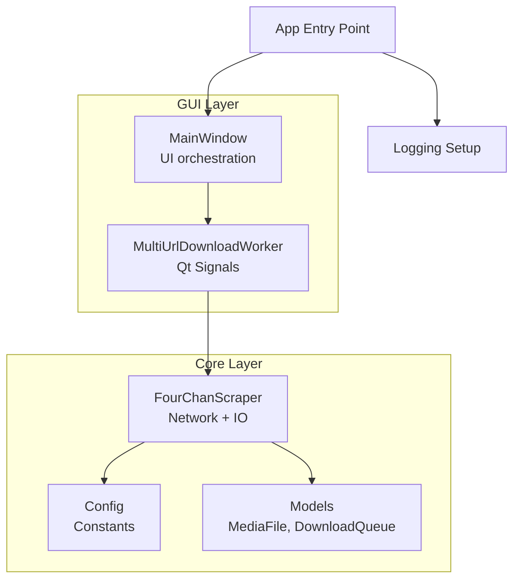
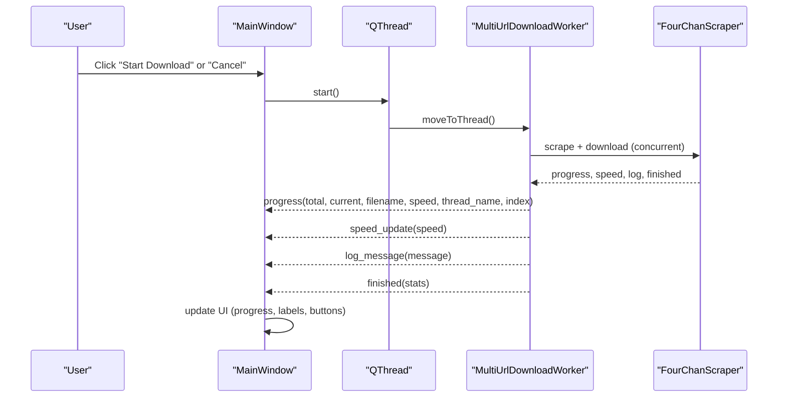
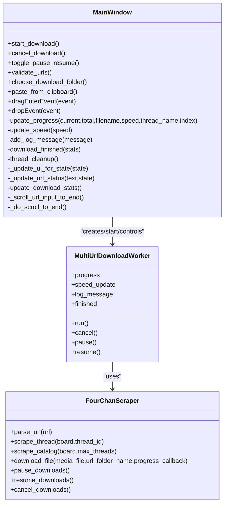

# MainWindow API

<cite>
**Referenced Files in This Document**
- [main_window.py](file://4Charm/src/four_charm/gui/main_window.py)
- [workers.py](file://4Charm/src/four_charm/gui/workers.py)
- [scraper.py](file://4Charm/src/four_charm/core/scraper.py)
- [models.py](file://4Charm/src/four_charm/core/models.py)
- [config.py](file://4Charm/src/four_charm/config.py)
- [logging_setup.py](file://4Charm/src/four_charm/utils/logging_setup.py)
- [main.py](file://4Charm/src/four_charm/main.py)
</cite>

## Table of Contents
1. [Introduction](#introduction)
2. [Project Structure](#project-structure)
3. [Core Components](#core-components)
4. [Architecture Overview](#architecture-overview)
5. [Detailed Component Analysis](#detailed-component-analysis)
6. [Dependency Analysis](#dependency-analysis)
7. [Performance Considerations](#performance-considerations)
8. [Troubleshooting Guide](#troubleshooting-guide)
9. [Conclusion](#conclusion)
10. [Appendices](#appendices)

## Introduction
This document provides comprehensive API documentation for the MainWindow class, focusing on public methods, signals/slots, UI component access, layout and responsiveness, threading integration, drag-and-drop and clipboard handling, accessibility and internationalization considerations, and practical integration examples for external scripts or extensions.

## Project Structure
The MainWindow class resides in the GUI layer and orchestrates user interactions, UI updates, and coordination with background workers. It integrates with the core scraping logic and configuration.

**Diagram sources**
- [main_window.py](file://4Charm/src/four_charm/gui/main_window.py#L40-L120)
- [workers.py](file://4Charm/src/four_charm/gui/workers.py#L143-L210)
- [scraper.py](file://4Charm/src/four_charm/core/scraper.py#L19-L64)
- [config.py](file://4Charm/src/four_charm/config.py#L4-L24)
- [models.py](file://4Charm/src/four_charm/core/models.py#L11-L20)
- [logging_setup.py](file://4Charm/src/four_charm/utils/logging_setup.py#L6-L38)
- [main.py](file://4Charm/src/four_charm/main.py#L37-L51)

**Section sources**
- [main_window.py](file://4Charm/src/four_charm/gui/main_window.py#L40-L120)
- [main.py](file://4Charm/src/four_charm/main.py#L37-L51)

## Core Components
- MainWindow: Central UI controller managing layout, user actions, and worker lifecycle.
- MultiUrlDownloadWorker: Qt-based worker emitting signals for progress, logs, speed, and completion.
- FourChanScraper: Core logic for URL parsing, scraping, and downloading with concurrency and rate limiting.
- Models: Data structures for queue management and media metadata.
- Config: Tunable constants for concurrency, timeouts, and limits.
- Logging: Centralized logging setup for diagnostics.

**Section sources**
- [main_window.py](file://4Charm/src/four_charm/gui/main_window.py#L40-L120)
- [workers.py](file://4Charm/src/four_charm/gui/workers.py#L143-L210)
- [scraper.py](file://4Charm/src/four_charm/core/scraper.py#L19-L64)
- [models.py](file://4Charm/src/four_charm/core/models.py#L11-L20)
- [config.py](file://4Charm/src/four_charm/config.py#L4-L24)
- [logging_setup.py](file://4Charm/src/four_charm/utils/logging_setup.py#L6-L38)

## Architecture Overview
The MainWindow coordinates UI state and user actions, delegates heavy work to MultiUrlDownloadWorker via a dedicated QThread, and updates UI elements in response to emitted signals. The worker uses FourChanScraper to perform scraping and downloads, reporting progress and completion back to the UI.

**Diagram sources**
- [main_window.py](file://4Charm/src/four_charm/gui/main_window.py#L488-L569)
- [workers.py](file://4Charm/src/four_charm/gui/workers.py#L143-L308)
- [scraper.py](file://4Charm/src/four_charm/core/scraper.py#L365-L547)

## Detailed Component Analysis

### MainWindow Public API

- start_download()
  - Purpose: Initiate a multi-URL download session.
  - Behavior:
    - Validates enabled state of the start/cancel button.
    - Reads URLs from the input widget, strips numbering, and parses valid URLs.
    - Prompts for a download folder if not set.
    - Creates a QThread and MultiUrlDownloadWorker, moves worker to thread, connects signals, starts thread.
    - Clears log, updates UI state to “downloading”, and displays status.
  - Side effects:
    - Starts background thread and worker.
    - Emits signals to update progress, speed, logs, and completion.
  - Notes: Enforces a maximum URL count during validation.

  **Section sources**
  - [main_window.py](file://4Charm/src/four_charm/gui/main_window.py#L488-L569)

- cancel_download()
  - Purpose: Request cancellation of the current download.
  - Behavior:
    - Calls worker.cancel() to signal cancellation.
    - Updates UI to reflect cancellation state.
  - Side effects:
    - Worker stops downloading and emits completion with current stats.

  **Section sources**
  - [main_window.py](file://4Charm/src/four_charm/gui/main_window.py#L551-L569)
  - [workers.py](file://4Charm/src/four_charm/gui/workers.py#L322-L330)

- pause_download()
  - Purpose: Toggle pause/resume state.
  - Behavior:
    - Toggles internal flag and calls worker.pause()/resume().
    - Updates UI state accordingly (“paused” vs “downloading”).
  - Side effects:
    - Worker pauses/resumes downloads; UI reflects state change.

  **Section sources**
  - [main_window.py](file://4Charm/src/four_charm/gui/main_window.py#L579-L591)
  - [workers.py](file://4Charm/src/four_charm/gui/workers.py#L325-L330)

- UI Access Methods
  - URL input and validation:
    - url_input: QTextEdit for multi-line URL entries.
    - validate_urls(): Real-time validation and auto-numbering; updates URL counter and enables/disables start button.
  - Controls:
    - start_cancel_btn: QPushButton toggles between “Start Download” and “Cancel”.
    - pause_resume_btn: QPushButton toggles pause/resume.
    - clear_btn: QPushButton clears URL input.
    - folder_btn: QPushButton opens folder selection dialog.
  - Progress and logs:
    - progress_bar: QProgressBar for overall progress.
    - progress_label: QLabel for detailed progress text.
    - speed_label: QLabel for instantaneous speed.
    - log_text: QTextEdit for activity log.
  - Statistics:
    - folders_label, files_label, size_label: QLabel for folder/file/size stats.
  - Status bar:
    - status_bar: QStatusBar for status messages and color-coded feedback.

  **Section sources**
  - [main_window.py](file://4Charm/src/four_charm/gui/main_window.py#L121-L356)
  - [main_window.py](file://4Charm/src/four_charm/gui/main_window.py#L362-L385)

- Signals and Slots
  - Signals exposed by MultiUrlDownloadWorker:
    - progress(current, total, filename, speed, thread_name, index)
    - speed_update(speed)
    - log_message(message)
    - finished(stats)
  - Slots connected in MainWindow:
    - update_progress(...)
    - update_speed(speed)
    - add_log_message(message)
    - download_finished(stats)
    - thread_cleanup()

  **Section sources**
  - [workers.py](file://4Charm/src/four_charm/gui/workers.py#L143-L152)
  - [main_window.py](file://4Charm/src/four_charm/gui/main_window.py#L536-L545)

- Drag-and-Drop and Clipboard
  - Drag-and-drop:
    - accept drops with text MIME; extracts URLs, filters 4chan URLs, auto-numbers, validates.
  - Clipboard:
    - Paste shortcut triggers paste_from_clipboard(), extracts 4chan URLs from clipboard text, inserts formatted URLs, validates, scrolls to end.

  **Section sources**
  - [main_window.py](file://4Charm/src/four_charm/gui/main_window.py#L757-L787)
  - [main_window.py](file://4Charm/src/four_charm/gui/main_window.py#L712-L750)

- Layout Management and Responsiveness
  - Uses QVBoxLayout/HBoxLayout for main layout and grouped sections.
  - QGroupBox frames for logical grouping with custom styling.
  - QTextEdit configured with scrollbars, placeholder text, and fixed min/max heights for consistent layout.
  - QProgressBar and QLabel for progress display.
  - Status bar for contextual messages.

  **Section sources**
  - [main_window.py](file://4Charm/src/four_charm/gui/main_window.py#L89-L356)

- Threading and Synchronization
  - QThread lifecycle:
    - MainWindow creates QThread and MultiUrlDownloadWorker, moves worker to thread, connects signals, starts thread, quits thread on completion, cleans up references.
  - Worker-to-UI synchronization:
    - Worker emits signals; MainWindow updates UI safely on the main thread.
  - Worker controls:
    - cancel(), pause(), resume() delegate to FourChanScraper’s state flags.

  **Section sources**
  - [main_window.py](file://4Charm/src/four_charm/gui/main_window.py#L532-L549)
  - [workers.py](file://4Charm/src/four_charm/gui/workers.py#L322-L330)
  - [scraper.py](file://4Charm/src/four_charm/core/scraper.py#L548-L557)

- Accessibility and Internationalization
  - Accessibility:
    - Uses native widgets with built-in keyboard navigation and focus indicators.
    - Shortcuts for paste, start, and escape improve accessibility.
  - Internationalization:
    - No explicit i18n infrastructure is present in the codebase; labels and messages are static strings.

  **Section sources**
  - [main_window.py](file://4Charm/src/four_charm/gui/main_window.py#L362-L385)

### Integration Examples

- Starting a download programmatically:
  - Steps:
    - Populate MainWindow.url_input with URLs (one per line).
    - Optionally set MainWindow.scraper.download_dir.
    - Call MainWindow.start_download().

  **Section sources**
  - [main_window.py](file://4Charm/src/four_charm/gui/main_window.py#L488-L569)

- Cancelling a download programmatically:
  - Steps:
    - Call MainWindow.cancel_download().

  **Section sources**
  - [main_window.py](file://4Charm/src/four_charm/gui/main_window.py#L551-L569)

- Pausing/resuming programmatically:
  - Steps:
    - Call MainWindow.toggle_pause_resume() to flip state.

  **Section sources**
  - [main_window.py](file://4Charm/src/four_charm/gui/main_window.py#L579-L591)

- Extending UI with custom widgets:
  - Recommendations:
    - Add new widgets to the main layout in MainWindow.setup_ui().
    - Connect signals/slots via MainWindow.setup_connections() for user interactions.
    - Emit custom signals from MainWindow if needed and connect them to your UI.

  **Section sources**
  - [main_window.py](file://4Charm/src/four_charm/gui/main_window.py#L89-L120)
  - [main_window.py](file://4Charm/src/four_charm/gui/main_window.py#L362-L385)

- Menu integration:
  - The code does not define a menu bar; to add menus, extend MainWindow.setup_ui() to create QMenuBar and QMenu items, then connect actions to slots.

  **Section sources**
  - [main_window.py](file://4Charm/src/four_charm/gui/main_window.py#L89-L120)

## Dependency Analysis

**Diagram sources**
- [main_window.py](file://4Charm/src/four_charm/gui/main_window.py#L488-L569)
- [workers.py](file://4Charm/src/four_charm/gui/workers.py#L143-L308)
- [scraper.py](file://4Charm/src/four_charm/core/scraper.py#L222-L547)

**Section sources**
- [main_window.py](file://4Charm/src/four_charm/gui/main_window.py#L488-L569)
- [workers.py](file://4Charm/src/four_charm/gui/workers.py#L143-L308)
- [scraper.py](file://4Charm/src/four_charm/core/scraper.py#L222-L547)

## Performance Considerations
- Concurrency:
  - Config.MAX_WORKERS determines thread pool size for downloads.
- Rate limiting:
  - FourChanScraper adapts delays based on success/failure and handles 429 responses.
- Disk space checks:
  - Pre-checks available space to avoid wasted I/O.
- Progress updates:
  - Worker calculates average speed periodically and emits updates.

**Section sources**
- [config.py](file://4Charm/src/four_charm/config.py#L4-L24)
- [scraper.py](file://4Charm/src/four_charm/core/scraper.py#L65-L74)
- [scraper.py](file://4Charm/src/four_charm/core/scraper.py#L210-L221)
- [workers.py](file://4Charm/src/four_charm/gui/workers.py#L277-L287)

## Troubleshooting Guide
- No URLs detected:
  - Ensure URLs are pasted or dropped with valid 4chan domains; validation enforces a maximum URL count.
- Download folder not set:
  - The app prompts for a folder when starting; ensure a valid directory is chosen.
- Cancel not responding:
  - Verify a download is running; cancel_download() only affects an active session.
- Pause/resume not working:
  - Ensure a worker exists and is running; toggle_pause_resume() flips internal state and calls worker.pause()/resume().

**Section sources**
- [main_window.py](file://4Charm/src/four_charm/gui/main_window.py#L499-L516)
- [main_window.py](file://4Charm/src/four_charm/gui/main_window.py#L551-L569)
- [main_window.py](file://4Charm/src/four_charm/gui/main_window.py#L579-L591)

## Conclusion
MainWindow provides a robust, threaded UI for multi-URL 4chan media downloads. It exposes clear public methods for starting, pausing, resuming, and cancelling downloads, and synchronizes UI updates via Qt signals. The architecture cleanly separates UI concerns from core scraping and download logic, enabling straightforward extension and maintenance.

## Appendices

### API Reference Summary

- Methods
  - start_download(): Initiates multi-URL download.
  - cancel_download(): Requests cancellation of active download.
  - toggle_pause_resume(): Toggles pause/resume state.
  - validate_urls(): Validates and auto-numbers URLs; updates counters and button state.
  - choose_download_folder(): Opens folder selection dialog and sets download directory.
  - paste_from_clipboard(): Extracts and inserts valid 4chan URLs from clipboard.
  - dragEnterEvent(event): Accepts text drops.
  - dropEvent(event): Processes dropped URLs, auto-numbers, validates.

- Signals (from MultiUrlDownloadWorker)
  - progress(current, total, filename, speed, thread_name, index)
  - speed_update(speed)
  - log_message(message)
  - finished(stats)

- UI Elements (accessors)
  - url_input, start_cancel_btn, pause_resume_btn, clear_btn, folder_btn
  - progress_bar, progress_label, speed_label
  - log_text
  - folders_label, files_label, size_label
  - status_bar

**Section sources**
- [main_window.py](file://4Charm/src/four_charm/gui/main_window.py#L362-L385)
- [main_window.py](file://4Charm/src/four_charm/gui/main_window.py#L488-L569)
- [workers.py](file://4Charm/src/four_charm/gui/workers.py#L143-L152)