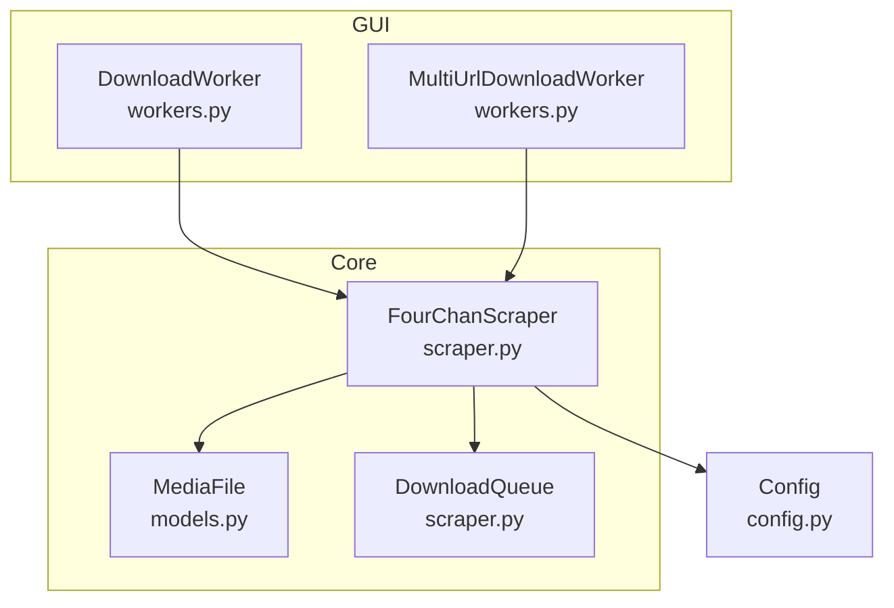
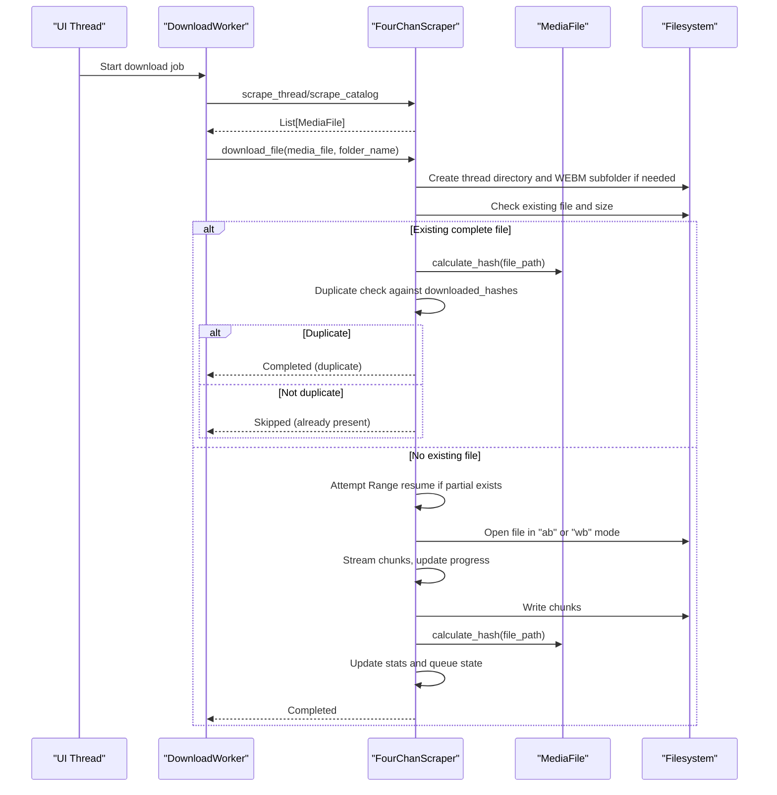
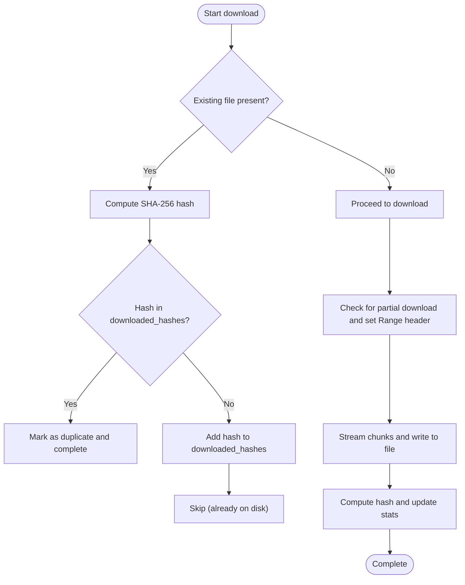
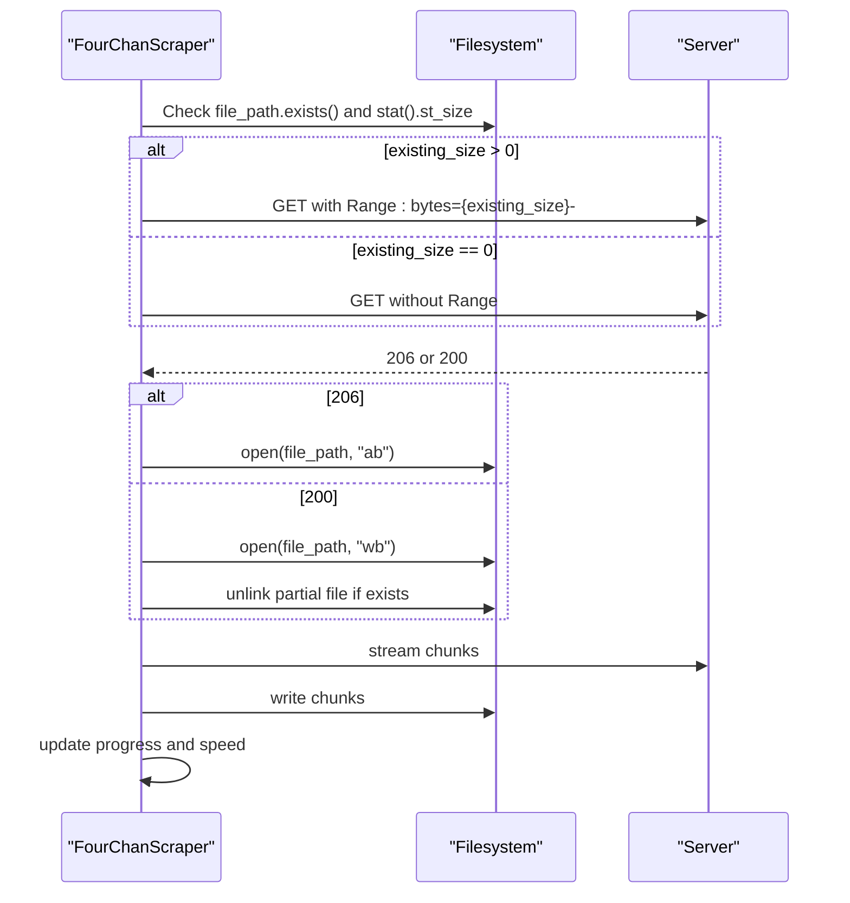
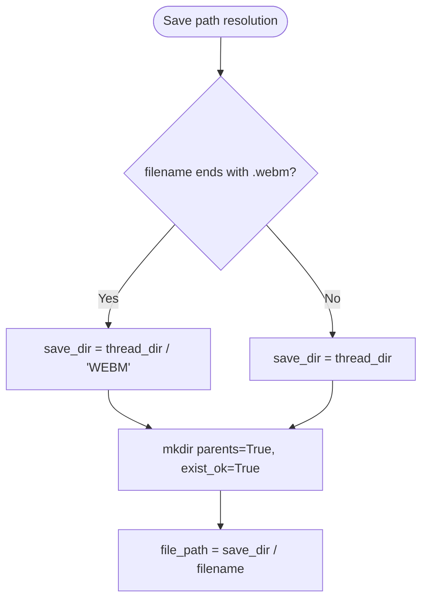
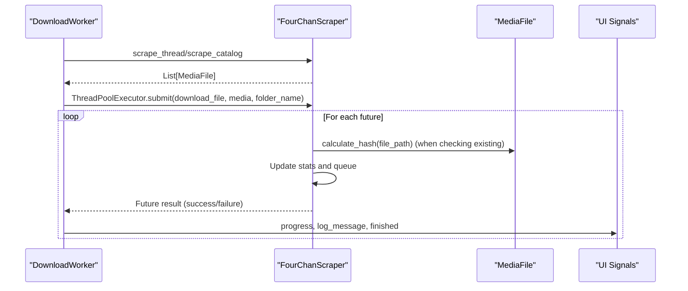
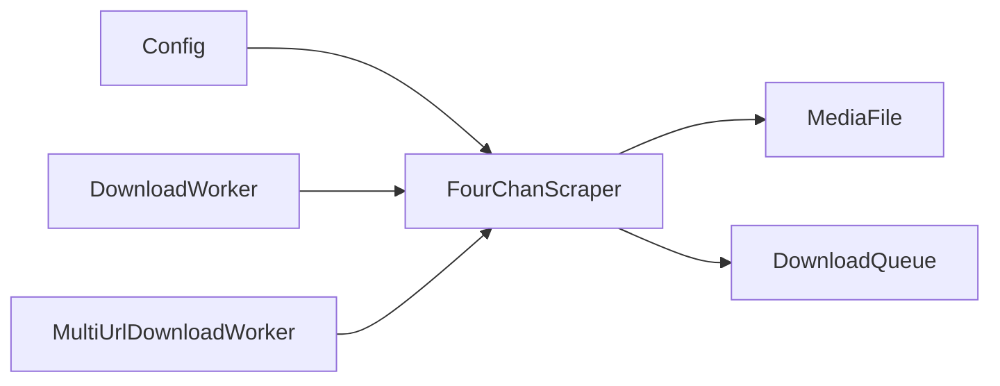

# MediaFile API

<cite>
**Referenced Files in This Document**
- [models.py](file://4Charm/src/four_charm/core/models.py)
- [scraper.py](file://4Charm/src/four_charm/core/scraper.py)
- [workers.py](file://4Charm/src/four_charm/gui/workers.py)
- [config.py](file://4Charm/src/four_charm/config.py)
</cite>

## Table of Contents
1. [Introduction](#introduction)
2. [Project Structure](#project-structure)
3. [Core Components](#core-components)
4. [Architecture Overview](#architecture-overview)
5. [Detailed Component Analysis](#detailed-component-analysis)
6. [Dependency Analysis](#dependency-analysis)
7. [Performance Considerations](#performance-considerations)
8. [Troubleshooting Guide](#troubleshooting-guide)
9. [Conclusion](#conclusion)
10. [Appendices](#appendices)

## Introduction
This document provides comprehensive documentation for the MediaFile class used in the 4Charm project. It explains the class’s properties, lifecycle, and methods for file operations, details the duplicate detection mechanism using SHA-256 hashing, and describes partial download resumption. It also covers file organization logic for WEBM files, integration with downloader worker threads, state transitions during downloads, and guidance for extending the class with additional metadata or custom naming schemes.

## Project Structure
The MediaFile class resides in the core module alongside the downloader logic and GUI worker threads. The key files involved are:
- Core model and downloader: models.py, scraper.py
- Worker threads: workers.py
- Configuration: config.py

**Diagram sources**
- [models.py](file://4Charm/src/four_charm/core/models.py#L91-L113)
- [scraper.py](file://4Charm/src/four_charm/core/scraper.py#L1-L120)
- [workers.py](file://4Charm/src/four_charm/gui/workers.py#L1-L120)
- [config.py](file://4Charm/src/four_charm/config.py#L1-L48)

**Section sources**
- [models.py](file://4Charm/src/four_charm/core/models.py#L91-L113)
- [scraper.py](file://4Charm/src/four_charm/core/scraper.py#L1-L120)
- [workers.py](file://4Charm/src/four_charm/gui/workers.py#L1-L120)
- [config.py](file://4Charm/src/four_charm/config.py#L1-L48)

## Core Components
- MediaFile: Represents a downloadable media file with URL, filename, board/thread metadata, size, download state, speed, timing, and hash.
- FourChanScraper: Orchestrates scraping, download scheduling, duplicate detection, partial resume, and progress reporting.
- DownloadWorker/MultiUrlDownloadWorker: Run concurrent downloads using worker threads and report progress.
- Config: Provides constants for chunk sizes, timeouts, retries, and media extensions.

Key responsibilities:
- MediaFile: Holds state and provides hash calculation.
- FourChanScraper: Creates directories, decides file placement, performs duplicate checks, resumes partial downloads, updates stats, and manages queue state.
- Workers: Submit downloads to the scraper and receive progress updates.

**Section sources**
- [models.py](file://4Charm/src/four_charm/core/models.py#L91-L113)
- [scraper.py](file://4Charm/src/four_charm/core/scraper.py#L365-L546)
- [workers.py](file://4Charm/src/four_charm/gui/workers.py#L1-L120)
- [config.py](file://4Charm/src/four_charm/config.py#L1-L48)

## Architecture Overview
The MediaFile class integrates with the downloader pipeline as follows:
- Workers submit MediaFile instances to FourChanScraper.download_file.
- The scraper determines save directories (including WEBM subfolders), checks for existing files, resumes partial downloads, calculates hashes, and updates stats and queue state.

**Diagram sources**
- [workers.py](file://4Charm/src/four_charm/gui/workers.py#L1-L120)
- [scraper.py](file://4Charm/src/four_charm/core/scraper.py#L365-L546)
- [models.py](file://4Charm/src/four_charm/core/models.py#L91-L113)

## Detailed Component Analysis

### MediaFile Class
MediaFile encapsulates the essential properties and capabilities for a downloadable media file.

Properties
- url: str
  - The download URL for the media resource.
- filename: str
  - The sanitized filename used for saving the file.
- board: str
  - Board identifier extracted from the source URL.
- thread_id: str
  - Thread identifier extracted from the source URL.
- size: int
  - Size of the downloaded file in bytes.
- downloaded: bool
  - Indicates whether the file was successfully downloaded.
- download_speed: float
  - Current download throughput in MiB/s.
- start_time: Optional[float]
  - Timestamp when the download started.
- hash: Optional[str]
  - SHA-256 hash of the downloaded file used for duplicate detection.

Methods
- calculate_hash(file_path: Path) -> str
  - Computes the SHA-256 hash of the file using streaming reads sized by Config.CHUNK_SIZE.

Lifecycle states
- Created: Properties initialized via constructor.
- Downloaded: size and downloaded set after successful completion; hash may be populated.
- Resumed: start_time and download_speed updated during streaming.
- Skipped/Duplicate: Marked as downloaded without re-downloading when a matching hash is found.

Notes
- The class does not define generate_filename or validate_download methods in the provided source. These are typically handled by the scraper’s filename sanitization and validation logic.

**Section sources**
- [models.py](file://4Charm/src/four_charm/core/models.py#L91-L113)
- [config.py](file://4Charm/src/four_charm/config.py#L1-L48)

### Duplicate Detection Mechanism (SHA-256)
Duplicate detection relies on SHA-256 hashing:
- Before writing a new file, the scraper checks if a file with the same name already exists and has a positive size.
- If so, it computes the file’s SHA-256 hash and compares it against a set of previously downloaded hashes.
- If the hash is already present, the download is marked as completed without re-downloading.
- If not present, the hash is added to the set and the file is skipped (already present on disk).

**Diagram sources**
- [scraper.py](file://4Charm/src/four_charm/core/scraper.py#L408-L526)
- [models.py](file://4Charm/src/four_charm/core/models.py#L105-L111)

**Section sources**
- [scraper.py](file://4Charm/src/four_charm/core/scraper.py#L408-L526)
- [models.py](file://4Charm/src/four_charm/core/models.py#L105-L111)

### Partial Download Resumption
Partial download resumption is supported:
- If a file exists and has a positive size, the scraper sets a Range header to resume from the existing offset.
- If the server responds with 206 Partial Content, the file is opened in append mode; otherwise, it is overwritten.
- Progress and speed are computed during streaming.

**Diagram sources**
- [scraper.py](file://4Charm/src/four_charm/core/scraper.py#L441-L501)

**Section sources**
- [scraper.py](file://4Charm/src/four_charm/core/scraper.py#L441-L501)

### File Organization Logic (WEBM Separation)
Files are organized into directories based on their extension:
- WEBM files are placed under a dedicated subfolder named WEBM within the thread directory.
- Other media types are saved directly into the thread directory.

**Diagram sources**
- [scraper.py](file://4Charm/src/four_charm/core/scraper.py#L399-L407)

**Section sources**
- [scraper.py](file://4Charm/src/four_charm/core/scraper.py#L399-L407)

### Integration with Downloader Worker Threads
Workers coordinate with the scraper:
- DownloadWorker and MultiUrlDownloadWorker submit MediaFile instances to FourChanScraper.download_file.
- They emit progress signals and aggregate average speeds.
- The scraper updates queue state and statistics, and marks completion or failure accordingly.

**Diagram sources**
- [workers.py](file://4Charm/src/four_charm/gui/workers.py#L1-L120)
- [scraper.py](file://4Charm/src/four_charm/core/scraper.py#L365-L546)
- [models.py](file://4Charm/src/four_charm/core/models.py#L91-L113)

**Section sources**
- [workers.py](file://4Charm/src/four_charm/gui/workers.py#L1-L120)
- [scraper.py](file://4Charm/src/four_charm/core/scraper.py#L365-L546)
- [models.py](file://4Charm/src/four_charm/core/models.py#L91-L113)

### Examples: Creating and Manipulating MediaFile Instances
- Constructing MediaFile:
  - Use the constructor with url, filename, and optional board and thread_id.
  - Example path: [constructor](file://4Charm/src/four_charm/core/models.py#L94-L104)
- Calculating hash:
  - Call calculate_hash(file_path) to compute SHA-256 for duplicate detection.
  - Example path: [calculate_hash](file://4Charm/src/four_charm/core/models.py#L105-L111)
- Using in scraper:
  - MediaFile instances are created during scraping and passed to download_file.
  - Example path: [extract_media_from_posts](file://4Charm/src/four_charm/core/scraper.py#L308-L327)

Note: There is no generate_filename or validate_download method defined in the MediaFile class in the provided source. Filename sanitization and validation are performed by the scraper’s sanitize_filename and related logic.

**Section sources**
- [models.py](file://4Charm/src/four_charm/core/models.py#L91-L113)
- [scraper.py](file://4Charm/src/four_charm/core/scraper.py#L308-L327)

### Extending MediaFile with Additional Metadata or Custom Naming Schemes
Guidance for extending MediaFile:
- Adding metadata fields:
  - Extend the constructor to accept and store additional attributes (e.g., creation_time, uploader, tags).
  - Update hashing or duplicate logic if needed.
- Custom naming schemes:
  - Override or complement filename generation in the scraper’s sanitize_filename and build_* folder name methods.
  - Ensure compatibility with filesystem limits and reserved names.
- Hash customization:
  - If changing hashing algorithm, update calculate_hash and ensure consistency across the application.

References for current behavior:
- Constructor and hash method: [MediaFile](file://4Charm/src/four_charm/core/models.py#L91-L113)
- Filename sanitization: [sanitize_filename](file://4Charm/src/four_charm/core/scraper.py#L133-L171)
- Folder naming: [build_session_base_name](file://4Charm/src/four_charm/core/scraper.py#L178-L193), [build_thread_folder_name](file://4Charm/src/four_charm/core/scraper.py#L194-L209)

**Section sources**
- [models.py](file://4Charm/src/four_charm/core/models.py#L91-L113)
- [scraper.py](file://4Charm/src/four_charm/core/scraper.py#L133-L209)

## Dependency Analysis
- MediaFile depends on:
  - hashlib for SHA-256 hashing.
  - Config.CHUNK_SIZE for streaming read granularity.
- FourChanScraper depends on:
  - MediaFile for state and hashing.
  - Config for timeouts, retries, chunk size, and media extensions.
  - DownloadQueue for queue management.
- Workers depend on:
  - FourChanScraper for download orchestration and progress callbacks.

**Diagram sources**
- [config.py](file://4Charm/src/four_charm/config.py#L1-L48)
- [scraper.py](file://4Charm/src/four_charm/core/scraper.py#L1-L120)
- [models.py](file://4Charm/src/four_charm/core/models.py#L91-L113)
- [workers.py](file://4Charm/src/four_charm/gui/workers.py#L1-L120)

**Section sources**
- [config.py](file://4Charm/src/four_charm/config.py#L1-L48)
- [scraper.py](file://4Charm/src/four_charm/core/scraper.py#L1-L120)
- [models.py](file://4Charm/src/four_charm/core/models.py#L91-L113)
- [workers.py](file://4Charm/src/four_charm/gui/workers.py#L1-L120)

## Performance Considerations
- Hash calculation:
  - Streaming SHA-256 with Config.CHUNK_SIZE reduces memory overhead and improves responsiveness for large files.
  - Hash computation occurs after download completion; consider caching hashes if repeated checks are frequent.
- File I/O:
  - Using append mode for partial resumes avoids unnecessary overwrites.
  - Ensuring directories exist with parents=True and exist_ok=True prevents redundant mkdir calls.
- Concurrency:
  - Workers use ThreadPoolExecutor with Config.MAX_WORKERS to maximize throughput while respecting system resources.
- Progress updates:
  - Frequent progress callbacks can impact UI responsiveness; batching or throttling may be considered if needed.

[No sources needed since this section provides general guidance]

## Troubleshooting Guide
Common issues and resolutions:
- Insufficient disk space:
  - The scraper checks available space and fails early if below threshold.
  - Reference: [check_disk_space](file://4Charm/src/four_charm/core/scraper.py#L210-L221)
- Empty downloaded file:
  - If the final file size is zero, it is removed and an exception is raised.
  - Reference: [empty file handling](file://4Charm/src/four_charm/core/scraper.py#L503-L506)
- Rate limiting and retries:
  - The scraper adapts delays and retries on network errors; inspect logs for error categories.
  - Reference: [handle_network_error](file://4Charm/src/four_charm/core/scraper.py#L75-L132)
- Duplicate detection failures:
  - If hash calculation fails, warnings are logged and the file is still processed.
  - Reference: [hash calculation warning](file://4Charm/src/four_charm/core/scraper.py#L508-L515)
- Queue state transitions:
  - Verify queue operations for start, complete, and fail states.
  - Reference: [DownloadQueue](file://4Charm/src/four_charm/core/models.py#L11-L90)

**Section sources**
- [scraper.py](file://4Charm/src/four_charm/core/scraper.py#L210-L221)
- [scraper.py](file://4Charm/src/four_charm/core/scraper.py#L503-L515)
- [scraper.py](file://4Charm/src/four_charm/core/scraper.py#L75-L132)
- [models.py](file://4Charm/src/four_charm/core/models.py#L11-L90)

## Conclusion
MediaFile serves as a lightweight, stateful representation of a downloadable media asset, focusing on URL, filename, metadata, and hashing for duplicate detection. The downloader pipeline integrates MediaFile with robust file organization, partial resume, and concurrency, while maintaining clear state transitions and progress reporting. Extensibility is straightforward through constructor additions and scraper-side naming logic.

[No sources needed since this section summarizes without analyzing specific files]

## Appendices

### Property Reference
- url: str — Download URL
- filename: str — Sanitized filename
- board: str — Board identifier
- thread_id: str — Thread identifier
- size: int — Bytes written
- downloaded: bool — Completion flag
- download_speed: float — MiB/s
- start_time: Optional[float] — Timestamp
- hash: Optional[str] — SHA-256 hex digest

**Section sources**
- [models.py](file://4Charm/src/four_charm/core/models.py#L91-L113)

### Method Reference
- calculate_hash(file_path: Path) -> str — SHA-256 streaming hash

**Section sources**
- [models.py](file://4Charm/src/four_charm/core/models.py#L105-L111)