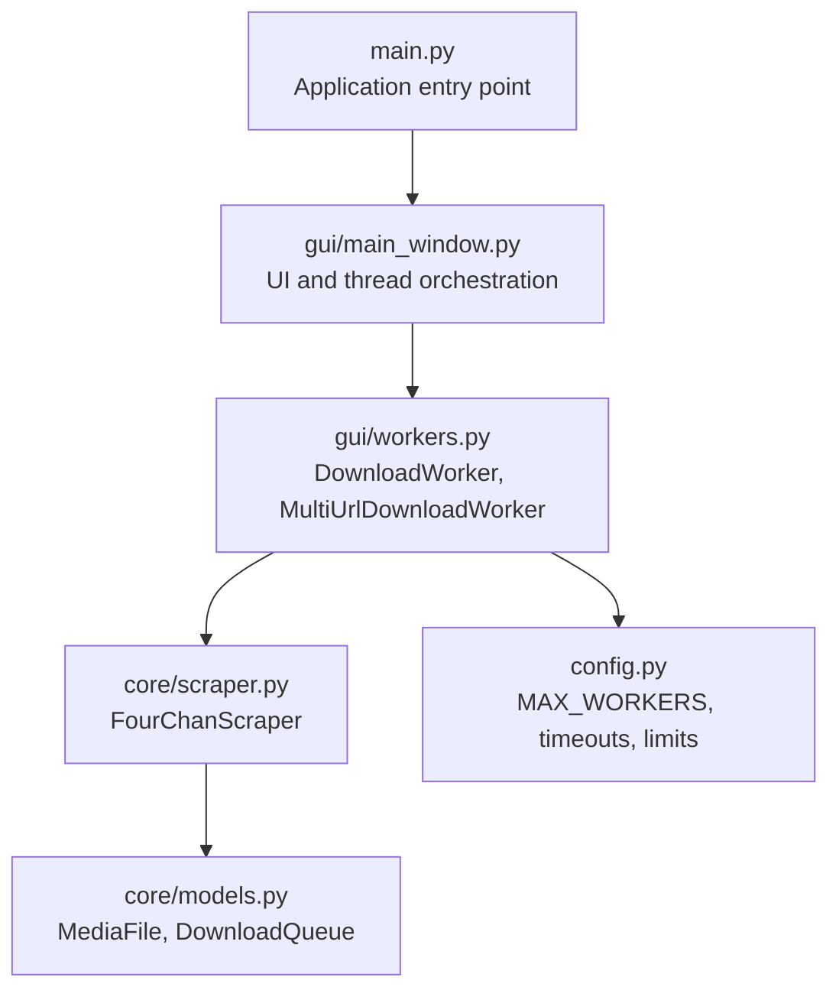
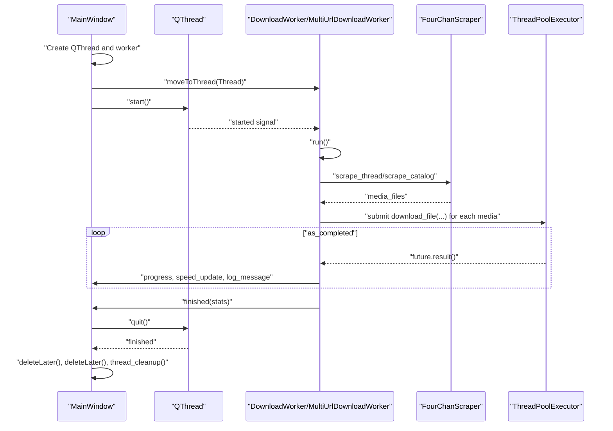
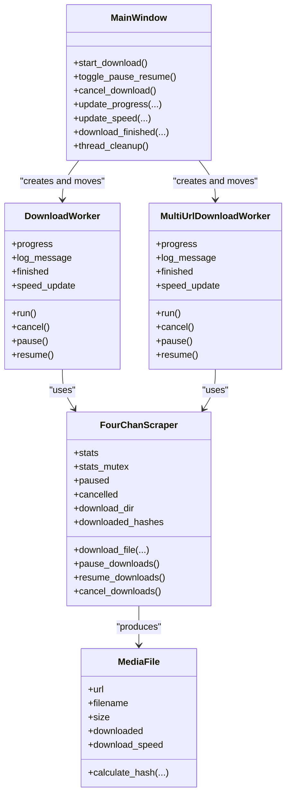

# Worker Threads API

<cite>
**Referenced Files in This Document**
- [workers.py](file://4Charm/src/four_charm/gui/workers.py)
- [scraper.py](file://4Charm/src/four_charm/core/scraper.py)
- [main_window.py](file://4Charm/src/four_charm/gui/main_window.py)
- [models.py](file://4Charm/src/four_charm/core/models.py)
- [config.py](file://4Charm/src/four_charm/config.py)
- [main.py](file://4Charm/src/four_charm/main.py)
</cite>

## Table of Contents
1. [Introduction](#introduction)
2. [Project Structure](#project-structure)
3. [Core Components](#core-components)
4. [Architecture Overview](#architecture-overview)
5. [Detailed Component Analysis](#detailed-component-analysis)
6. [Dependency Analysis](#dependency-analysis)
7. [Performance Considerations](#performance-considerations)
8. [Troubleshooting Guide](#troubleshooting-guide)
9. [Conclusion](#conclusion)
10. [Appendices](#appendices)

## Introduction
This document provides comprehensive API documentation for the worker thread classes used in the 4Charm application. It focuses on DownloadWorker and MultiUrlDownloadWorker, detailing their threading model using QThread and signal-based communication. It explains thread control methods (start, pause, resume, cancel), progress reporting, statistics aggregation, and integration with FourChanScraper. It also covers thread pool management, resource cleanup, error handling, and memory lifecycle considerations. Finally, it includes practical examples for creating custom worker classes that integrate seamlessly with the existing system.

## Project Structure
The worker APIs reside in the GUI layer and coordinate with the core scraping logic and configuration. The main application entry point initializes the Qt application and opens the main window, which orchestrates worker threads.

**Diagram sources**
- [main.py](file://4Charm/src/four_charm/main.py#L37-L51)
- [main_window.py](file://4Charm/src/four_charm/gui/main_window.py#L78-L88)
- [workers.py](file://4Charm/src/four_charm/gui/workers.py#L14-L330)
- [scraper.py](file://4Charm/src/four_charm/core/scraper.py#L19-L120)
- [models.py](file://4Charm/src/four_charm/core/models.py#L11-L113)
- [config.py](file://4Charm/src/four_charm/config.py#L1-L48)

**Section sources**
- [main.py](file://4Charm/src/four_charm/main.py#L37-L51)
- [main_window.py](file://4Charm/src/four_charm/gui/main_window.py#L78-L88)
- [workers.py](file://4Charm/src/four_charm/gui/workers.py#L14-L330)
- [scraper.py](file://4Charm/src/four_charm/core/scraper.py#L19-L120)
- [models.py](file://4Charm/src/four_charm/core/models.py#L11-L113)
- [config.py](file://4Charm/src/four_charm/config.py#L1-L48)

## Core Components
- DownloadWorker: Single-URL concurrent downloader that scrapes media from a thread or catalog and downloads them using a thread pool.
- MultiUrlDownloadWorker: Multi-URL concurrent downloader that aggregates media across multiple URLs and downloads them concurrently.
- FourChanScraper: Central coordinator for scraping, downloading, rate limiting, duplicate detection, and statistics.
- MediaFile and DownloadQueue: Data models for tracked downloads and duplicate detection.
- Config: Global constants controlling concurrency, timeouts, retries, and limits.

Key responsibilities:
- Thread orchestration: QThread lifecycle and signal emission.
- Progress reporting: Signals for progress, speed updates, logs, and completion.
- Statistics aggregation: Thread-safe accumulation of download metrics.
- Resource management: Cleanup of thread and worker references.

**Section sources**
- [workers.py](file://4Charm/src/four_charm/gui/workers.py#L14-L330)
- [scraper.py](file://4Charm/src/four_charm/core/scraper.py#L19-L120)
- [models.py](file://4Charm/src/four_charm/core/models.py#L11-L113)
- [config.py](file://4Charm/src/four_charm/config.py#L1-L48)

## Architecture Overview
The UI creates a QThread and moves a worker instance onto it. The worker emits signals for progress, speed, logs, and completion. The UI connects to these signals and updates the progress bar and status messages. The worker delegates actual scraping and downloading to FourChanScraper, which manages shared state and thread safety.

**Diagram sources**
- [main_window.py](file://4Charm/src/four_charm/gui/main_window.py#L528-L590)
- [workers.py](file://4Charm/src/four_charm/gui/workers.py#L27-L141)
- [workers.py](file://4Charm/src/four_charm/gui/workers.py#L158-L330)
- [scraper.py](file://4Charm/src/four_charm/core/scraper.py#L365-L547)

## Detailed Component Analysis

### DownloadWorker API
Purpose: Download media from a single parsed URL (thread or catalog) using a thread pool and report progress and statistics.

Public signals:
- progress(current: int, total: int, filename: str, avg_speed: float, extra: str, extra_int: int)
- log_message(message: str)
- finished(stats: dict)
- speed_update(speed: float)

Public methods:
- run(): Orchestrates scraping and concurrent downloads; emits signals; handles cancellation and exceptions.
- cancel(): Delegates cancellation to FourChanScraper.
- pause(): Delegates pausing to FourChanScraper.
- resume(): Delegates resuming to FourChanScraper.

Threading model:
- Inherits QObject and is moved onto a QThread via moveToThread.
- The QThread starts the worker’s run method automatically upon Thread.start().
- Signals are emitted from the worker thread and received on the main thread.

Thread control guarantees:
- cancel(): Sets a cancellation flag; subsequent download checks abort early.
- pause()/resume(): Toggle a paused flag; download loop sleeps until resumed or cancelled.
- run(): Periodically checks cancellation and pauses; exits gracefully.

Progress reporting:
- Emits progress with current count, total, filename, and average speed.
- Emits speed_update for live speed display.
- Emits log_message for user-visible feedback.

Statistics aggregation:
- Uses FourChanScraper.stats and stats_mutex for thread-safe updates.
- Aggregates downloaded, failed, skipped, duplicates, size_mb, and timing.

Error handling:
- Catches exceptions during scraping and download submission.
- Emits a log message and finishes with current stats.

Lifecycle:
- Worker is deleted via deleteLater() after Thread.finished.
- UI cleans up references in thread_cleanup().

**Section sources**
- [workers.py](file://4Charm/src/four_charm/gui/workers.py#L14-L141)
- [workers.py](file://4Charm/src/four_charm/gui/workers.py#L121-L141)
- [scraper.py](file://4Charm/src/four_charm/core/scraper.py#L47-L64)
- [scraper.py](file://4Charm/src/four_charm/core/scraper.py#L548-L557)
- [main_window.py](file://4Charm/src/four_charm/gui/main_window.py#L528-L590)

### MultiUrlDownloadWorker API
Purpose: Concurrently download media from multiple parsed URLs, aggregating totals and emitting per-URL progress.

Public signals:
- progress(current: int, total: int, filename: str, avg_speed: float, thread_name: str, url_index: int)
- log_message(message: str)
- finished(stats: dict)
- speed_update(speed: float)

Public methods:
- run(): Two-pass pipeline—first pass scrapes all URLs to compute totals; second pass submits all downloads to a thread pool and processes completions.
- cancel()/pause()/resume(): Same delegation semantics as DownloadWorker.

Threading model and lifecycle:
- Identical to DownloadWorker: QThread + moveToThread + started -> run().

Progress reporting:
- Emits progress with per-URL context (thread_name, url_index) for clarity.
- Emits speed_update and log_message.

Statistics aggregation:
- Uses FourChanScraper.stats and stats_mutex for thread-safe updates.
- Computes average speed over total time.

Error handling:
- Catches exceptions during scraping and download submission; logs and finishes with current stats.

**Section sources**
- [workers.py](file://4Charm/src/four_charm/gui/workers.py#L143-L330)
- [workers.py](file://4Charm/src/four_charm/gui/workers.py#L310-L330)
- [scraper.py](file://4Charm/src/four_charm/core/scraper.py#L47-L64)
- [scraper.py](file://4Charm/src/four_charm/core/scraper.py#L548-L557)
- [main_window.py](file://4Charm/src/four_charm/gui/main_window.py#L528-L590)

### FourChanScraper Integration
Responsibilities:
- Scraping: scrape_thread(), scrape_catalog(), get_thread_data(), get_catalog_data().
- Downloading: download_file() with retries, resume support, duplicate detection, and progress callback hook.
- Rate limiting: adaptive_delay(), handle_network_error(), smart backoff.
- Shared state: stats, stats_mutex, paused, cancelled, download_dir, downloaded_hashes, download_queue.

Signal-to-worker mapping:
- Workers call FourChanScraper methods and rely on its internal state for thread safety and coordination.
- Workers emit signals; UI updates progress and speed.

**Section sources**
- [scraper.py](file://4Charm/src/four_charm/core/scraper.py#L19-L120)
- [scraper.py](file://4Charm/src/four_charm/core/scraper.py#L248-L364)
- [scraper.py](file://4Charm/src/four_charm/core/scraper.py#L365-L547)
- [models.py](file://4Charm/src/four_charm/core/models.py#L11-L113)

### Threading Model and Signal Communication
- QThread lifecycle: Created in UI, worker moved to thread, started, run executed, finished signals trigger cleanup.
- Signal emission: Workers emit progress, log_message, speed_update, finished from worker thread; UI receives on main thread.
- Thread safety: FourChanScraper.stats_mutex protects shared statistics; pause/cancel flags are checked in tight loops.

**Section sources**
- [main_window.py](file://4Charm/src/four_charm/gui/main_window.py#L528-L590)
- [workers.py](file://4Charm/src/four_charm/gui/workers.py#L27-L141)
- [workers.py](file://4Charm/src/four_charm/gui/workers.py#L158-L330)
- [scraper.py](file://4Charm/src/four_charm/core/scraper.py#L47-L64)

### Progress Reporting Mechanism
- Current progress: emitted as (current, total, filename, avg_speed, thread_name, url_index).
- Average speed calculation: computed by workers using FourChanScraper.stats and stats_mutex.
- Live speed: emitted via speed_update for real-time UI updates.
- Logs: emitted via log_message for user feedback.

**Section sources**
- [workers.py](file://4Charm/src/four_charm/gui/workers.py#L90-L115)
- [workers.py](file://4Charm/src/four_charm/gui/workers.py#L277-L302)
- [workers.py](file://4Charm/src/four_charm/gui/workers.py#L121-L141)
- [workers.py](file://4Charm/src/four_charm/gui/workers.py#L310-L330)
- [main_window.py](file://4Charm/src/four_charm/gui/main_window.py#L627-L648)

### Thread Control Methods
- start: UI constructs QThread, moves worker, connects signals, and calls start().
- pause/resume: UI toggles pause state and calls worker.pause()/worker.resume(); FourChanScraper.paused controls download loop sleep.
- cancel: UI calls worker.cancel(); FourChanScraper.cancelled aborts ongoing downloads.

Thread-safety guarantees:
- Pause/resume toggles FourChanScraper.paused; download loop checks paused and cancelled flags periodically.
- Cancel sets FourChanScraper.cancelled; download loop checks cancelled and exits early.

**Section sources**
- [main_window.py](file://4Charm/src/four_charm/gui/main_window.py#L551-L590)
- [workers.py](file://4Charm/src/four_charm/gui/workers.py#L133-L141)
- [workers.py](file://4Charm/src/four_charm/gui/workers.py#L322-L329)
- [scraper.py](file://4Charm/src/four_charm/core/scraper.py#L548-L557)

### Statistics Aggregation
- Stats keys: total, downloaded, failed, skipped, size_mb, current_speed, start_time, duplicates.
- Thread-safe updates: protected by FourChanScraper.stats_mutex.
- Average speed: computed as size_mb / elapsed_time in workers’ _calculate_average_speed().

**Section sources**
- [scraper.py](file://4Charm/src/four_charm/core/scraper.py#L47-L64)
- [workers.py](file://4Charm/src/four_charm/gui/workers.py#L121-L141)
- [workers.py](file://4Charm/src/four_charm/gui/workers.py#L310-L330)

### Example: Creating a Custom Worker
Steps to integrate a new worker:
1. Subclass QObject and define signals for progress, logs, speed, and completion.
2. Accept a FourChanScraper instance in __init__.
3. Implement run() to:
   - Parse inputs and scrape media.
   - Submit downloads to ThreadPoolExecutor.
   - Emit progress, speed_update, and log_message.
   - Aggregate stats via FourChanScraper.stats and stats_mutex.
4. Implement cancel(), pause(), resume() to delegate to FourChanScraper.
5. In UI:
   - Create QThread and instantiate your worker.
   - Move worker to thread with moveToThread.
   - Connect signals to UI slots.
   - Connect Thread.started to worker.run.
   - Connect worker.finished to Thread.quit and cleanup handlers.
   - Call Thread.start() to begin.

Reference implementations:
- [workers.py](file://4Charm/src/four_charm/gui/workers.py#L14-L141)
- [workers.py](file://4Charm/src/four_charm/gui/workers.py#L143-L330)
- [main_window.py](file://4Charm/src/four_charm/gui/main_window.py#L528-L590)

**Section sources**
- [workers.py](file://4Charm/src/four_charm/gui/workers.py#L14-L141)
- [workers.py](file://4Charm/src/four_charm/gui/workers.py#L143-L330)
- [main_window.py](file://4Charm/src/four_charm/gui/main_window.py#L528-L590)

### Work Distribution and Results Collection
- Work distribution:
  - DownloadWorker: Scrape a single URL; submit all media to a thread pool.
  - MultiUrlDownloadWorker: Two passes—scrape all URLs to compute totals; submit all downloads to a thread pool.
- Results collection:
  - as_completed iterates over futures; each completion updates counters and emits progress.
  - On completion, finished(stats) is emitted with aggregated stats.

**Section sources**
- [workers.py](file://4Charm/src/four_charm/gui/workers.py#L55-L115)
- [workers.py](file://4Charm/src/four_charm/gui/workers.py#L160-L302)

### Thread Pool Management and Resource Cleanup
- Thread pool:
  - ThreadPoolExecutor(max_workers=Config.MAX_WORKERS) is used in both workers.
  - MAX_WORKERS is bounded by CPU cores and defaults to a small value to avoid overload.
- Cleanup:
  - UI connects worker.finished to Thread.quit.
  - Thread.finished triggers deleteLater() on worker and thread.
  - thread_cleanup() clears references to thread and worker.

**Section sources**
- [workers.py](file://4Charm/src/four_charm/gui/workers.py#L56-L62)
- [workers.py](file://4Charm/src/four_charm/gui/workers.py#L236-L247)
- [config.py](file://4Charm/src/four_charm/config.py#L1-L10)
- [main_window.py](file://4Charm/src/four_charm/gui/main_window.py#L528-L590)

### Error Handling and Exception Propagation
- Worker-level:
  - Exceptions in run() are caught; a log message is emitted and finished(stats) is emitted.
- Download-level:
  - download_file() retries with exponential backoff, marks failures, and updates stats.
  - handle_network_error() categorizes errors and adapts delay.
- UI-level:
  - UI updates status and progress; logs are appended to the UI log.

**Section sources**
- [workers.py](file://4Charm/src/four_charm/gui/workers.py#L115-L141)
- [workers.py](file://4Charm/src/four_charm/gui/workers.py#L304-L330)
- [scraper.py](file://4Charm/src/four_charm/core/scraper.py#L75-L132)
- [scraper.py](file://4Charm/src/four_charm/core/scraper.py#L528-L547)

### Memory Management and Lifecycle Events
- Worker lifecycle:
  - Created in UI, moved to QThread, runs run(), emits finished, then deleted via deleteLater().
- Thread lifecycle:
  - Thread.start() begins execution; finished signal triggers cleanup.
- References:
  - UI holds weak references to thread and worker; thread_cleanup() clears them.

**Section sources**
- [main_window.py](file://4Charm/src/four_charm/gui/main_window.py#L528-L590)
- [workers.py](file://4Charm/src/four_charm/gui/workers.py#L14-L141)
- [workers.py](file://4Charm/src/four_charm/gui/workers.py#L143-L330)

## Dependency Analysis

**Diagram sources**
- [main_window.py](file://4Charm/src/four_charm/gui/main_window.py#L528-L590)
- [workers.py](file://4Charm/src/four_charm/gui/workers.py#L14-L330)
- [scraper.py](file://4Charm/src/four_charm/core/scraper.py#L19-L120)
- [models.py](file://4Charm/src/four_charm/core/models.py#L92-L113)

**Section sources**
- [main_window.py](file://4Charm/src/four_charm/gui/main_window.py#L528-L590)
- [workers.py](file://4Charm/src/four_charm/gui/workers.py#L14-L330)
- [scraper.py](file://4Charm/src/four_charm/core/scraper.py#L19-L120)
- [models.py](file://4Charm/src/four_charm/core/models.py#L92-L113)

## Performance Considerations
- Concurrency: MAX_WORKERS bounds the thread pool size to balance throughput and resource usage.
- Rate limiting: adaptive_delay() and handle_network_error() reduce server pressure and improve resilience.
- Disk space checks: check_disk_space() prevents wasted I/O on low disk conditions.
- Resume support: download_file() resumes partial downloads to minimize bandwidth waste.
- Progress granularity: frequent speed updates enable responsive UI without excessive overhead.

[No sources needed since this section provides general guidance]

## Troubleshooting Guide
Common issues and resolutions:
- No media found: Verify URL parsing and that the board/thread exists.
- Insufficient disk space: Ensure adequate free space before starting downloads.
- Rate-limited by server: The scraper adapts delay; wait and retry.
- Paused/resumed downloads: Ensure toggle_pause_resume() is invoked and worker.pause()/resume() is called.
- Cancellation not taking effect: Ensure cancel_download() is called and worker.cancel() propagates to FourChanScraper.

**Section sources**
- [scraper.py](file://4Charm/src/four_charm/core/scraper.py#L210-L221)
- [scraper.py](file://4Charm/src/four_charm/core/scraper.py#L75-L132)
- [main_window.py](file://4Charm/src/four_charm/gui/main_window.py#L551-L590)
- [workers.py](file://4Charm/src/four_charm/gui/workers.py#L133-L141)
- [workers.py](file://4Charm/src/four_charm/gui/workers.py#L322-L329)

## Conclusion
The worker thread system in 4Charm provides a robust, signal-driven architecture for concurrent downloads. DownloadWorker and MultiUrlDownloadWorker encapsulate scraping and downloading logic, while FourChanScraper centralizes state and thread safety. The UI coordinates QThread lifecycles, signal connections, and cleanup, ensuring responsive and reliable operation. Following the provided patterns enables extending the system with custom workers that integrate seamlessly.

[No sources needed since this section summarizes without analyzing specific files]

## Appendices

### API Reference Summary

- DownloadWorker
  - Signals: progress, log_message, finished, speed_update
  - Methods: run(), cancel(), pause(), resume()

- MultiUrlDownloadWorker
  - Signals: progress, log_message, finished, speed_update
  - Methods: run(), cancel(), pause(), resume()

- FourChanScraper
  - Attributes: stats, stats_mutex, paused, cancelled, download_dir, downloaded_hashes
  - Methods: download_file(), pause_downloads(), resume_downloads(), cancel_downloads()

- MediaFile
  - Attributes: url, filename, size, downloaded, download_speed, hash
  - Methods: calculate_hash()

- Config
  - Constants: MAX_WORKERS, DOWNLOAD_TIMEOUT, MAX_RETRIES, CHUNK_SIZE, MEDIA_EXTENSIONS, USER_AGENT, etc.

**Section sources**
- [workers.py](file://4Charm/src/four_charm/gui/workers.py#L14-L330)
- [scraper.py](file://4Charm/src/four_charm/core/scraper.py#L19-L120)
- [models.py](file://4Charm/src/four_charm/core/models.py#L92-L113)
- [config.py](file://4Charm/src/four_charm/config.py#L1-L48)