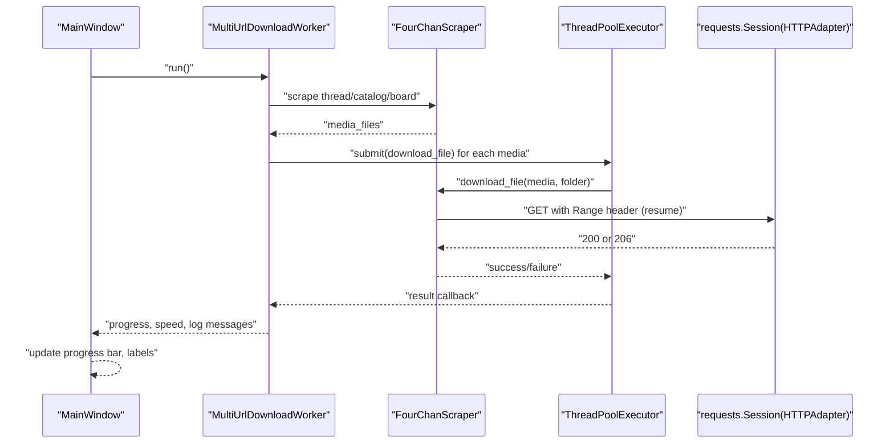
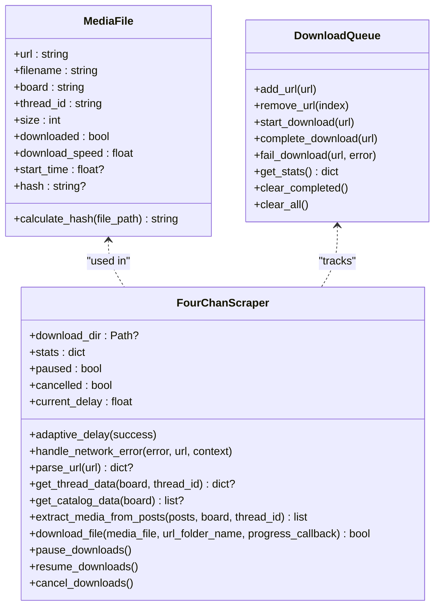
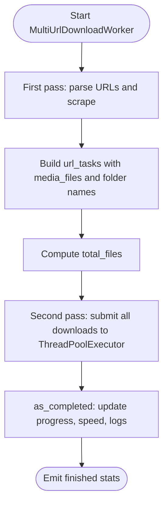
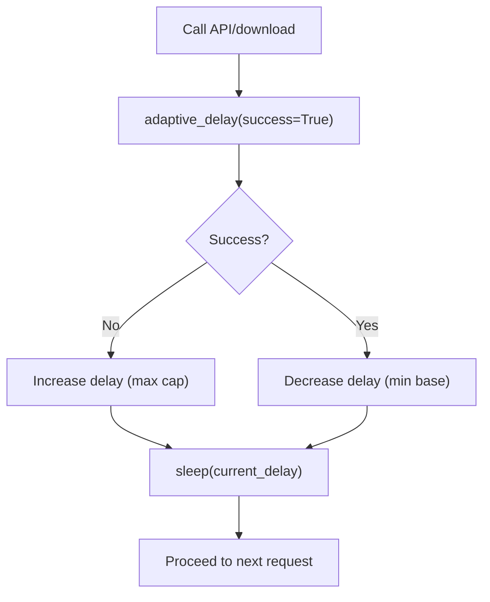
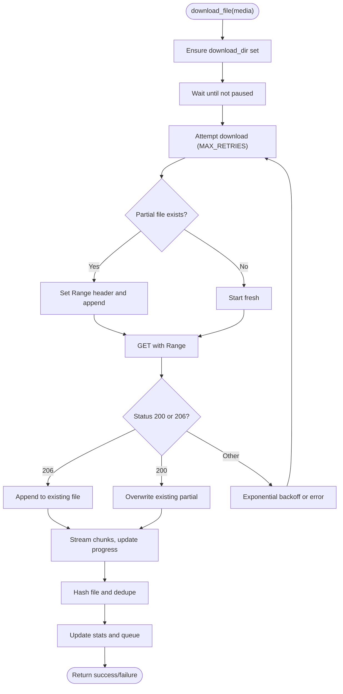
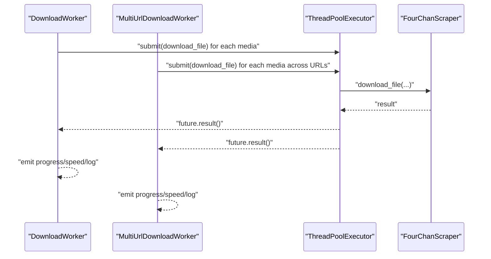
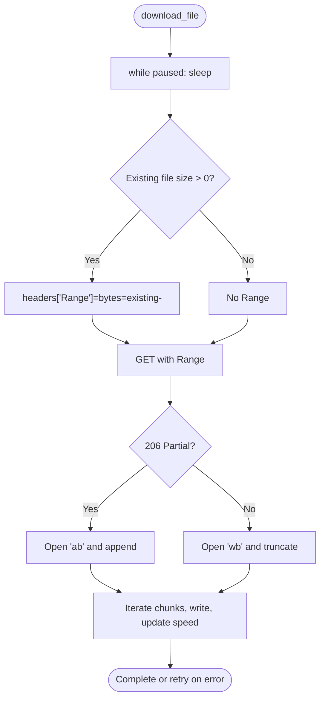
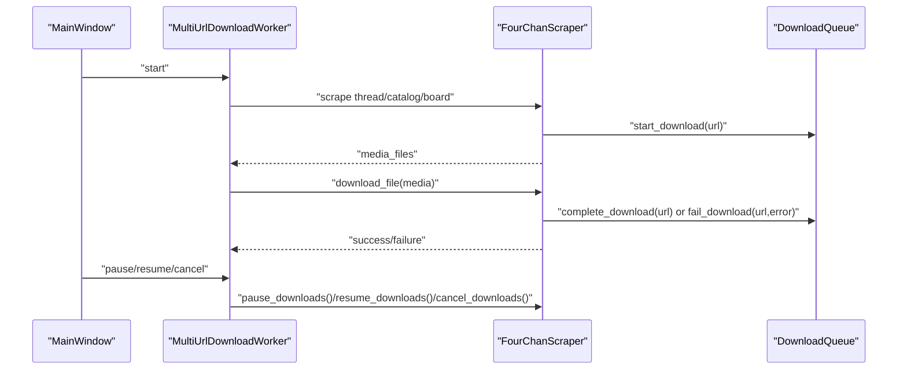
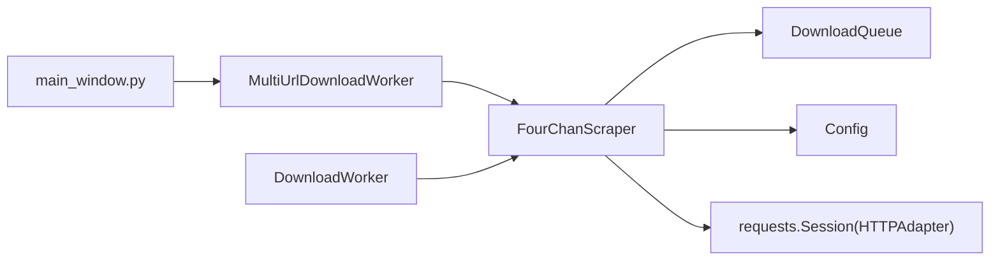

# Advanced Features

<cite>
**Referenced Files in This Document**
- [models.py](file://4Charm/src/four_charm/core/models.py)
- [scraper.py](file://4Charm/src/four_charm/core/scraper.py)
- [workers.py](file://4Charm/src/four_charm/gui/workers.py)
- [main_window.py](file://4Charm/src/four_charm/gui/main_window.py)
- [config.py](file://4Charm/src/four_charm/config.py)
</cite>

## Table of Contents
1. [Introduction](#introduction)
2. [Project Structure](#project-structure)
3. [Core Components](#core-components)
4. [Architecture Overview](#architecture-overview)
5. [Detailed Component Analysis](#detailed-component-analysis)
6. [Dependency Analysis](#dependency-analysis)
7. [Performance Considerations](#performance-considerations)
8. [Troubleshooting Guide](#troubleshooting-guide)
9. [Conclusion](#conclusion)

## Introduction
This document explains the Advanced Features implemented in the downloader, focusing on:
- Bulk downloading from multiple URL types (threads, catalogs, boards)
- Adaptive rate limiting that adjusts dynamically based on server responses
- Sophisticated error handling with retry mechanisms
- How MultiUrlDownloadWorker coordinates concurrent operations
- How ThreadPoolExecutor optimizes throughput
- Pause/resume functionality using HTTP Range requests and partial file detection
- Domain model for download states and the interaction between scraper and worker components
- Common issues such as rate limiting triggers and incomplete downloads, with practical solutions

## Project Structure
The advanced features span three primary areas:
- Core domain and scraping logic: URL parsing, media extraction, and download orchestration
- Worker orchestration: MultiUrlDownloadWorker and DownloadWorker manage concurrency and progress
- UI integration: MainWindow wires user actions to worker lifecycle and state updates

```mermaid
graph TB
subgraph "Core"
M["models.py<br/>DownloadQueue, MediaFile"]
S["scraper.py<br/>FourChanScraper"]
C["config.py<br/>Constants and limits"]
end
subgraph "Workers"
DW["workers.py<br/>DownloadWorker"]
MW["workers.py<br/>MultiUrlDownloadWorker"]
end
subgraph "UI"
UI["main_window.py<br/>MainWindow"]
end
UI --> MW
MW --> S
DW --> S
S --> M
S --> C
```

**Diagram sources**
- [models.py](file://4Charm/src/four_charm/core/models.py#L1-L113)
- [scraper.py](file://4Charm/src/four_charm/core/scraper.py#L1-L557)
- [workers.py](file://4Charm/src/four_charm/gui/workers.py#L1-L330)
- [main_window.py](file://4Charm/src/four_charm/gui/main_window.py#L1-L200)
- [config.py](file://4Charm/src/four_charm/config.py#L1-L48)

**Section sources**
- [models.py](file://4Charm/src/four_charm/core/models.py#L1-L113)
- [scraper.py](file://4Charm/src/four_charm/core/scraper.py#L1-L557)
- [workers.py](file://4Charm/src/four_charm/gui/workers.py#L1-L330)
- [main_window.py](file://4Charm/src/four_charm/gui/main_window.py#L1-L200)
- [config.py](file://4Charm/src/four_charm/config.py#L1-L48)

## Core Components
- DownloadQueue: Tracks queued, active, completed, and failed URLs and maintains history
- MediaFile: Represents a downloadable file with metadata and hashing support
- FourChanScraper: Orchestrates URL parsing, API calls, media extraction, and file downloads with adaptive rate limiting and robust error handling
- DownloadWorker and MultiUrlDownloadWorker: Run downloads in parallel using ThreadPoolExecutor, emit progress and logs, and support pause/resume/cancel
- MainWindow: Integrates UI controls, starts/stops workers, and displays progress and stats

**Section sources**
- [models.py](file://4Charm/src/four_charm/core/models.py#L1-L113)
- [scraper.py](file://4Charm/src/four_charm/core/scraper.py#L1-L557)
- [workers.py](file://4Charm/src/four_charm/gui/workers.py#L1-L330)
- [main_window.py](file://4Charm/src/four_charm/gui/main_window.py#L590-L787)
- [config.py](file://4Charm/src/four_charm/config.py#L1-L48)

## Architecture Overview
The system uses a Qt-based worker architecture with a dedicated scraper service. Workers submit jobs to a shared ThreadPoolExecutor, which executes downloads concurrently. The scraper encapsulates HTTP session configuration, rate limiting, and retry logic, while the workers coordinate UI signals and aggregate statistics.



**Diagram sources**
- [workers.py](file://4Charm/src/four_charm/gui/workers.py#L143-L330)
- [scraper.py](file://4Charm/src/four_charm/core/scraper.py#L365-L547)
- [config.py](file://4Charm/src/four_charm/config.py#L1-L48)

## Detailed Component Analysis

### Domain Model: Download States and Entities
The domain model centers around two core entities and a queue:

- DownloadQueue: Manages lifecycle transitions and history
- MediaFile: Encapsulates file metadata and hashing for duplicate detection
- FourChanScraper: Holds shared state (stats, pause/cancel flags, current delay) and coordinates downloads



**Diagram sources**
- [models.py](file://4Charm/src/four_charm/core/models.py#L1-L113)
- [scraper.py](file://4Charm/src/four_charm/core/scraper.py#L1-L557)

**Section sources**
- [models.py](file://4Charm/src/four_charm/core/models.py#L1-L113)
- [scraper.py](file://4Charm/src/four_charm/core/scraper.py#L1-L557)

### Bulk Downloading from Multiple URL Types
The system supports:
- Threads: Scrape a single thread and extract media from its posts
- Catalogs: Fetch recent threads from a board’s catalog and extract media
- Boards: As a fallback, scrape a small subset of catalog threads

MultiUrlDownloadWorker orchestrates:
- First pass: Parse each URL, scrape media, compute totals, and prepare tasks
- Second pass: Submit all downloads to ThreadPoolExecutor and process results as they complete



**Diagram sources**
- [workers.py](file://4Charm/src/four_charm/gui/workers.py#L143-L330)

**Section sources**
- [workers.py](file://4Charm/src/four_charm/gui/workers.py#L143-L330)
- [scraper.py](file://4Charm/src/four_charm/core/scraper.py#L330-L364)

### Adaptive Rate Limiting and Backoff
The scraper implements an adaptive delay that reacts to success/failure and HTTP status codes:
- On success: reduce delay toward a base minimum
- On failure or rate limiting: increase delay up to a maximum bound
- Special handling for 429 responses (rate limited) with immediate backoff
- API calls and media downloads both apply adaptive delays



**Diagram sources**
- [scraper.py](file://4Charm/src/four_charm/core/scraper.py#L65-L98)
- [config.py](file://4Charm/src/four_charm/config.py#L16-L24)

**Section sources**
- [scraper.py](file://4Charm/src/four_charm/core/scraper.py#L65-L132)
- [config.py](file://4Charm/src/four_charm/config.py#L16-L24)

### Sophisticated Error Handling with Retry Mechanisms
The system handles diverse network conditions:
- Connection errors, timeouts, HTTP errors, and too many redirects
- On 429 (rate limited), increases delay and retries once
- General failures trigger exponential backoff per attempt
- Disk space checks prevent wasted attempts when storage is low
- Duplicate detection avoids redundant downloads



**Diagram sources**
- [scraper.py](file://4Charm/src/four_charm/core/scraper.py#L365-L547)
- [config.py](file://4Charm/src/four_charm/config.py#L1-L48)

**Section sources**
- [scraper.py](file://4Charm/src/four_charm/core/scraper.py#L365-L547)
- [config.py](file://4Charm/src/four_charm/config.py#L1-L48)

### Concurrent Operations with ThreadPoolExecutor
Both DownloadWorker and MultiUrlDownloadWorker use ThreadPoolExecutor to maximize throughput:
- Fixed pool size from configuration
- Futures mapped to media and task metadata
- as_completed ensures progress reporting as soon as any download completes
- Cancellation and pause flags are respected during streaming



**Diagram sources**
- [workers.py](file://4Charm/src/four_charm/gui/workers.py#L55-L115)
- [workers.py](file://4Charm/src/four_charm/gui/workers.py#L234-L303)

**Section sources**
- [workers.py](file://4Charm/src/four_charm/gui/workers.py#L55-L115)
- [workers.py](file://4Charm/src/four_charm/gui/workers.py#L234-L303)
- [config.py](file://4Charm/src/four_charm/config.py#L1-L8)

### Pause/Resume Using HTTP Range Requests and Partial Detection
Pause/resume is implemented via:
- Pause flag checked before and during streaming
- HTTP Range requests to resume partial downloads
- Partial file detection to decide overwrite vs append modes
- Atomic speed and progress updates guarded by a mutex



**Diagram sources**
- [scraper.py](file://4Charm/src/four_charm/core/scraper.py#L384-L501)
- [main_window.py](file://4Charm/src/four_charm/gui/main_window.py#L580-L590)

**Section sources**
- [scraper.py](file://4Charm/src/four_charm/core/scraper.py#L384-L501)
- [main_window.py](file://4Charm/src/four_charm/gui/main_window.py#L580-L590)

### Domain Model for Download States and Scraper-Worker Interaction
- URL parsing determines whether to scrape a thread, catalog, or board
- Workers build tasks and submit them to the scraper’s download pipeline
- The scraper updates DownloadQueue and stats, emitting signals for UI updates
- MainWindow toggles pause/resume and cancels the worker, which sets flags observed inside download loops



**Diagram sources**
- [workers.py](file://4Charm/src/four_charm/gui/workers.py#L143-L330)
- [scraper.py](file://4Charm/src/four_charm/core/scraper.py#L1-L113)
- [main_window.py](file://4Charm/src/four_charm/gui/main_window.py#L580-L590)

**Section sources**
- [workers.py](file://4Charm/src/four_charm/gui/workers.py#L143-L330)
- [scraper.py](file://4Charm/src/four_charm/core/scraper.py#L1-L113)
- [main_window.py](file://4Charm/src/four_charm/gui/main_window.py#L580-L590)

## Dependency Analysis
- FourChanScraper depends on:
  - requests Session with HTTPAdapter configured for connection pooling and retries
  - Config constants for timeouts, chunk sizes, worker limits, and rate limiting bounds
  - DownloadQueue for state tracking
- Workers depend on FourChanScraper and emit Qt signals for UI updates
- MainWindow integrates UI controls with worker lifecycle and state



**Diagram sources**
- [workers.py](file://4Charm/src/four_charm/gui/workers.py#L1-L330)
- [scraper.py](file://4Charm/src/four_charm/core/scraper.py#L1-L557)
- [config.py](file://4Charm/src/four_charm/config.py#L1-L48)
- [main_window.py](file://4Charm/src/four_charm/gui/main_window.py#L1-L200)

**Section sources**
- [workers.py](file://4Charm/src/four_charm/gui/workers.py#L1-L330)
- [scraper.py](file://4Charm/src/four_charm/core/scraper.py#L1-L557)
- [config.py](file://4Charm/src/four_charm/config.py#L1-L48)
- [main_window.py](file://4Charm/src/four_charm/gui/main_window.py#L1-L200)

## Performance Considerations
- Connection pooling: HTTPAdapter configured with pool sizes proportional to MAX_WORKERS
- Chunked streaming: Large files are downloaded in configurable chunk sizes to balance memory and throughput
- Adaptive rate limiting: Reduces contention with servers and improves reliability under throttling
- Concurrency: ThreadPoolExecutor caps parallelism to avoid resource exhaustion
- Duplicate detection: SHA256 hashing prevents redundant downloads and saves bandwidth

[No sources needed since this section provides general guidance]

## Troubleshooting Guide
Common issues and solutions:
- Rate limiting triggers (429): The scraper increases delay and retries once. If persistent, reduce MAX_WORKERS or increase BASE_DELAY
- Network interruptions: Exponential backoff per attempt; ensure DOWNLOAD_TIMEOUT and RETRY_DELAY are reasonable
- Insufficient disk space: The scraper fails early with a clear error; free space before resuming
- Paused downloads: Downloads wait until resumed; ensure pause flag is cleared
- Empty files: The scraper removes zero-byte files and marks as failed; re-download or skip
- Incomplete downloads: HTTP Range requests resume automatically if a partial file exists

Practical steps:
- Adjust MAX_WORKERS and BASE_DELAY in configuration to match server responsiveness
- Verify disk space availability before starting large batches
- Use pause/resume to temporarily reduce load or handle interruptions
- Monitor logs emitted by workers for detailed error categories

**Section sources**
- [scraper.py](file://4Charm/src/four_charm/core/scraper.py#L65-L132)
- [scraper.py](file://4Charm/src/four_charm/core/scraper.py#L365-L547)
- [config.py](file://4Charm/src/four_charm/config.py#L1-L48)
- [workers.py](file://4Charm/src/four_charm/gui/workers.py#L143-L330)

## Conclusion
The Advanced Features combine a robust scraper with a worker-based concurrency model to deliver reliable, efficient downloads across multiple URL types. Adaptive rate limiting, comprehensive error handling, and pause/resume semantics provide resilience against network variability. The domain model cleanly separates concerns between state tracking, media representation, and download orchestration, while the UI remains responsive through signal-driven updates.