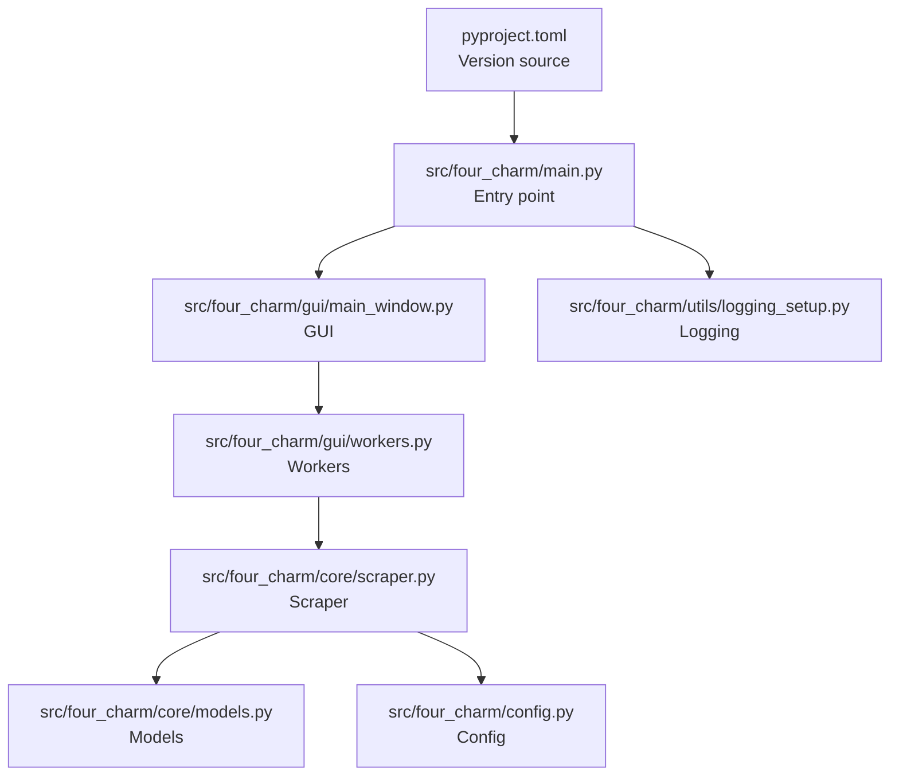
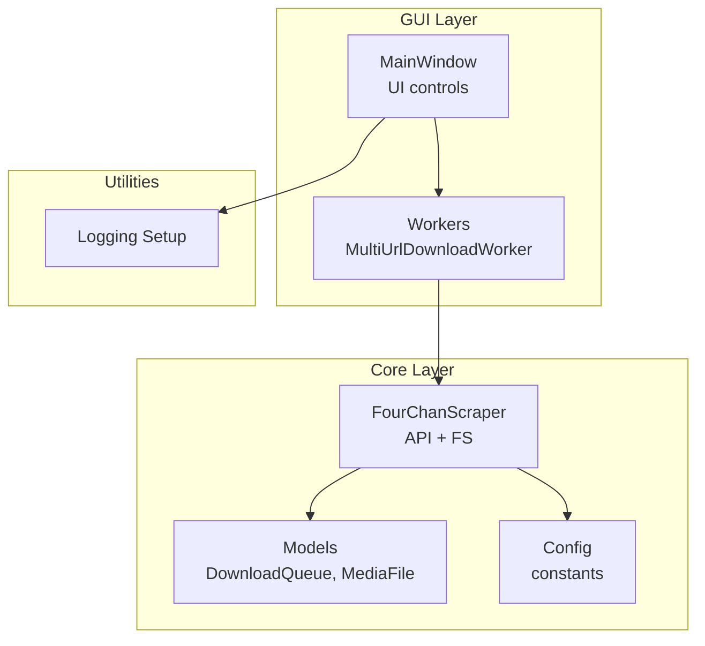
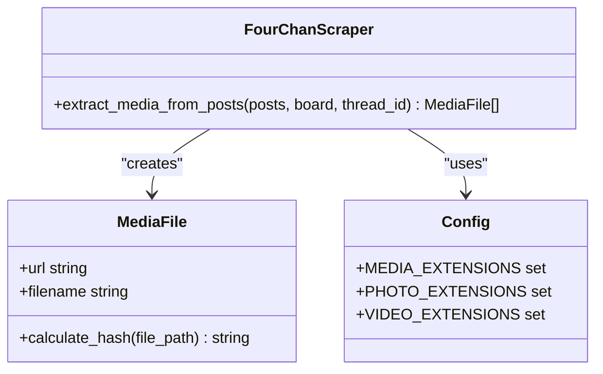
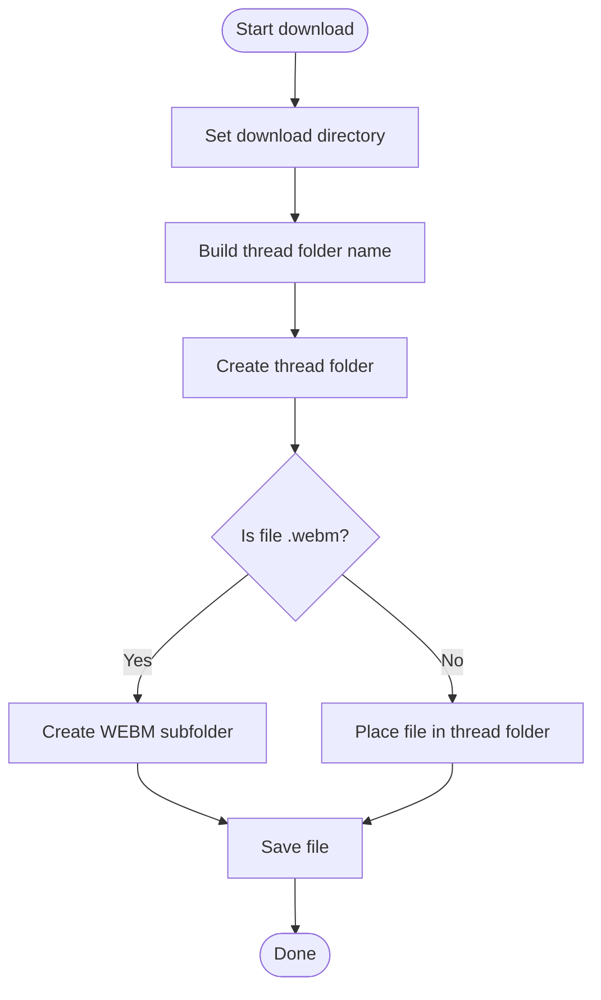
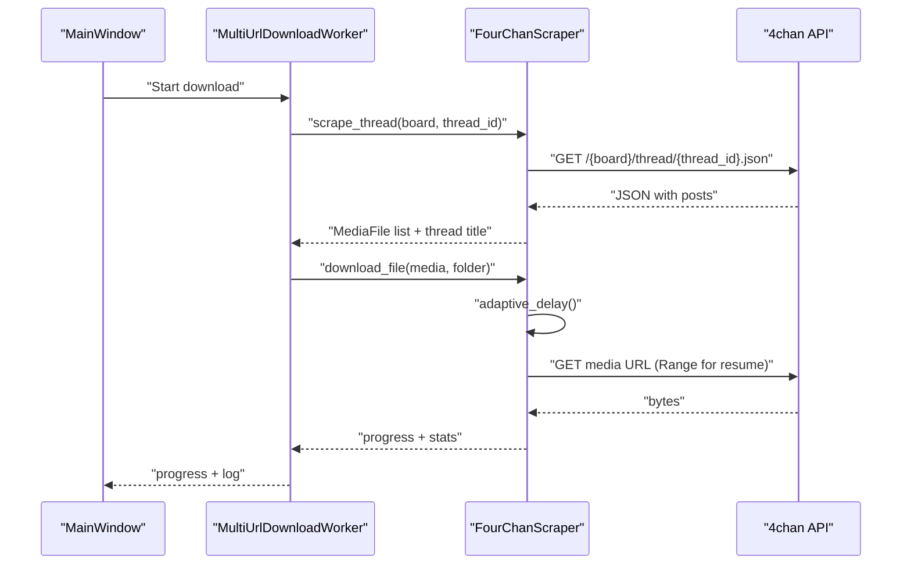
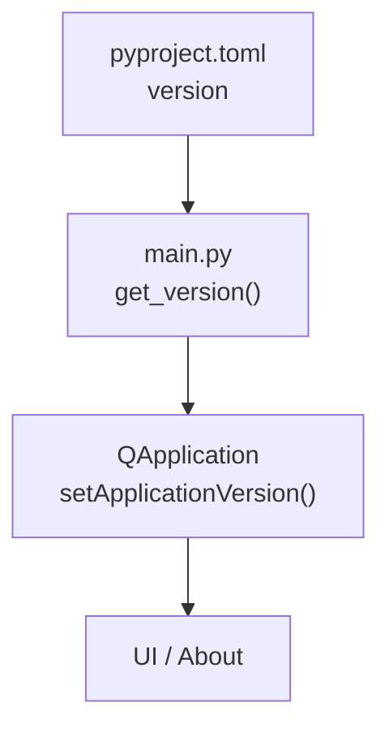
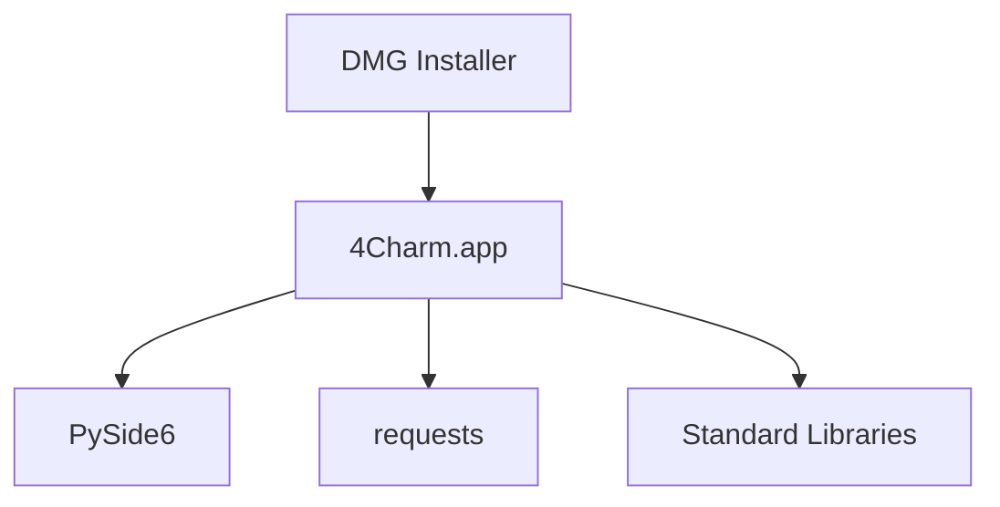

# Appendix

<cite>
**Referenced Files in This Document**
- [README.md](file://README.md)
- [pyproject.toml](file://pyproject.toml)
- [main.py](file://src/four_charm/main.py)
- [config.py](file://src/four_charm/config.py)
- [models.py](file://src/four_charm/core/models.py)
- [scraper.py](file://src/four_charm/core/scraper.py)
- [main_window.py](file://src/four_charm/gui/main_window.py)
- [workers.py](file://src/four_charm/gui/workers.py)
- [logging_setup.py](file://src/four_charm/utils/logging_setup.py)
- [CHANGELOG.md](file://docs/CHANGELOG.md)
- [BUILD.md](file://docs/BUILD.md)
</cite>

## Table of Contents
1. [Introduction](#introduction)
2. [Project Structure](#project-structure)
3. [Core Components](#core-components)
4. [Architecture Overview](#architecture-overview)
5. [Detailed Component Analysis](#detailed-component-analysis)
6. [Dependency Analysis](#dependency-analysis)
7. [Performance Considerations](#performance-considerations)
8. [Troubleshooting Guide](#troubleshooting-guide)
9. [Conclusion](#conclusion)
10. [Appendices](#appendices)

## Introduction
This appendix consolidates essential reference material for 4Charm, focusing on supported media types, file structure conventions, version history, API usage patterns, data retention and management practices, and troubleshooting diagnostics. It is designed to be a quick, reliable reference for users and developers integrating or operating 4Charm.

## Project Structure
The application is structured around a Qt-based GUI, a core scraping engine, configuration constants, and utilities for logging and packaging. The primary runtime entry initializes the application, sets the version from project metadata, and launches the main window.

**Diagram sources**
- [main.py](file://src/four_charm/main.py#L1-L55)
- [main_window.py](file://src/four_charm/gui/main_window.py#L1-L120)
- [workers.py](file://src/four_charm/gui/workers.py#L1-L120)
- [scraper.py](file://src/four_charm/core/scraper.py#L1-L120)
- [models.py](file://src/four_charm/core/models.py#L1-L60)
- [config.py](file://src/four_charm/config.py#L1-L48)
- [logging_setup.py](file://src/four_charm/utils/logging_setup.py#L1-L40)
- [pyproject.toml](file://pyproject.toml#L1-L13)

**Section sources**
- [main.py](file://src/four_charm/main.py#L1-L55)
- [pyproject.toml](file://pyproject.toml#L1-L13)

## Core Components
- Supported media types and extensions:
  - Images: JPG, JPEG, PNG, GIF, WEBP, BMP
  - Videos: WEBM, MP4, MOV, AVI, MKV
  - Documents: PDF, TXT, ZIP, RAR
- Download structure:
  - Per-thread folders named using board and thread identifiers
  - Dedicated WEBM subfolder inside each thread folder for video files
- Version source:
  - Version is read from project metadata and injected into the application

**Section sources**
- [README.md](file://README.md#L37-L42)
- [README.md](file://README.md#L68-L84)
- [config.py](file://src/four_charm/config.py#L25-L41)
- [pyproject.toml](file://pyproject.toml#L1-L13)

## Architecture Overview
The application follows a layered architecture:
- GUI layer (PySide6) manages user interactions and displays progress/logs
- Worker layer orchestrates concurrent scraping and downloads
- Core layer handles URL parsing, API calls, media extraction, and filesystem organization
- Configuration layer centralizes constants and policies
- Utilities layer provides logging and packaging helpers

**Diagram sources**
- [main_window.py](file://src/four_charm/gui/main_window.py#L1-L120)
- [workers.py](file://src/four_charm/gui/workers.py#L143-L210)
- [scraper.py](file://src/four_charm/core/scraper.py#L1-L120)
- [models.py](file://src/four_charm/core/models.py#L1-L60)
- [config.py](file://src/four_charm/config.py#L1-L48)
- [logging_setup.py](file://src/four_charm/utils/logging_setup.py#L1-L40)

## Detailed Component Analysis

### Supported Media Types and Extensions
- Media extensions are centrally defined and used to filter and categorize downloadable content.
- Photos and videos are distinguished for filename sanitization and folder placement.

**Diagram sources**
- [config.py](file://src/four_charm/config.py#L25-L41)
- [scraper.py](file://src/four_charm/core/scraper.py#L308-L329)
- [models.py](file://src/four_charm/core/models.py#L92-L113)

**Section sources**
- [config.py](file://src/four_charm/config.py#L25-L41)
- [scraper.py](file://src/four_charm/core/scraper.py#L308-L329)
- [models.py](file://src/four_charm/core/models.py#L92-L113)

### File Structure and Organization
- Thread folders are created under the chosen download directory using a base naming convention derived from board and thread identifiers.
- WEBM files are separated into a dedicated subfolder within each thread folder.
- Non-WEBM media are placed directly into the thread folder.

**Diagram sources**
- [scraper.py](file://src/four_charm/core/scraper.py#L390-L410)
- [README.md](file://README.md#L68-L84)

**Section sources**
- [scraper.py](file://src/four_charm/core/scraper.py#L390-L410)
- [README.md](file://README.md#L68-L84)

### URL Parsing and API Usage Patterns
- Supported URL patterns:
  - Board: https://boards.4chan.org/{board}/
  - Thread: https://boards.4chan.org/{board}/thread/{thread_id}
  - Catalog: https://boards.4chan.org/{board}/catalog
- API endpoints used:
  - Thread JSON: https://a.4cdn.org/{board}/thread/{thread_id}.json
  - Catalog JSON: https://a.4cdn.org/{board}/catalog.json
- Adaptive rate limiting and retry logic are implemented to respect server constraints.

**Diagram sources**
- [main_window.py](file://src/four_charm/gui/main_window.py#L488-L550)
- [workers.py](file://src/four_charm/gui/workers.py#L143-L210)
- [scraper.py](file://src/four_charm/core/scraper.py#L248-L307)
- [scraper.py](file://src/four_charm/core/scraper.py#L330-L342)
- [scraper.py](file://src/four_charm/core/scraper.py#L365-L557)

**Section sources**
- [main_window.py](file://src/four_charm/gui/main_window.py#L488-L550)
- [workers.py](file://src/four_charm/gui/workers.py#L143-L210)
- [scraper.py](file://src/four_charm/core/scraper.py#L248-L307)
- [scraper.py](file://src/four_charm/core/scraper.py#L330-L342)
- [scraper.py](file://src/four_charm/core/scraper.py#L365-L557)

### Version History and Change Log
- Current version is read from project metadata and injected into the application.
- The changelog follows semantic versioning and documents notable changes.

**Diagram sources**
- [pyproject.toml](file://pyproject.toml#L1-L13)
- [main.py](file://src/four_charm/main.py#L19-L35)

**Section sources**
- [pyproject.toml](file://pyproject.toml#L1-L13)
- [main.py](file://src/four_charm/main.py#L19-L35)
- [CHANGELOG.md](file://docs/CHANGELOG.md#L1-L13)

### Data Retention and File Management Best Practices
- Duplicate prevention:
  - SHA-256 hashing is used to detect and skip identical files.
- Resume capability:
  - Range requests enable resuming interrupted downloads.
- Disk space checks:
  - Minimum free space threshold is enforced before downloading.
- Filename sanitization:
  - Reserved characters and lengths are normalized to ensure compatibility.
- Logging:
  - Rotating file logs are maintained under the user’s home directory for diagnostics.

**Section sources**
- [models.py](file://src/four_charm/core/models.py#L106-L113)
- [scraper.py](file://src/four_charm/core/scraper.py#L431-L440)
- [scraper.py](file://src/four_charm/core/scraper.py#L133-L172)
- [logging_setup.py](file://src/four_charm/utils/logging_setup.py#L1-L40)

### Troubleshooting References and Diagnostic Codes
- Common issues and resolutions:
  - App is damaged / Cannot be opened: Gatekeeper override required.
  - Slow downloads: Expect rate limits; the application adapts automatically.
  - No media found: Verify URL correctness and that the thread/board has assets.
- Network error categories handled:
  - ConnectionError, Timeout, HTTPError (including 429, 403, 404), TooManyRedirects, Unknown
- Diagnostic logging:
  - Logs are written to a rotating file under the user’s home directory for review.

**Section sources**
- [README.md](file://README.md#L97-L104)
- [scraper.py](file://src/four_charm/core/scraper.py#L75-L132)
- [logging_setup.py](file://src/four_charm/utils/logging_setup.py#L1-L40)

## Dependency Analysis
- Runtime dependencies include PySide6 for UI, requests for HTTP, and standard libraries.
- Packaging and distribution rely on py2app and create-dmg for macOS bundles and DMG creation.

**Diagram sources**
- [BUILD.md](file://docs/BUILD.md#L20-L44)
- [BUILD.md](file://docs/BUILD.md#L56-L58)

**Section sources**
- [BUILD.md](file://docs/BUILD.md#L20-L44)
- [BUILD.md](file://docs/BUILD.md#L56-L58)

## Performance Considerations
- Concurrency:
  - Thread pool size is bounded by CPU cores and a configurable maximum.
- Rate limiting:
  - Base delay, backoff multiplier, and maximum delay adapt dynamically to server feedback.
- Chunked downloads:
  - Streaming with configurable chunk sizes balances memory and throughput.
- Progress reporting:
  - Real-time progress and speed updates improve responsiveness.

**Section sources**
- [config.py](file://src/four_charm/config.py#L1-L24)
- [scraper.py](file://src/four_charm/core/scraper.py#L65-L74)
- [workers.py](file://src/four_charm/gui/workers.py#L56-L62)

## Troubleshooting Guide
- Build and packaging:
  - Ensure py2app, create-dmg, and Xcode CLI tools are installed.
  - Follow the build script or manual steps to create the app bundle and DMG.
- Running the app:
  - If the app does not launch, inspect logs and verify dependencies are bundled.
- Network and API:
  - Monitor for rate-limiting responses and adjust expectations accordingly.

**Section sources**
- [BUILD.md](file://docs/BUILD.md#L20-L44)
- [BUILD.md](file://docs/BUILD.md#L104-L178)
- [BUILD.md](file://docs/BUILD.md#L401-L455)
- [BUILD.md](file://docs/BUILD.md#L641-L800)

## Conclusion
This appendix consolidates practical, code-backed references for supported media types, download structure, versioning, API usage, and operational guidance. Use it as a quick lookup for configuring, troubleshooting, and optimizing 4Charm.

## Appendices

### A. Supported Media Types and Extensions
- Images: JPG, JPEG, PNG, GIF, WEBP, BMP
- Videos: WEBM, MP4, MOV, AVI, MKV
- Documents: PDF, TXT, ZIP, RAR

**Section sources**
- [README.md](file://README.md#L37-L42)
- [config.py](file://src/four_charm/config.py#L25-L41)

### B. Download Structure Example
- Per-thread folders named with board and thread identifiers
- WEBM subfolder inside each thread folder for video files

**Section sources**
- [README.md](file://README.md#L68-L84)
- [scraper.py](file://src/four_charm/core/scraper.py#L390-L410)

### C. Version History and Change Log
- Version source: pyproject.toml
- Changelog adheres to semantic versioning

**Section sources**
- [pyproject.toml](file://pyproject.toml#L1-L13)
- [CHANGELOG.md](file://docs/CHANGELOG.md#L1-L13)

### D. 4chan URL Patterns and API Endpoints
- Board: https://boards.4chan.org/{board}/
- Thread: https://boards.4chan.org/{board}/thread/{thread_id}
- Catalog: https://boards.4chan.org/{board}/catalog
- API:
  - Thread JSON: https://a.4cdn.org/{board}/thread/{thread_id}.json
  - Catalog JSON: https://a.4cdn.org/{board}/catalog.json

**Section sources**
- [main_window.py](file://src/four_charm/gui/main_window.py#L488-L550)
- [workers.py](file://src/four_charm/gui/workers.py#L143-L210)
- [scraper.py](file://src/four_charm/core/scraper.py#L248-L307)

### E. Data Retention and File Management
- Duplicate detection via SHA-256 hashing
- Resume using HTTP Range requests
- Disk space checks before download
- Filename sanitization and length limits
- Rotating logs under ~/.4charm/logs

**Section sources**
- [models.py](file://src/four_charm/core/models.py#L106-L113)
- [scraper.py](file://src/four_charm/core/scraper.py#L431-L440)
- [scraper.py](file://src/four_charm/core/scraper.py#L133-L172)
- [logging_setup.py](file://src/four_charm/utils/logging_setup.py#L1-L40)

### F. Troubleshooting and Diagnostics
- Common issues and remedies
- Network error categories and handling
- Diagnostic logging location

**Section sources**
- [README.md](file://README.md#L97-L104)
- [scraper.py](file://src/four_charm/core/scraper.py#L75-L132)
- [logging_setup.py](file://src/four_charm/utils/logging_setup.py#L1-L40)

### G. Additional Resources
- Build and packaging guide for macOS
- Project homepage and issue tracker

**Section sources**
- [BUILD.md](file://docs/BUILD.md#L1-L120)
- [README.md](file://README.md#L105-L121)