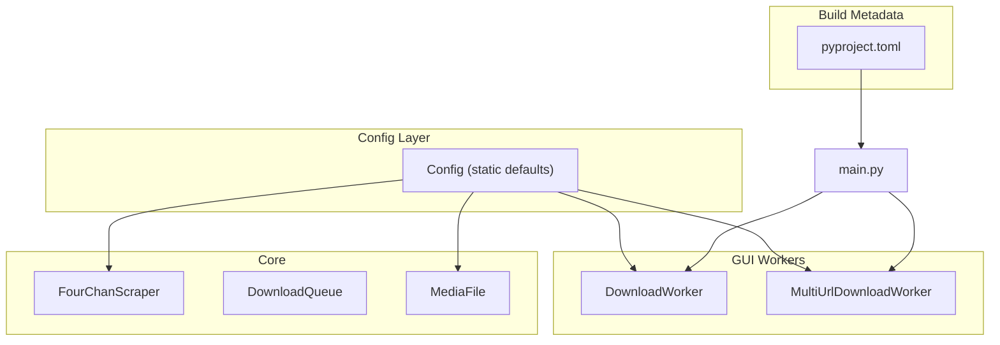
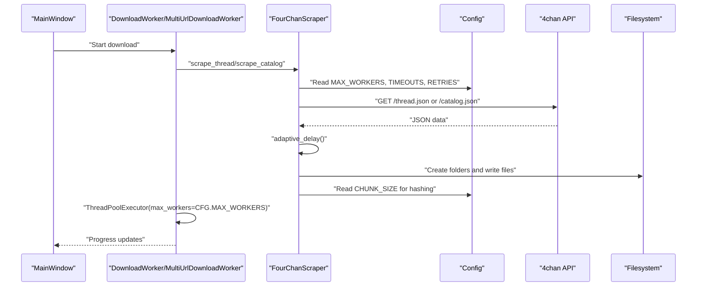
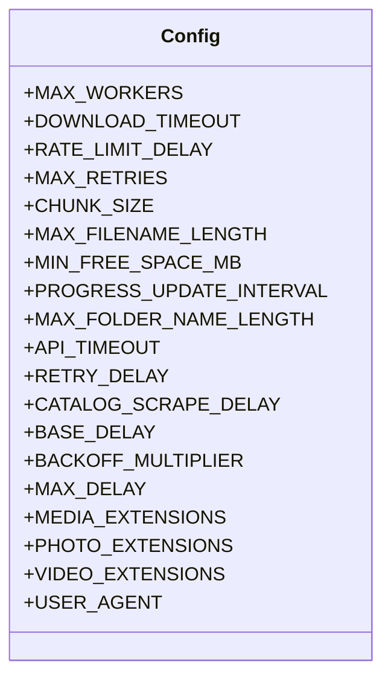
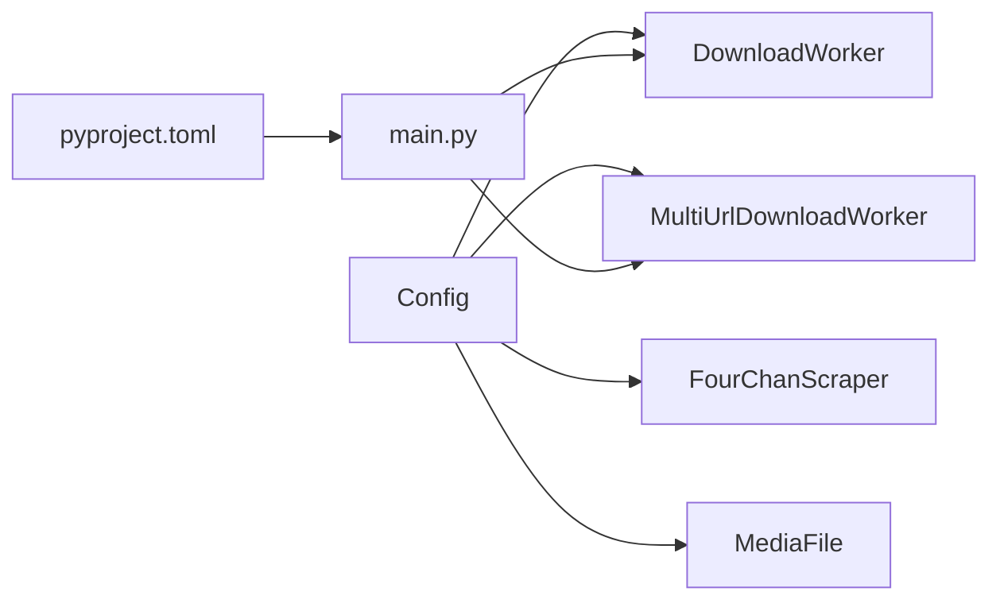

# Configuration

<cite>
**Referenced Files in This Document**
- [config.py](file://4Charm/src/four_charm/config.py)
- [scraper.py](file://4Charm/src/four_charm/core/scraper.py)
- [workers.py](file://4Charm/src/four_charm/gui/workers.py)
- [models.py](file://4Charm/src/four_charm/core/models.py)
- [pyproject.toml](file://4Charm/pyproject.toml)
- [main.py](file://4Charm/src/four_charm/main.py)
</cite>

## Table of Contents
1. [Introduction](#introduction)
2. [Project Structure](#project-structure)
3. [Core Components](#core-components)
4. [Architecture Overview](#architecture-overview)
5. [Detailed Component Analysis](#detailed-component-analysis)
6. [Dependency Analysis](#dependency-analysis)
7. [Performance Considerations](#performance-considerations)
8. [Troubleshooting Guide](#troubleshooting-guide)
9. [Conclusion](#conclusion)

## Introduction
This document explains the application’s centralized configuration system and how it influences download behavior, file paths, and performance. The Config class defines static, global defaults that are consumed across the scraper and worker layers. It also clarifies how runtime configuration in config.py relates to build-time metadata in pyproject.toml and how changes propagate through the system.

## Project Structure
The configuration system is defined in a single module and consumed by core and GUI components:
- Centralized configuration: four_charm/config.py
- Core downloader logic: four_charm/core/scraper.py
- Worker threads: four_charm/gui/workers.py
- Supporting model: four_charm/core/models.py
- Build metadata: pyproject.toml
- Application entry point: four_charm/main.py

**Diagram sources**
- [config.py](file://4Charm/src/four_charm/config.py#L1-L48)
- [scraper.py](file://4Charm/src/four_charm/core/scraper.py#L1-L120)
- [workers.py](file://4Charm/src/four_charm/gui/workers.py#L1-L120)
- [models.py](file://4Charm/src/four_charm/core/models.py#L1-L113)
- [pyproject.toml](file://4Charm/pyproject.toml#L1-L13)
- [main.py](file://4Charm/src/four_charm/main.py#L1-L55)

**Section sources**
- [config.py](file://4Charm/src/four_charm/config.py#L1-L48)
- [scraper.py](file://4Charm/src/four_charm/core/scraper.py#L1-L120)
- [workers.py](file://4Charm/src/four_charm/gui/workers.py#L1-L120)
- [models.py](file://4Charm/src/four_charm/core/models.py#L1-L113)
- [pyproject.toml](file://4Charm/pyproject.toml#L1-L13)
- [main.py](file://4Charm/src/four_charm/main.py#L1-L55)

## Core Components
- Config: Static class containing all tunable parameters for concurrency, timeouts, rate limiting, file naming, and media filtering.
- FourChanScraper: Consumes Config for session pooling, timeouts, retries, rate limiting, filename length limits, and media extension filtering.
- DownloadWorker and MultiUrlDownloadWorker: Consume Config for thread pool sizing and progress reporting.
- MediaFile: Uses Config.CHUNK_SIZE for hashing during duplicate detection.
- pyproject.toml: Provides application metadata (name, version) used at runtime.

Key configuration parameters include:
- Concurrency and threading: MAX_WORKERS, RATE_LIMIT_DELAY, BASE_DELAY, BACKOFF_MULTIPLIER, MAX_DELAY
- Timeouts and retries: API_TIMEOUT, DOWNLOAD_TIMEOUT, RETRY_DELAY, MAX_RETRIES
- Disk and file safety: MIN_FREE_SPACE_MB, MAX_FILENAME_LENGTH, MAX_FOLDER_NAME_LENGTH
- File organization: MEDIA_EXTENSIONS, PHOTO_EXTENSIONS, VIDEO_EXTENSIONS
- Network identity: USER_AGENT

These parameters directly influence throughput, resilience, and resource usage.

**Section sources**
- [config.py](file://4Charm/src/four_charm/config.py#L1-L48)
- [scraper.py](file://4Charm/src/four_charm/core/scraper.py#L1-L120)
- [workers.py](file://4Charm/src/four_charm/gui/workers.py#L1-L120)
- [models.py](file://4Charm/src/four_charm/core/models.py#L90-L113)
- [pyproject.toml](file://4Charm/pyproject.toml#L1-L13)

## Architecture Overview
The configuration is a single source of truth consumed by the core downloader and GUI workers. The scraper sets up the HTTP session and applies rate limiting, while workers orchestrate concurrent downloads using the configured thread pool size.

**Diagram sources**
- [workers.py](file://4Charm/src/four_charm/gui/workers.py#L55-L120)
- [scraper.py](file://4Charm/src/four_charm/core/scraper.py#L22-L120)
- [config.py](file://4Charm/src/four_charm/config.py#L1-L48)

## Detailed Component Analysis

### Config class
The Config class centralizes all tunable parameters. It includes:
- Concurrency: MAX_WORKERS, RATE_LIMIT_DELAY
- Rate limiting: BASE_DELAY, BACKOFF_MULTIPLIER, MAX_DELAY
- Timeouts: API_TIMEOUT, DOWNLOAD_TIMEOUT, RETRY_DELAY
- Retries: MAX_RETRIES
- Chunking: CHUNK_SIZE
- Safety and limits: MIN_FREE_SPACE_MB, MAX_FILENAME_LENGTH, MAX_FOLDER_NAME_LENGTH
- Media classification: MEDIA_EXTENSIONS, PHOTO_EXTENSIONS, VIDEO_EXTENSIONS
- Identity: USER_AGENT

These fields are read directly by the scraper and workers to tune behavior.

**Diagram sources**
- [config.py](file://4Charm/src/four_charm/config.py#L1-L48)

**Section sources**
- [config.py](file://4Charm/src/four_charm/config.py#L1-L48)

### FourChanScraper usage of Config
The scraper consumes Config for:
- Session pool sizing and retries
- Rate limiting and adaptive delays
- Timeout configuration for API and downloads
- Filename and folder name length enforcement
- Disk space checks
- Media extension filtering
- Hash chunk size for duplicate detection

Examples of usage locations:
- Session pool connections and retries: [scraper.py](file://4Charm/src/four_charm/core/scraper.py#L22-L33)
- Rate limiting and adaptive delay: [scraper.py](file://4Charm/src/four_charm/core/scraper.py#L65-L74)
- API and download timeouts: [scraper.py](file://4Charm/src/four_charm/core/scraper.py#L252-L256), [scraper.py](file://4Charm/src/four_charm/core/scraper.py#L452-L459)
- Filename and folder name limits: [scraper.py](file://4Charm/src/four_charm/core/scraper.py#L166-L171), [scraper.py](file://4Charm/src/four_charm/core/scraper.py#L188-L192), [scraper.py](file://4Charm/src/four_charm/core/scraper.py#L199-L208)
- Disk space check: [scraper.py](file://4Charm/src/four_charm/core/scraper.py#L210-L221)
- Media extension filtering: [scraper.py](file://4Charm/src/four_charm/core/scraper.py#L315-L317)
- Hash chunk size: [models.py](file://4Charm/src/four_charm/core/models.py#L106-L112)

**Section sources**
- [scraper.py](file://4Charm/src/four_charm/core/scraper.py#L22-L120)
- [scraper.py](file://4Charm/src/four_charm/core/scraper.py#L310-L320)
- [scraper.py](file://4Charm/src/four_charm/core/scraper.py#L450-L460)
- [scraper.py](file://4Charm/src/four_charm/core/scraper.py#L210-L221)
- [models.py](file://4Charm/src/four_charm/core/models.py#L106-L112)

### Worker threads and Config
Workers use Config to:
- Size the thread pool for concurrent downloads
- Emit progress and speed updates

Examples:
- Thread pool sizing: [workers.py](file://4Charm/src/four_charm/gui/workers.py#L55-L62), [workers.py](file://4Charm/src/four_charm/gui/workers.py#L234-L247)
- Progress reporting: [workers.py](file://4Charm/src/four_charm/gui/workers.py#L90-L110), [workers.py](file://4Charm/src/four_charm/gui/workers.py#L277-L301)

**Section sources**
- [workers.py](file://4Charm/src/four_charm/gui/workers.py#L55-L120)
- [workers.py](file://4Charm/src/four_charm/gui/workers.py#L234-L308)

### MediaFile and Config.CHUNK_SIZE
MediaFile uses Config.CHUNK_SIZE when calculating hashes for duplicate detection, ensuring consistent hashing behavior across the application.

**Section sources**
- [models.py](file://4Charm/src/four_charm/core/models.py#L106-L112)

### Relationship between runtime config and build-time metadata
- Runtime configuration: Config is imported and used by core and GUI modules to tune behavior at runtime.
- Build-time metadata: pyproject.toml provides application metadata (name, version) consumed by the main entry point for display and packaging.

**Section sources**
- [pyproject.toml](file://4Charm/pyproject.toml#L1-L13)
- [main.py](file://4Charm/src/four_charm/main.py#L19-L35)

## Dependency Analysis
The configuration dependency graph shows how components rely on Config:

**Diagram sources**
- [config.py](file://4Charm/src/four_charm/config.py#L1-L48)
- [scraper.py](file://4Charm/src/four_charm/core/scraper.py#L1-L120)
- [workers.py](file://4Charm/src/four_charm/gui/workers.py#L1-L120)
- [models.py](file://4Charm/src/four_charm/core/models.py#L1-L113)
- [pyproject.toml](file://4Charm/pyproject.toml#L1-L13)
- [main.py](file://4Charm/src/four_charm/main.py#L1-L55)

**Section sources**
- [config.py](file://4Charm/src/four_charm/config.py#L1-L48)
- [scraper.py](file://4Charm/src/four_charm/core/scraper.py#L1-L120)
- [workers.py](file://4Charm/src/four_charm/gui/workers.py#L1-L120)
- [models.py](file://4Charm/src/four_charm/core/models.py#L1-L113)
- [pyproject.toml](file://4Charm/pyproject.toml#L1-L13)
- [main.py](file://4Charm/src/four_charm/main.py#L1-L55)

## Performance Considerations
- Concurrency: MAX_WORKERS controls the number of simultaneous downloads. Increasing it improves throughput but raises memory and network load. It is capped by CPU cores and used to size the HTTP connection pool.
- Rate limiting: BASE_DELAY, BACKOFF_MULTIPLIER, MAX_DELAY govern adaptive delays. Lower base delays increase speed; higher multipliers and caps reduce bursts and improve resilience under throttling.
- Timeouts: API_TIMEOUT and DOWNLOAD_TIMEOUT balance responsiveness and reliability. Tight timeouts may cause premature failures; generous timeouts risk hanging on slow networks.
- Retries: MAX_RETRIES and RETRY_DELAY determine resilience against transient failures. Higher retries improve robustness but add latency.
- Chunk size: CHUNK_SIZE affects I/O throughput and memory usage during hashing and streaming.
- Disk safety: MIN_FREE_SPACE_MB prevents out-of-space failures by pre-checking available space before writing.

Optimization guidelines:
- High-speed downloads: Increase MAX_WORKERS moderately, lower BASE_DELAY, keep reasonable MAX_DELAY and RETRY_DELAY.
- Stealth mode: Increase BASE_DELAY, BACKOFF_MULTIPLIER, and MAX_DELAY to reduce server-side suspicion; lower MAX_WORKERS to reduce burstiness.
- Stable environments: Reduce RETRY_DELAY and MAX_RETRIES to minimize overhead.

[No sources needed since this section provides general guidance]

## Troubleshooting Guide
Common configuration-related issues and remedies:
- Downloads stall or fail under rate limiting:
  - Adjust BASE_DELAY, BACKOFF_MULTIPLIER, and MAX_DELAY to be more conservative.
  - Verify CATALOG_SCRAPE_DELAY is adequate to avoid server throttling.
  - Reference: [scraper.py](file://4Charm/src/four_charm/core/scraper.py#L65-L74), [scraper.py](file://4Charm/src/four_charm/core/scraper.py#L360-L363)
- Excessive network errors:
  - Increase MAX_RETRIES and RETRY_DELAY; adjust API_TIMEOUT and DOWNLOAD_TIMEOUT.
  - Reference: [scraper.py](file://4Charm/src/four_charm/core/scraper.py#L252-L256), [scraper.py](file://4Charm/src/four_charm/core/scraper.py#L452-L459)
- Filename or folder name too long:
  - Reduce MAX_FILENAME_LENGTH or MAX_FOLDER_NAME_LENGTH.
  - Reference: [scraper.py](file://4Charm/src/four_charm/core/scraper.py#L166-L171), [scraper.py](file://4Charm/src/four_charm/core/scraper.py#L188-L192), [scraper.py](file://4Charm/src/four_charm/core/scraper.py#L199-L208)
- Out of disk space:
  - Increase MIN_FREE_SPACE_MB or ensure sufficient free space; verify download_dir is set.
  - Reference: [scraper.py](file://4Charm/src/four_charm/core/scraper.py#L210-L221)
- Hashing inconsistencies:
  - Ensure CHUNK_SIZE remains unchanged to preserve duplicate detection behavior.
  - Reference: [models.py](file://4Charm/src/four_charm/core/models.py#L106-L112)

Best practices:
- Keep MAX_WORKERS aligned with CPU cores and available bandwidth.
- Tune rate limiting parameters to match target server policies.
- Monitor progress callbacks and adjust PROGRESS_UPDATE_INTERVAL if needed.
- Validate MEDIA_EXTENSIONS and classification sets for your use case.

**Section sources**
- [scraper.py](file://4Charm/src/four_charm/core/scraper.py#L65-L74)
- [scraper.py](file://4Charm/src/four_charm/core/scraper.py#L210-L221)
- [scraper.py](file://4Charm/src/four_charm/core/scraper.py#L360-L363)
- [scraper.py](file://4Charm/src/four_charm/core/scraper.py#L452-L459)
- [models.py](file://4Charm/src/four_charm/core/models.py#L106-L112)

## Conclusion
The Config class provides a centralized, static configuration surface that directly shapes the application’s behavior across concurrency, rate limiting, timeouts, file handling, and media classification. Changes to Config propagate to the scraper and workers, enabling predictable tuning for different operational scenarios. For build-time metadata, pyproject.toml supplies application identity consumed by the main entry point. By adjusting the documented parameters, users can optimize for speed, stealth, or stability depending on their environment and goals.