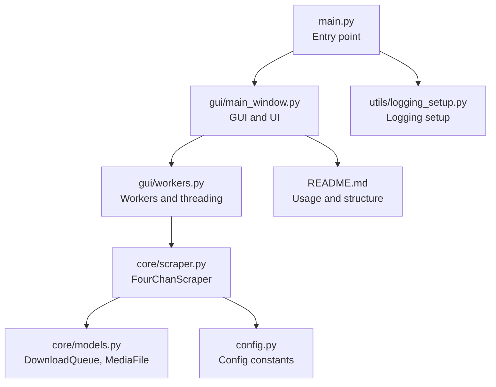
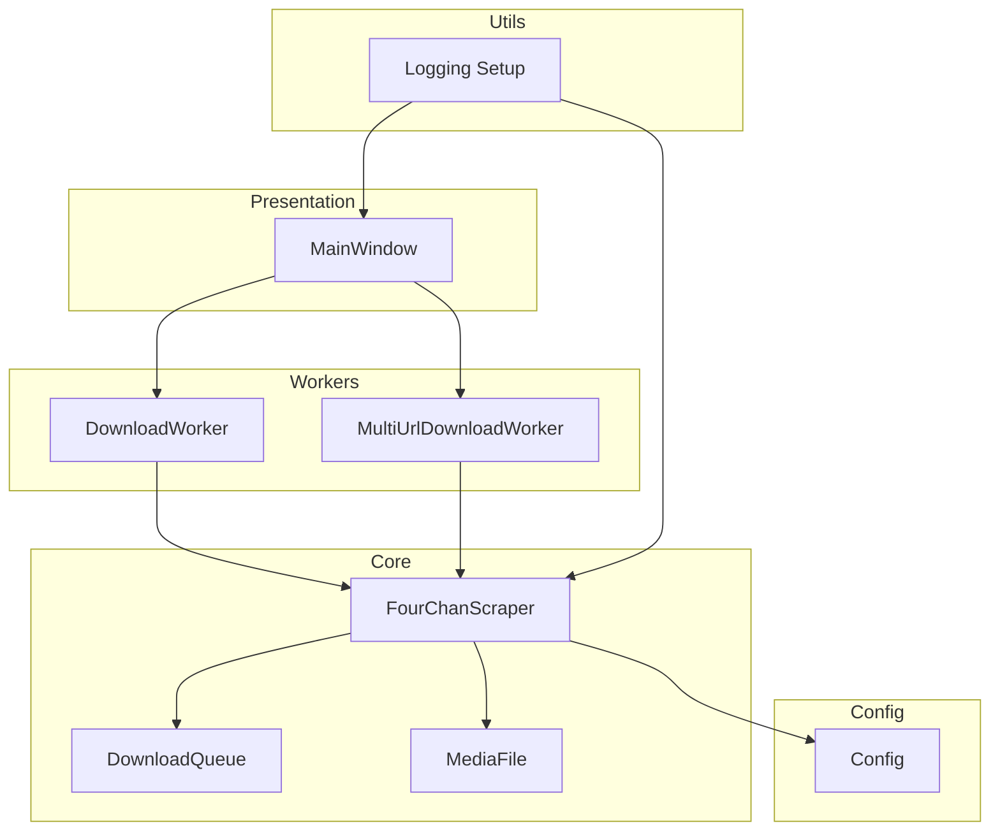
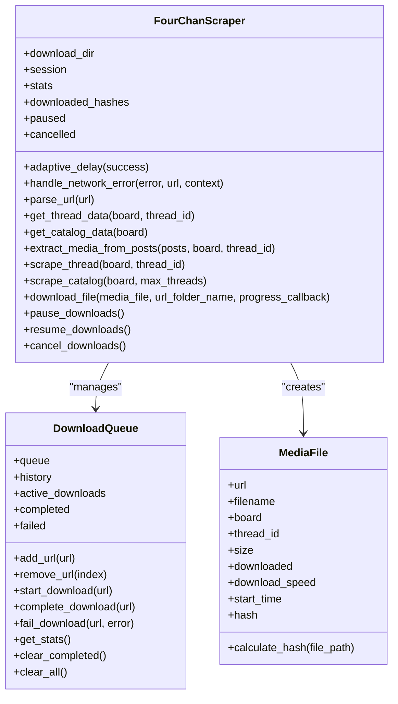
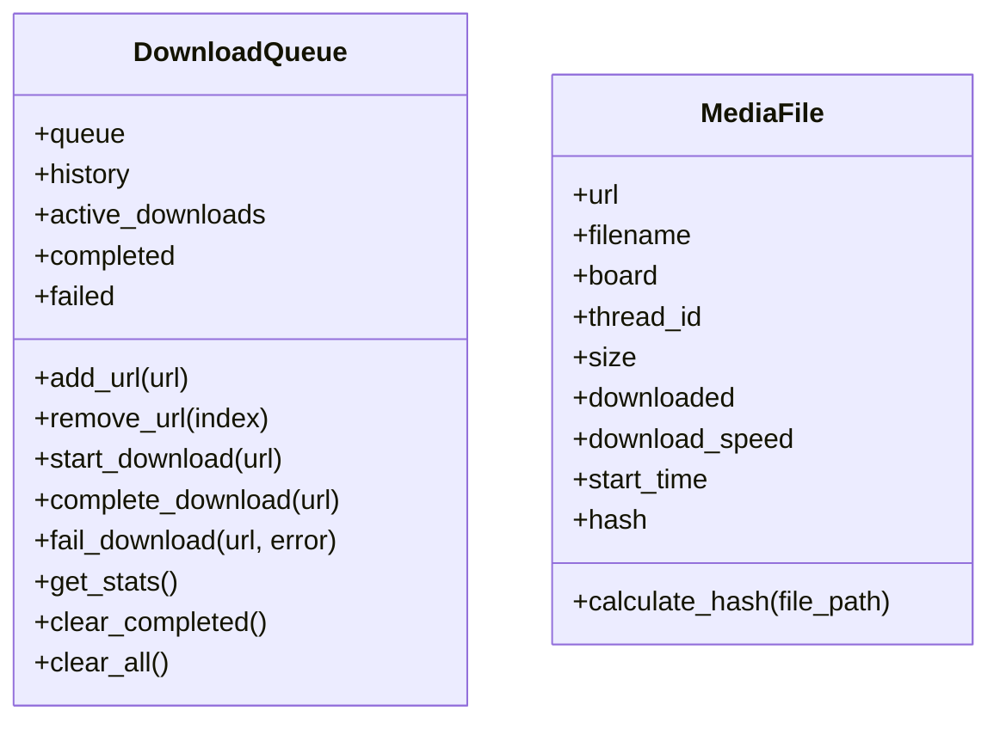
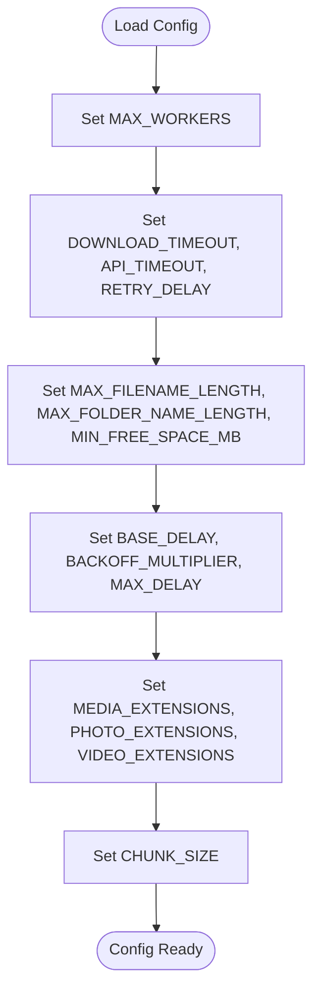
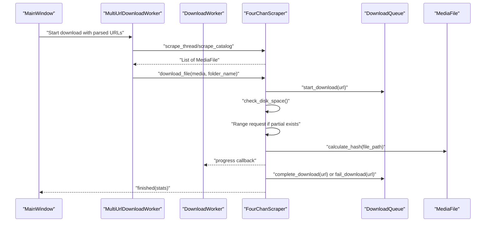
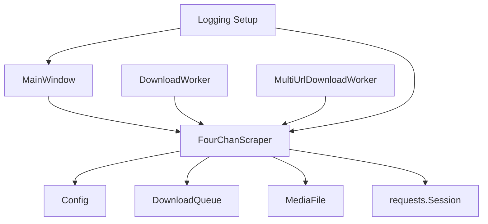

# Core Features

<cite>
**Referenced Files in This Document**
- [main.py](file://4Charm/src/four_charm/main.py)
- [config.py](file://4Charm/src/four_charm/config.py)
- [scraper.py](file://4Charm/src/four_charm/core/scraper.py)
- [models.py](file://4Charm/src/four_charm/core/models.py)
- [main_window.py](file://4Charm/src/four_charm/gui/main_window.py)
- [workers.py](file://4Charm/src/four_charm/gui/workers.py)
- [logging_setup.py](file://4Charm/src/four_charm/utils/logging_setup.py)
- [README.md](file://4Charm/README.md)
</cite>

## Table of Contents
1. [Introduction](#introduction)
2. [Project Structure](#project-structure)
3. [Core Components](#core-components)
4. [Architecture Overview](#architecture-overview)
5. [Detailed Component Analysis](#detailed-component-analysis)
6. [Dependency Analysis](#dependency-analysis)
7. [Performance Considerations](#performance-considerations)
8. [Troubleshooting Guide](#troubleshooting-guide)
9. [Conclusion](#conclusion)

## Introduction
This document explains the core features of 4Charm, focusing on how the application performs bulk URL processing, concurrent downloads, file organization, duplicate detection, and resume capability. It also details how the FourChanScraper class manages HTTP requests with adaptive rate limiting, how DownloadQueue and MediaFile track download state and metadata, and how the configuration system controls download behavior and storage paths. Practical examples demonstrate how a URL is parsed, media is extracted, and files are saved with proper organization. The document concludes with technical decisions behind SHA-256 hashing for duplicates and range requests for resuming downloads, usage patterns for typical and edge cases, and performance considerations for handling large numbers of files.

## Project Structure
4Charm is organized around a Qt-based GUI, a core scraping engine, and shared configuration and model classes. The main entry point initializes logging and launches the GUI. The GUI coordinates URL parsing, validation, and concurrent downloads via worker threads. The core scraper handles HTTP requests, adaptive rate limiting, media extraction, and file saving with resume and duplicate detection. Configuration constants define concurrency, timeouts, retries, and storage behavior.

**Diagram sources**
- [main.py](file://4Charm/src/four_charm/main.py#L1-L55)
- [main_window.py](file://4Charm/src/four_charm/gui/main_window.py#L1-L120)
- [workers.py](file://4Charm/src/four_charm/gui/workers.py#L1-L60)
- [scraper.py](file://4Charm/src/four_charm/core/scraper.py#L1-L60)
- [models.py](file://4Charm/src/four_charm/core/models.py#L1-L40)
- [config.py](file://4Charm/src/four_charm/config.py#L1-L48)
- [logging_setup.py](file://4Charm/src/four_charm/utils/logging_setup.py#L1-L40)
- [README.md](file://4Charm/README.md#L60-L120)

**Section sources**
- [main.py](file://4Charm/src/four_charm/main.py#L1-L55)
- [README.md](file://4Charm/README.md#L60-L120)

## Core Components
- FourChanScraper: Central orchestrator for URL parsing, API requests, media extraction, concurrent downloads, adaptive rate limiting, resume capability, duplicate detection, and progress reporting.
- DownloadQueue: Tracks queued, active, completed, and failed downloads, and maintains history.
- MediaFile: Represents a downloadable media item with metadata and SHA-256 hashing for duplicates.
- Config: Defines global constants for concurrency, timeouts, retries, chunk sizes, filename limits, and supported media types.
- GUI Workers: MultiUrlDownloadWorker and DownloadWorker coordinate scraping and concurrent downloads across threads and emit progress and log signals.
- Logging: Centralized logging setup with rotating file handler and console handler.

**Section sources**
- [scraper.py](file://4Charm/src/four_charm/core/scraper.py#L1-L120)
- [models.py](file://4Charm/src/four_charm/core/models.py#L1-L113)
- [config.py](file://4Charm/src/four_charm/config.py#L1-L48)
- [workers.py](file://4Charm/src/four_charm/gui/workers.py#L1-L120)
- [logging_setup.py](file://4Charm/src/four_charm/utils/logging_setup.py#L1-L40)

## Architecture Overview
The system follows a layered architecture:
- Presentation Layer: MainWindow manages UI, user input, and progress updates.
- Worker Layer: Workers orchestrate scraping and concurrent downloads, emitting signals for progress and logs.
- Core Layer: FourChanScraper encapsulates HTTP logic, adaptive rate limiting, media extraction, and file I/O.
- Model Layer: DownloadQueue and MediaFile represent state and metadata.
- Configuration Layer: Config centralizes tunables for performance and behavior.

**Diagram sources**
- [main_window.py](file://4Charm/src/four_charm/gui/main_window.py#L1-L120)
- [workers.py](file://4Charm/src/four_charm/gui/workers.py#L1-L120)
- [scraper.py](file://4Charm/src/four_charm/core/scraper.py#L1-L120)
- [models.py](file://4Charm/src/four_charm/core/models.py#L1-L113)
- [config.py](file://4Charm/src/four_charm/config.py#L1-L48)
- [logging_setup.py](file://4Charm/src/four_charm/utils/logging_setup.py#L1-L40)

## Detailed Component Analysis

### FourChanScraper: HTTP Requests, Adaptive Rate Limiting, Media Extraction, and Downloads
- URL parsing: Validates and parses 4chan URLs to extract board, thread_id, and type (thread/catalog/board).
- API requests: Fetches thread and catalog JSON from 4chan’s public API with timeouts and adaptive delays.
- Adaptive rate limiting: Adjusts delay based on success/failure and HTTP 429 responses; increases delay on failures and decreases on success.
- Media extraction: Scans posts for supported media types and constructs MediaFile instances.
- Concurrent downloads: Uses a thread pool to download files concurrently, respecting pause/cancel states.
- Resume capability: Uses HTTP Range requests to resume partial downloads; detects 206 vs 200 responses to append or overwrite.
- Duplicate detection: Calculates SHA-256 hashes of existing files and skips duplicates.
- File organization: Creates per-thread folders and a dedicated WEBM subfolder for .webm files; sanitizes filenames and folder names.
- Progress and stats: Emits progress callbacks and tracks totals, sizes, and speeds.

**Diagram sources**
- [scraper.py](file://4Charm/src/four_charm/core/scraper.py#L1-L120)
- [models.py](file://4Charm/src/four_charm/core/models.py#L1-L113)

**Section sources**
- [scraper.py](file://4Charm/src/four_charm/core/scraper.py#L1-L120)
- [scraper.py](file://4Charm/src/four_charm/core/scraper.py#L222-L364)
- [scraper.py](file://4Charm/src/four_charm/core/scraper.py#L365-L557)
- [models.py](file://4Charm/src/four_charm/core/models.py#L92-L113)

### DownloadQueue and MediaFile: State and Metadata Management
- DownloadQueue: Maintains lists for queued, active, completed, and failed downloads; records history with timestamps and statuses; provides statistics.
- MediaFile: Holds metadata for each download, including URL, filename, board, thread_id, size, speed, start time, and hash; calculates SHA-256 for duplicate detection.

**Diagram sources**
- [models.py](file://4Charm/src/four_charm/core/models.py#L1-L91)
- [models.py](file://4Charm/src/four_charm/core/models.py#L92-L113)

**Section sources**
- [models.py](file://4Charm/src/four_charm/core/models.py#L1-L91)
- [models.py](file://4Charm/src/four_charm/core/models.py#L92-L113)

### Configuration System: Tunables for Behavior and Storage
- Concurrency: MAX_WORKERS derived from CPU count with a cap.
- Timeouts and retries: DOWNLOAD_TIMEOUT, API_TIMEOUT, MAX_RETRIES, RETRY_DELAY.
- Chunk size: CHUNK_SIZE for streaming downloads.
- Filename and folder limits: MAX_FILENAME_LENGTH, MAX_FOLDER_NAME_LENGTH.
- Minimum free space: MIN_FREE_SPACE_MB to guard against disk exhaustion.
- Progress update interval: PROGRESS_UPDATE_INTERVAL.
- Smart rate limiting: BASE_DELAY, BACKOFF_MULTIPLIER, MAX_DELAY.
- Supported media: MEDIA_EXTENSIONS, PHOTO_EXTENSIONS, VIDEO_EXTENSIONS.
- User agent: USER_AGENT for HTTP requests.

**Diagram sources**
- [config.py](file://4Charm/src/four_charm/config.py#L1-L48)

**Section sources**
- [config.py](file://4Charm/src/four_charm/config.py#L1-L48)

### GUI Integration: URL Parsing, Validation, and Concurrent Downloads
- MainWindow: Provides URL input, validation, folder selection, progress bars, speed labels, and activity log. Starts/stops downloads and toggles pause/resume.
- MultiUrlDownloadWorker: Parses multiple URLs, scrapes media from threads and catalogs, computes total files, and submits downloads to a thread pool.
- DownloadWorker: Handles individual URL scraping and downloads, emitting progress and log signals.

**Diagram sources**
- [main_window.py](file://4Charm/src/four_charm/gui/main_window.py#L480-L560)
- [workers.py](file://4Charm/src/four_charm/gui/workers.py#L143-L330)
- [scraper.py](file://4Charm/src/four_charm/core/scraper.py#L365-L557)
- [models.py](file://4Charm/src/four_charm/core/models.py#L1-L91)

**Section sources**
- [main_window.py](file://4Charm/src/four_charm/gui/main_window.py#L480-L560)
- [workers.py](file://4Charm/src/four_charm/gui/workers.py#L143-L330)

### Practical Examples: How Features Work Together
- URL parsing and media extraction:
  - The scraper parses a 4chan URL and determines whether it is a thread, catalog, or board.
  - For threads, it fetches JSON and extracts posts with supported media types, constructing MediaFile objects with sanitized filenames.
- File organization:
  - Per-thread folders are created under the chosen download directory. A dedicated WEBM subfolder is used for .webm files.
  - Filenames and folder names are sanitized and truncated to configured length limits.
- Concurrent downloads:
  - The worker submits all MediaFile downloads to a thread pool with a configurable maximum number of workers.
  - Progress and speed updates are emitted and displayed in the UI.
- Duplicate detection:
  - Before saving, the scraper checks if a file exists and calculates its SHA-256 hash. If the hash matches previously seen files, the download is skipped and counted as a duplicate.
- Resume capability:
  - If a partial file exists, the scraper sends a Range request to continue from the last byte. On 206 responses, it appends; on 200, it overwrites.
- Adaptive rate limiting:
  - The scraper adjusts delay after each request based on success/failure and HTTP 429 responses, reducing delay on success and increasing it on failures.

**Section sources**
- [scraper.py](file://4Charm/src/four_charm/core/scraper.py#L222-L364)
- [scraper.py](file://4Charm/src/four_charm/core/scraper.py#L365-L557)
- [models.py](file://4Charm/src/four_charm/core/models.py#L92-L113)
- [workers.py](file://4Charm/src/four_charm/gui/workers.py#L143-L330)

### Technical Decisions
- SHA-256 hashing for duplicates:
  - The MediaFile.calculate_hash method streams file content in chunks to compute a SHA-256 digest. This ensures reliable duplicate detection across large files without loading entire content into memory.
- Range requests for resuming:
  - The scraper checks for existing partial files and sends a Range header to resume. It distinguishes 206 Partial Content (append) versus 200 OK (overwrite), enabling robust resume behavior.

**Section sources**
- [models.py](file://4Charm/src/four_charm/core/models.py#L92-L113)
- [scraper.py](file://4Charm/src/four_charm/core/scraper.py#L441-L470)

### Usage Patterns
- Typical usage:
  - Paste or drop multiple 4chan URLs into the UI, choose a download folder, and click Start Download. The system validates URLs, scrapes media, organizes files, and downloads concurrently with adaptive rate limiting.
- Edge cases:
  - Pausing/resuming during downloads is supported; the scraper respects pause flags and resumes when unpaused.
  - Canceling mid-download stops further work and cleans up thread references.
  - Insufficient disk space triggers early termination with appropriate stats.
  - Empty files are detected and removed to avoid corrupt saves.

**Section sources**
- [main_window.py](file://4Charm/src/four_charm/gui/main_window.py#L579-L610)
- [scraper.py](file://4Charm/src/four_charm/core/scraper.py#L548-L557)
- [scraper.py](file://4Charm/src/four_charm/core/scraper.py#L431-L440)
- [scraper.py](file://4Charm/src/four_charm/core/scraper.py#L504-L510)

## Dependency Analysis
- FourChanScraper depends on:
  - Config for tunables (timeouts, retries, concurrency, chunk size).
  - DownloadQueue for tracking download lifecycle.
  - MediaFile for metadata and hashing.
  - requests.Session for HTTP operations and adaptive rate limiting.
- GUI workers depend on FourChanScraper to perform scraping and downloads, and on Config for concurrency limits.
- Logging is centralized via utils/logging_setup.py and used throughout the application.

**Diagram sources**
- [scraper.py](file://4Charm/src/four_charm/core/scraper.py#L1-L120)
- [workers.py](file://4Charm/src/four_charm/gui/workers.py#L1-L120)
- [main_window.py](file://4Charm/src/four_charm/gui/main_window.py#L1-L120)
- [logging_setup.py](file://4Charm/src/four_charm/utils/logging_setup.py#L1-L40)

**Section sources**
- [scraper.py](file://4Charm/src/four_charm/core/scraper.py#L1-L120)
- [workers.py](file://4Charm/src/four_charm/gui/workers.py#L1-L120)
- [main_window.py](file://4Charm/src/four_charm/gui/main_window.py#L1-L120)
- [logging_setup.py](file://4Charm/src/four_charm/utils/logging_setup.py#L1-L40)

## Performance Considerations
- Concurrency: MAX_WORKERS caps parallelism to balance throughput and resource usage. Tune based on CPU cores and network conditions.
- Streaming and chunking: CHUNK_SIZE controls memory usage during downloads; larger chunks improve throughput but increase memory footprint.
- Adaptive rate limiting: Reduces server-side throttling and improves reliability; adjust BASE_DELAY, BACKOFF_MULTIPLIER, and MAX_DELAY for different environments.
- Disk space checks: MIN_FREE_SPACE_MB prevents crashes from disk exhaustion; ensure adequate free space before starting large batches.
- Hashing cost: SHA-256 hashing is efficient for duplicate detection; consider disabling if storage is constrained and duplicates are rare.
- Progress updates: PROGRESS_UPDATE_INTERVAL balances UI responsiveness with overhead.

[No sources needed since this section provides general guidance]

## Troubleshooting Guide
- Logging:
  - Logs are written to a rotating file in the user’s home directory and streamed to the console. Review logs for HTTP errors, rate limiting, and resume behavior.
- Common issues:
  - “No media found”: Verify URL correctness and that the thread or catalog contains supported media types.
  - Slow downloads: 4chan rate limits; the scraper adapts automatically, but patience is advised.
  - “Insufficient disk space”: Increase available space or adjust MIN_FREE_SPACE_MB.
  - “Empty file”: The scraper removes zero-byte files and marks the download as failed; retry after verifying network stability.

**Section sources**
- [logging_setup.py](file://4Charm/src/four_charm/utils/logging_setup.py#L1-L40)
- [scraper.py](file://4Charm/src/four_charm/core/scraper.py#L431-L440)
- [scraper.py](file://4Charm/src/four_charm/core/scraper.py#L504-L510)
- [README.md](file://4Charm/README.md#L97-L104)

## Conclusion
4Charm’s core features combine robust URL parsing, adaptive rate limiting, concurrent downloads, intelligent file organization, duplicate detection, and resume capability. The FourChanScraper class centralizes HTTP logic and download state, while DownloadQueue and MediaFile provide clear state and metadata management. The configuration system offers fine-grained control over performance and behavior. Together, these components deliver a reliable, high-throughput downloader for 4chan content with thoughtful safeguards and user-friendly feedback.