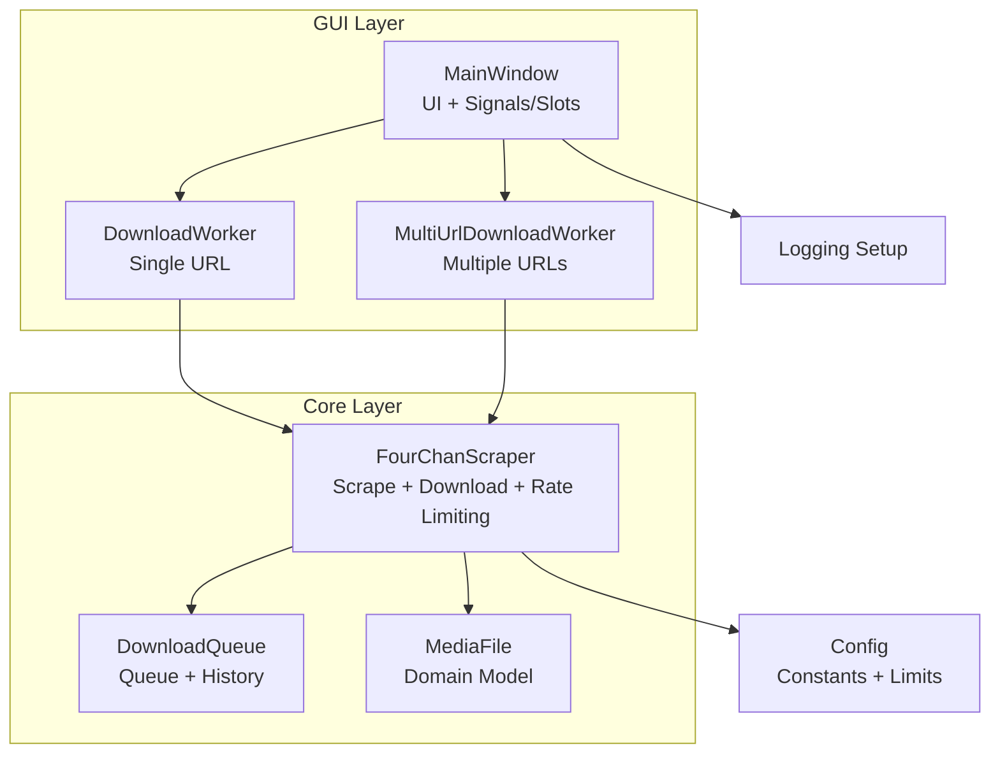
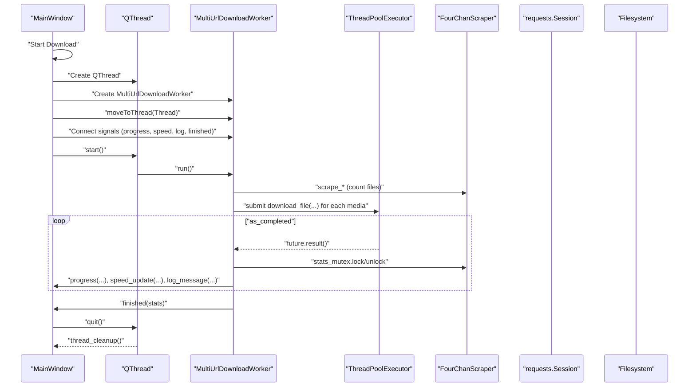
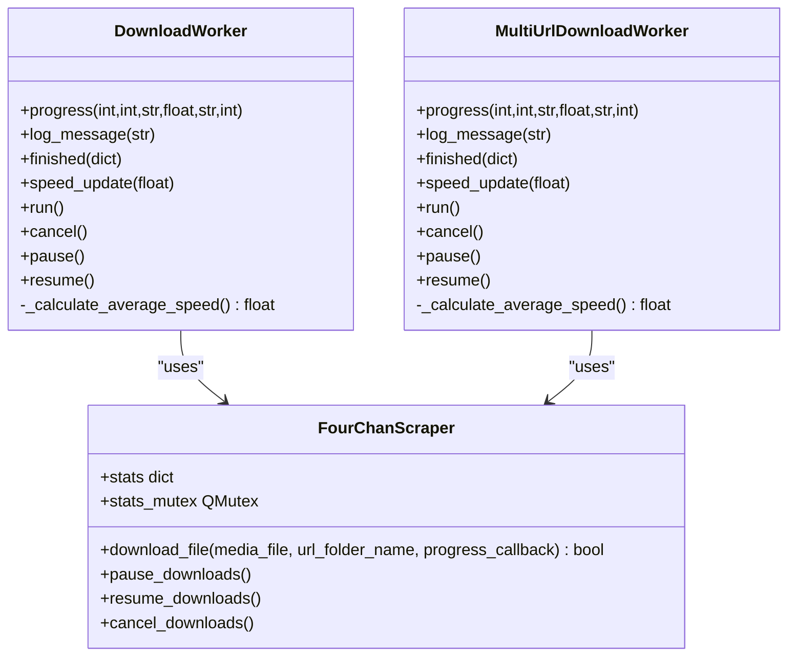
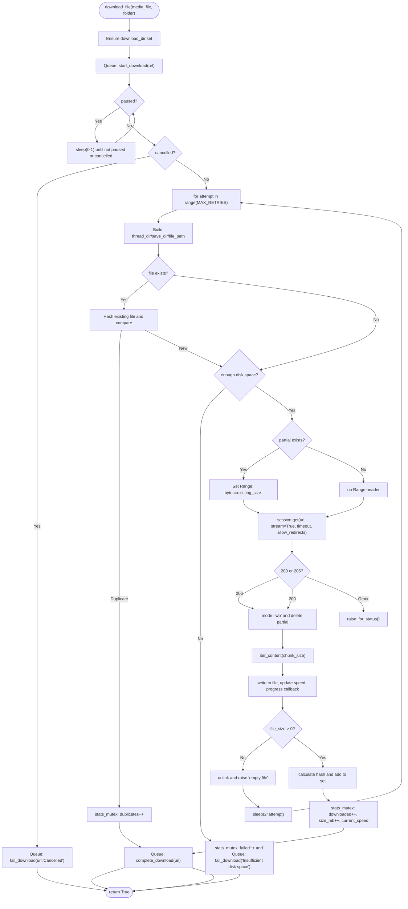
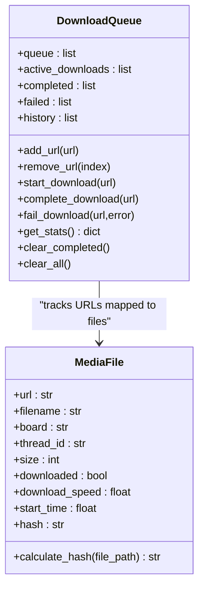
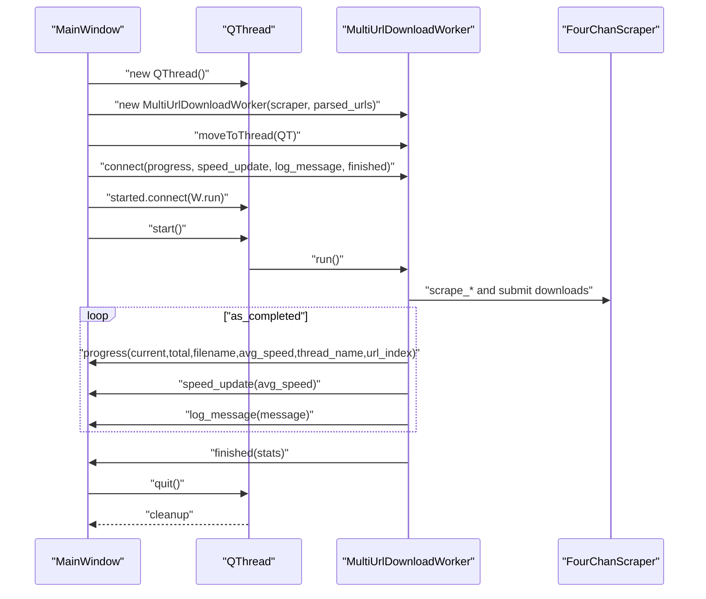
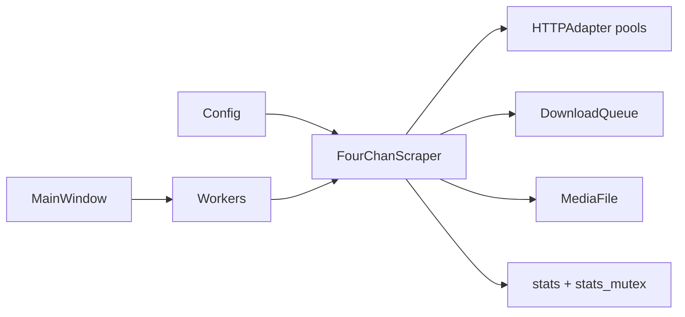

# Download Management

<cite>
**Referenced Files in This Document**
- [main.py](file://4Charm/src/four_charm/main.py)
- [main_window.py](file://4Charm/src/four_charm/gui/main_window.py)
- [workers.py](file://4Charm/src/four_charm/gui/workers.py)
- [scraper.py](file://4Charm/src/four_charm/core/scraper.py)
- [models.py](file://4Charm/src/four_charm/core/models.py)
- [config.py](file://4Charm/src/four_charm/config.py)
- [logging_setup.py](file://4Charm/src/four_charm/utils/logging_setup.py)
</cite>

## Table of Contents
1. [Introduction](#introduction)
2. [Project Structure](#project-structure)
3. [Core Components](#core-components)
4. [Architecture Overview](#architecture-overview)
5. [Detailed Component Analysis](#detailed-component-analysis)
6. [Dependency Analysis](#dependency-analysis)
7. [Performance Considerations](#performance-considerations)
8. [Troubleshooting Guide](#troubleshooting-guide)
9. [Conclusion](#conclusion)

## Introduction
This document explains the Download Management sub-feature of the application, focusing on how concurrent downloads are implemented using ThreadPoolExecutor, how progress and speed are tracked, and how the UI remains responsive via Qt’s signal/slot mechanism. It documents the interaction between DownloadWorker, FourChanScraper, and DownloadQueue, including their interfaces and domain model. Practical examples from the codebase illustrate how download tasks are created, executed, and monitored. The document also covers thread pool configuration, resource management, and solutions for common issues such as network timeouts and connection errors.

## Project Structure
The Download Management feature spans the GUI layer (worker threads and UI), the core scraping and download logic, and shared configuration/constants.

**Diagram sources**
- [main_window.py](file://4Charm/src/four_charm/gui/main_window.py#L488-L549)
- [workers.py](file://4Charm/src/four_charm/gui/workers.py#L14-L141)
- [workers.py](file://4Charm/src/four_charm/gui/workers.py#L143-L330)
- [scraper.py](file://4Charm/src/four_charm/core/scraper.py#L19-L64)
- [models.py](file://4Charm/src/four_charm/core/models.py#L11-L113)
- [config.py](file://4Charm/src/four_charm/config.py#L4-L48)
- [logging_setup.py](file://4Charm/src/four_charm/utils/logging_setup.py#L6-L39)

**Section sources**
- [main.py](file://4Charm/src/four_charm/main.py#L19-L51)
- [main_window.py](file://4Charm/src/four_charm/gui/main_window.py#L488-L549)
- [workers.py](file://4Charm/src/four_charm/gui/workers.py#L14-L141)
- [workers.py](file://4Charm/src/four_charm/gui/workers.py#L143-L330)
- [scraper.py](file://4Charm/src/four_charm/core/scraper.py#L19-L64)
- [models.py](file://4Charm/src/four_charm/core/models.py#L11-L113)
- [config.py](file://4Charm/src/four_charm/config.py#L4-L48)
- [logging_setup.py](file://4Charm/src/four_charm/utils/logging_setup.py#L6-L39)

## Core Components
- DownloadWorker: Executes a single URL session (thread or catalog) using a thread pool to download media files concurrently. Emits progress, speed, logs, and completion signals.
- MultiUrlDownloadWorker: Orchestrates multiple URLs, first counting files, then downloading them concurrently with a thread pool. Emits progress with per-URL context.
- FourChanScraper: Central coordinator for scraping, building filenames/folders, downloading with retries and resume, rate limiting, and stats synchronization via a mutex.
- DownloadQueue: Tracks queued, active, completed, and failed downloads; maintains history.
- MediaFile: Domain model representing a downloadable file with metadata and hashing for deduplication.
- Config: Thread pool size, timeouts, retries, chunk sizes, and limits.

**Section sources**
- [workers.py](file://4Charm/src/four_charm/gui/workers.py#L14-L141)
- [workers.py](file://4Charm/src/four_charm/gui/workers.py#L143-L330)
- [scraper.py](file://4Charm/src/four_charm/core/scraper.py#L19-L64)
- [models.py](file://4Charm/src/four_charm/core/models.py#L11-L113)
- [config.py](file://4Charm/src/four_charm/config.py#L4-L48)

## Architecture Overview
The UI spawns a QThread and moves a worker instance onto it. The worker uses ThreadPoolExecutor to submit download tasks. The downloader updates stats and emits signals for progress and speed. The UI receives signals and updates the progress bar, speed label, and activity log.

**Diagram sources**
- [main_window.py](file://4Charm/src/four_charm/gui/main_window.py#L488-L549)
- [workers.py](file://4Charm/src/four_charm/gui/workers.py#L143-L330)
- [scraper.py](file://4Charm/src/four_charm/core/scraper.py#L365-L547)

## Detailed Component Analysis

### DownloadWorker and MultiUrlDownloadWorker
- Both inherit QObject and expose signals for progress, speed updates, logs, and completion.
- Both construct a ThreadPoolExecutor with Config.MAX_WORKERS and submit download_file tasks.
- Both compute average speed using FourChanScraper’s stats and emit progress with filename and current average speed.
- MultiUrlDownloadWorker additionally tracks per-URL context (thread title and index) for richer progress display.

**Diagram sources**
- [workers.py](file://4Charm/src/four_charm/gui/workers.py#L14-L141)
- [workers.py](file://4Charm/src/four_charm/gui/workers.py#L143-L330)
- [scraper.py](file://4Charm/src/four_charm/core/scraper.py#L365-L547)

**Section sources**
- [workers.py](file://4Charm/src/four_charm/gui/workers.py#L14-L141)
- [workers.py](file://4Charm/src/four_charm/gui/workers.py#L143-L330)

### FourChanScraper: Scrape, Download, and Rate Limiting
- Builds session with HTTPAdapter configured with pool connections and max size proportional to MAX_WORKERS.
- Parses URLs, scrapes thread or catalog data, extracts media, and builds sanitized filenames and folder names.
- Implements adaptive delay and backoff for rate limiting and handles various network errors categorically.
- Performs duplicate detection via SHA256 hashing and resume support via Range requests.
- Updates stats atomically using QMutex and exposes pause/cancel/paused/cancelled flags.

**Diagram sources**
- [scraper.py](file://4Charm/src/four_charm/core/scraper.py#L365-L547)
- [config.py](file://4Charm/src/four_charm/config.py#L4-L48)

**Section sources**
- [scraper.py](file://4Charm/src/four_charm/core/scraper.py#L19-L64)
- [scraper.py](file://4Charm/src/four_charm/core/scraper.py#L248-L307)
- [scraper.py](file://4Charm/src/four_charm/core/scraper.py#L308-L364)
- [scraper.py](file://4Charm/src/four_charm/core/scraper.py#L365-L547)

### DownloadQueue and MediaFile
- DownloadQueue manages lifecycle of downloads: add/remove URL, move from queue to active, mark complete or failed, and maintain history.
- MediaFile holds metadata for a file, including filename, URL, board/thread association, size, download flag, speed, start time, and hash. Provides calculate_hash for deduplication.

**Diagram sources**
- [models.py](file://4Charm/src/four_charm/core/models.py#L11-L113)

**Section sources**
- [models.py](file://4Charm/src/four_charm/core/models.py#L11-L113)

### UI Integration and Signal/Slot Patterns
- MainWindow creates a QThread and moves MultiUrlDownloadWorker onto it.
- Connects worker signals to UI slots for progress, speed, log messages, and completion.
- Uses QMutex to safely update stats from worker threads.
- Emits progress with filename and per-URL context for multi-URL sessions.

**Diagram sources**
- [main_window.py](file://4Charm/src/four_charm/gui/main_window.py#L488-L549)
- [workers.py](file://4Charm/src/four_charm/gui/workers.py#L143-L330)

**Section sources**
- [main_window.py](file://4Charm/src/four_charm/gui/main_window.py#L488-L549)
- [workers.py](file://4Charm/src/four_charm/gui/workers.py#L143-L330)

## Dependency Analysis
- Thread pool sizing: MAX_WORKERS is bounded by CPU count and set to a small default to balance throughput and resource usage.
- Session pooling: HTTPAdapter pool sizes are set to a multiple of MAX_WORKERS to support concurrent downloads efficiently.
- Rate limiting: adaptive_delay reduces or increases delay based on success/failure; special handling for 429 (rate limit) with backoff.
- Duplicate detection: SHA256 hashing prevents redundant downloads.
- Progress callbacks: download_file accepts a progress callback to report percentage and instantaneous speed.

**Diagram sources**
- [config.py](file://4Charm/src/four_charm/config.py#L4-L48)
- [scraper.py](file://4Charm/src/four_charm/core/scraper.py#L19-L64)
- [scraper.py](file://4Charm/src/four_charm/core/scraper.py#L365-L547)
- [models.py](file://4Charm/src/four_charm/core/models.py#L11-L113)
- [main_window.py](file://4Charm/src/four_charm/gui/main_window.py#L488-L549)
- [workers.py](file://4Charm/src/four_charm/gui/workers.py#L143-L330)

**Section sources**
- [config.py](file://4Charm/src/four_charm/config.py#L4-L48)
- [scraper.py](file://4Charm/src/four_charm/core/scraper.py#L19-L64)
- [scraper.py](file://4Charm/src/four_charm/core/scraper.py#L365-L547)
- [models.py](file://4Charm/src/four_charm/core/models.py#L11-L113)
- [main_window.py](file://4Charm/src/four_charm/gui/main_window.py#L488-L549)
- [workers.py](file://4Charm/src/four_charm/gui/workers.py#L143-L330)

## Performance Considerations
- Thread pool configuration: MAX_WORKERS defaults to a small fraction of CPU cores to avoid saturating the network or filesystem. Adjusting this value can improve throughput on systems with strong I/O and network capacity.
- Chunk size: CHUNK_SIZE controls streaming buffer size; larger chunks can reduce overhead but increase memory usage.
- Session pooling: pool_connections and pool_maxsize are scaled with MAX_WORKERS to maximize reuse of TCP connections.
- Rate limiting: adaptive_delay and backoff mitigate server throttling and transient failures.
- Disk space checks: pre-check prevents wasted I/O on insufficient storage.
- Resume support: Range requests minimize wasted bandwidth on interrupted downloads.

[No sources needed since this section provides general guidance]

## Troubleshooting Guide
Common issues and their solutions:
- Network timeouts and connection errors
  - Symptom: Requests exceptions during scraping or downloading.
  - Solution: The downloader categorizes errors and applies adaptive delay/backoff. For 429, it increases delay; for 403/404, it logs and retries with backoff; for unknown errors, it retries with exponential backoff.
  - References:
    - [scraper.py](file://4Charm/src/four_charm/core/scraper.py#L75-L132)
    - [scraper.py](file://4Charm/src/four_charm/core/scraper.py#L248-L307)
    - [scraper.py](file://4Charm/src/four_charm/core/scraper.py#L365-L547)
- Insufficient disk space
  - Symptom: Download fails early with a “failed” stat.
  - Solution: The downloader checks available space before writing and skips if below threshold.
  - References:
    - [scraper.py](file://4Charm/src/four_charm/core/scraper.py#L210-L221)
    - [scraper.py](file://4Charm/src/four_charm/core/scraper.py#L431-L439)
- Duplicate files
  - Symptom: “Skipped duplicates” reported.
  - Solution: Hash-based deduplication prevents re-downloading identical files.
  - References:
    - [scraper.py](file://4Charm/src/four_charm/core/scraper.py#L410-L429)
    - [scraper.py](file://4Charm/src/four_charm/core/scraper.py#L508-L515)
    - [models.py](file://4Charm/src/four_charm/core/models.py#L92-L113)
- Pausing and resuming
  - Symptom: Downloads appear stuck.
  - Solution: pause_downloads sets paused flag; download_file sleeps while paused and checks cancelled.
  - References:
    - [scraper.py](file://4Charm/src/four_charm/core/scraper.py#L548-L553)
    - [scraper.py](file://4Charm/src/four_charm/core/scraper.py#L384-L389)
    - [scraper.py](file://4Charm/src/four_charm/core/scraper.py#L484-L488)
- Cancellation
  - Symptom: Long-running downloads do not stop immediately.
  - Solution: cancel_downloads sets cancelled flag; download_file exits early on cancellation.
  - References:
    - [scraper.py](file://4Charm/src/four_charm/core/scraper.py#L554-L557)
    - [scraper.py](file://4Charm/src/four_charm/core/scraper.py#L380-L383)
    - [scraper.py](file://4Charm/src/four_charm/core/scraper.py#L481-L483)
- Speed reporting
  - Symptom: Speed appears zero or fluctuates wildly.
  - Solution: Average speed is computed from stats and instantaneous speed is updated per chunk; ensure stats_mutex is used to avoid race conditions.
  - References:
    - [workers.py](file://4Charm/src/four_charm/gui/workers.py#L121-L132)
    - [workers.py](file://4Charm/src/four_charm/gui/workers.py#L310-L321)
    - [scraper.py](file://4Charm/src/four_charm/core/scraper.py#L493-L502)
    - [scraper.py](file://4Charm/src/four_charm/core/scraper.py#L518-L522)

**Section sources**
- [scraper.py](file://4Charm/src/four_charm/core/scraper.py#L75-L132)
- [scraper.py](file://4Charm/src/four_charm/core/scraper.py#L210-L221)
- [scraper.py](file://4Charm/src/four_charm/core/scraper.py#L365-L547)
- [workers.py](file://4Charm/src/four_charm/gui/workers.py#L121-L132)
- [workers.py](file://4Charm/src/four_charm/gui/workers.py#L310-L321)
- [models.py](file://4Charm/src/four_charm/core/models.py#L92-L113)

## Conclusion
The Download Management feature achieves responsive, concurrent downloads by offloading work to worker threads and using ThreadPoolExecutor for parallelism. FourChanScraper centralizes scraping, downloading, rate limiting, and duplicate detection, while DownloadQueue and MediaFile provide a clean domain model. The UI remains responsive through Qt’s signal/slot pattern, receiving progress, speed, and completion updates. Robust error handling and adaptive rate limiting improve reliability under varying network conditions. For optimal performance, tune MAX_WORKERS and CHUNK_SIZE according to system capabilities and network conditions.