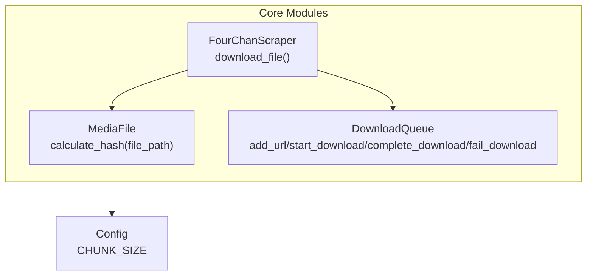
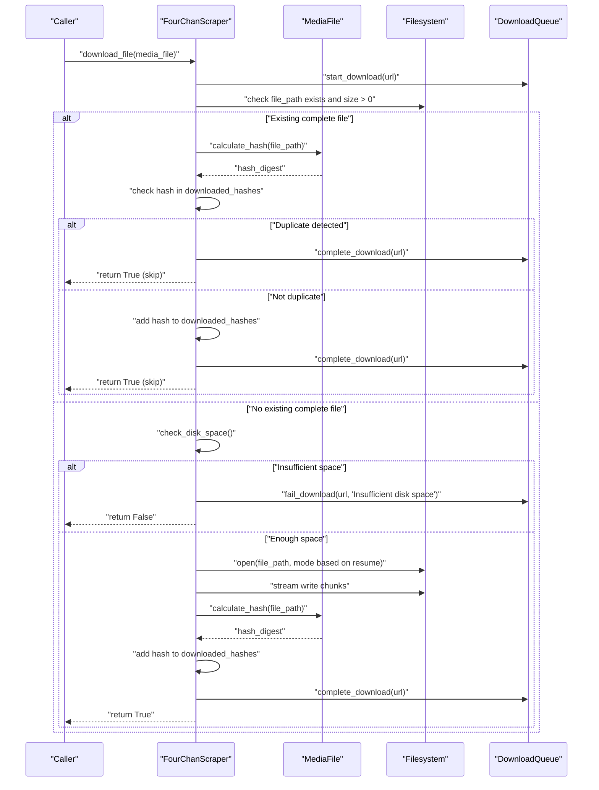
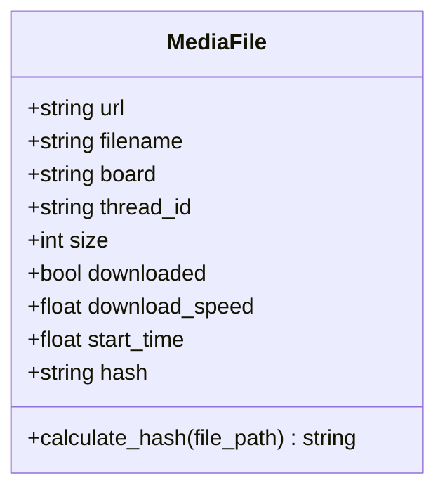
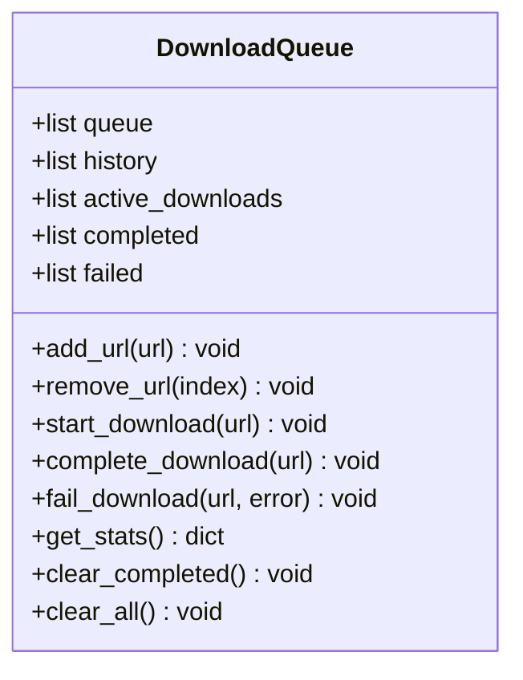
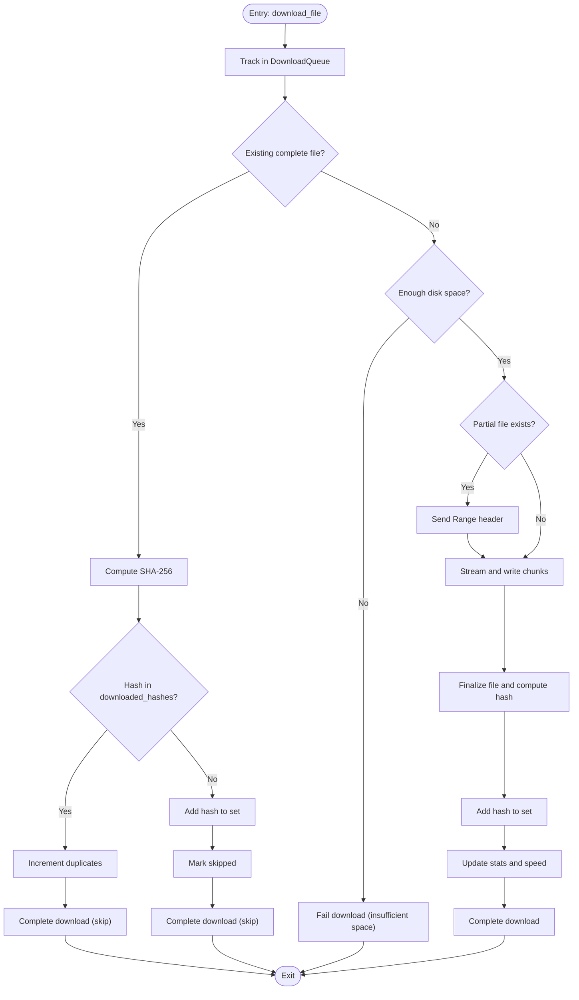
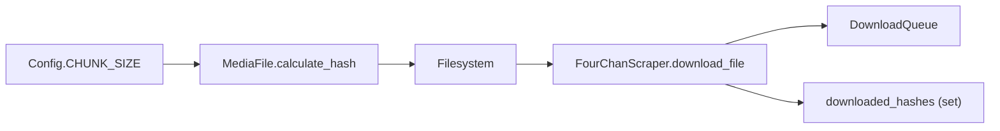

# Duplicate Detection

<cite>
**Referenced Files in This Document**
- [models.py](file://4Charm/src/four_charm/core/models.py)
- [scraper.py](file://4Charm/src/four_charm/core/scraper.py)
- [config.py](file://4Charm/src/four_charm/config.py)
</cite>

## Table of Contents
1. [Introduction](#introduction)
2. [Project Structure](#project-structure)
3. [Core Components](#core-components)
4. [Architecture Overview](#architecture-overview)
5. [Detailed Component Analysis](#detailed-component-analysis)
6. [Dependency Analysis](#dependency-analysis)
7. [Performance Considerations](#performance-considerations)
8. [Troubleshooting Guide](#troubleshooting-guide)
9. [Conclusion](#conclusion)

## Introduction
This document explains the Duplicate Detection sub-feature implemented in the 4Charm project. It focuses on how SHA-256 hashing is used to identify duplicate files and skip redundant downloads. The document covers:
- How the MediaFile class calculates and stores hash values
- How the FourChanScraper checks for duplicates before initiating downloads
- The role of the DownloadQueue in tracking completion and failures
- Technical decisions behind choosing SHA-256 and performance implications
- Common issues such as hash collisions and partial file detection, and their solutions

## Project Structure
The duplicate detection logic spans three core modules:
- models.py: Defines MediaFile and DownloadQueue
- scraper.py: Implements the download pipeline, including duplicate detection and partial resume
- config.py: Provides CHUNK_SIZE and other constants used during hashing and streaming

**Diagram sources**
- [models.py](file://4Charm/src/four_charm/core/models.py#L92-L113)
- [scraper.py](file://4Charm/src/four_charm/core/scraper.py#L365-L547)
- [config.py](file://4Charm/src/four_charm/config.py#L1-L48)

**Section sources**
- [models.py](file://4Charm/src/four_charm/core/models.py#L92-L113)
- [scraper.py](file://4Charm/src/four_charm/core/scraper.py#L365-L547)
- [config.py](file://4Charm/src/four_charm/config.py#L1-L48)

## Core Components
- MediaFile: Represents a downloadable media item and provides a method to compute the SHA-256 hash of a saved file.
- DownloadQueue: Tracks URLs in queue, active downloads, completed, failed, and history entries.
- FourChanScraper: Orchestrates downloading, duplicate detection, and partial resume; maintains a set of previously seen hashes.

Key responsibilities:
- MediaFile.calculate_hash(file_path): Streams file content in chunks and computes SHA-256 digest.
- FourChanScraper.download_file(): Checks for existing complete files, computes hash, compares against known hashes, and decides whether to skip or proceed with download.
- DownloadQueue: Completes or fails downloads and records history.

**Section sources**
- [models.py](file://4Charm/src/four_charm/core/models.py#L92-L113)
- [scraper.py](file://4Charm/src/four_charm/core/scraper.py#L365-L547)

## Architecture Overview
The duplicate detection pipeline integrates hashing with the download workflow:

**Diagram sources**
- [scraper.py](file://4Charm/src/four_charm/core/scraper.py#L365-L547)
- [models.py](file://4Charm/src/four_charm/core/models.py#L92-L113)

## Detailed Component Analysis

### MediaFile: Hash Calculation and Storage
- Purpose: Encapsulate metadata for a media file and compute its SHA-256 hash from disk.
- Implementation highlights:
  - Uses a streaming approach to read file content in chunks sized by Config.CHUNK_SIZE.
  - Updates a SHA-256 context incrementally and returns the hexadecimal digest.
  - Stores the computed hash in the MediaFile.hash field after successful download.

**Diagram sources**
- [models.py](file://4Charm/src/four_charm/core/models.py#L92-L113)

**Section sources**
- [models.py](file://4Charm/src/four_charm/core/models.py#L92-L113)
- [config.py](file://4Charm/src/four_charm/config.py#L1-L48)

### DownloadQueue: Completion and Failure Tracking
- Purpose: Manage lifecycle of downloads without UI changes.
- Key behaviors:
  - add_url(url): Adds a URL if not already queued or active.
  - start_download(url): Moves a URL from queue to active.
  - complete_download(url): Removes from active and appends to completed/history.
  - fail_download(url, error): Removes from active and appends to failed/history with error details.

**Diagram sources**
- [models.py](file://4Charm/src/four_charm/core/models.py#L11-L91)

**Section sources**
- [models.py](file://4Charm/src/four_charm/core/models.py#L11-L91)

### FourChanScraper: Duplicate Detection and Download Pipeline
- Purpose: Coordinate downloads, detect duplicates, and resume partial files.
- Duplicate detection logic:
  - Before downloading, checks if a file exists and has a positive size.
  - Computes the file’s SHA-256 hash and checks membership in a set of previously seen hashes.
  - If duplicate, increments duplicate counter and completes the download without re-fetching.
  - If not duplicate, adds the hash to the set and marks the download as skipped (already present).
- Partial file handling:
  - Detects existing partial files by inspecting file size.
  - Sends a Range header to resume from the existing size.
  - Handles 206 Partial Content to append or 200 OK to overwrite.
- Post-download:
  - Recomputes hash and adds to the set.
  - Updates MediaFile metadata (size, speed, downloaded flag).
  - Records statistics and completes the download via DownloadQueue.

**Diagram sources**
- [scraper.py](file://4Charm/src/four_charm/core/scraper.py#L365-L547)
- [models.py](file://4Charm/src/four_charm/core/models.py#L92-L113)

**Section sources**
- [scraper.py](file://4Charm/src/four_charm/core/scraper.py#L365-L547)
- [models.py](file://4Charm/src/four_charm/core/models.py#L92-L113)

## Dependency Analysis
- MediaFile.calculate_hash depends on Config.CHUNK_SIZE for streaming reads.
- FourChanScraper uses MediaFile.calculate_hash and DownloadQueue to manage lifecycle and deduplication.
- The duplicate set (downloaded_hashes) is maintained in-memory within FourChanScraper.

**Diagram sources**
- [config.py](file://4Charm/src/four_charm/config.py#L1-L48)
- [models.py](file://4Charm/src/four_charm/core/models.py#L92-L113)
- [scraper.py](file://4Charm/src/four_charm/core/scraper.py#L365-L547)

**Section sources**
- [config.py](file://4Charm/src/four_charm/config.py#L1-L48)
- [models.py](file://4Charm/src/four_charm/core/models.py#L92-L113)
- [scraper.py](file://4Charm/src/four_charm/core/scraper.py#L365-L547)

## Performance Considerations
- Streaming hashing:
  - The hashing algorithm streams file content in chunks sized by Config.CHUNK_SIZE, balancing memory usage and throughput.
  - Larger chunk sizes reduce overhead but increase memory footprint; smaller chunk sizes improve responsiveness for small files but add overhead for large files.
- SHA-256 choice:
  - SHA-256 provides strong collision resistance suitable for duplicate detection across diverse media types.
  - It is widely supported and standardized, enabling interoperability and future-proofing.
- In-memory hash set:
  - The set of seen hashes grows with the number of unique files processed. Memory usage scales linearly with unique files.
  - Consider periodic pruning or external persistence for very large runs.
- Partial resume:
  - Resume reduces bandwidth and time by appending to existing partial files, avoiding recomputation of hashes for partially downloaded content.

[No sources needed since this section provides general guidance]

## Troubleshooting Guide
Common issues and resolutions:
- Empty or zero-byte files:
  - The pipeline removes zero-sized files and raises an exception to signal failure. Retries are handled by the outer loop.
  - Resolution: Verify network conditions and server responses; ensure the target URL is valid.
- Insufficient disk space:
  - The pipeline checks available space and fails the download early with a descriptive message.
  - Resolution: Free up disk space or adjust download directory.
- Hash calculation exceptions:
  - If hash calculation fails (e.g., permission or IO errors), the pipeline logs a warning and continues.
  - Resolution: Check file permissions and filesystem health.
- Partial file resume anomalies:
  - If a partial file exists but server does not support resume, the pipeline overwrites the file.
  - Resolution: Ensure the server supports Range requests; otherwise, expect a full re-download.
- Duplicate detection false negatives:
  - Extremely unlikely with SHA-256, but possible with hash collisions. The pipeline relies on the hash set for deduplication.
  - Resolution: Monitor statistics; if duplicates persist, investigate file corruption or tampering.

**Section sources**
- [scraper.py](file://4Charm/src/four_charm/core/scraper.py#L408-L526)
- [models.py](file://4Charm/src/four_charm/core/models.py#L106-L112)

## Conclusion
The Duplicate Detection sub-feature in 4Charm leverages SHA-256 hashing to reliably skip redundant downloads. The MediaFile class streams file content in configurable chunk sizes to compute digests, while FourChanScraper orchestrates duplicate checks, partial resume, and lifecycle management via DownloadQueue. The approach balances performance, memory usage, and robustness, with clear fallbacks for edge cases.