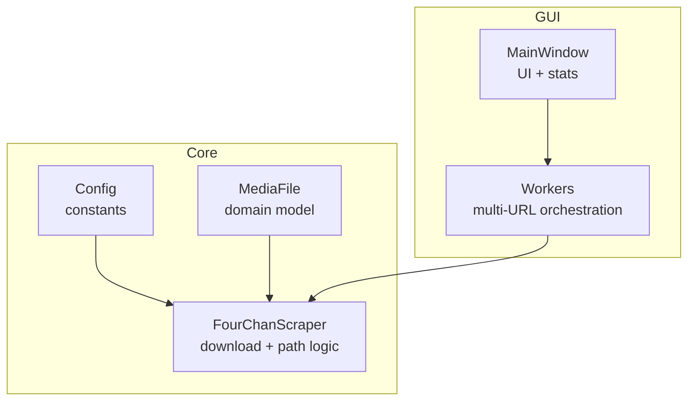
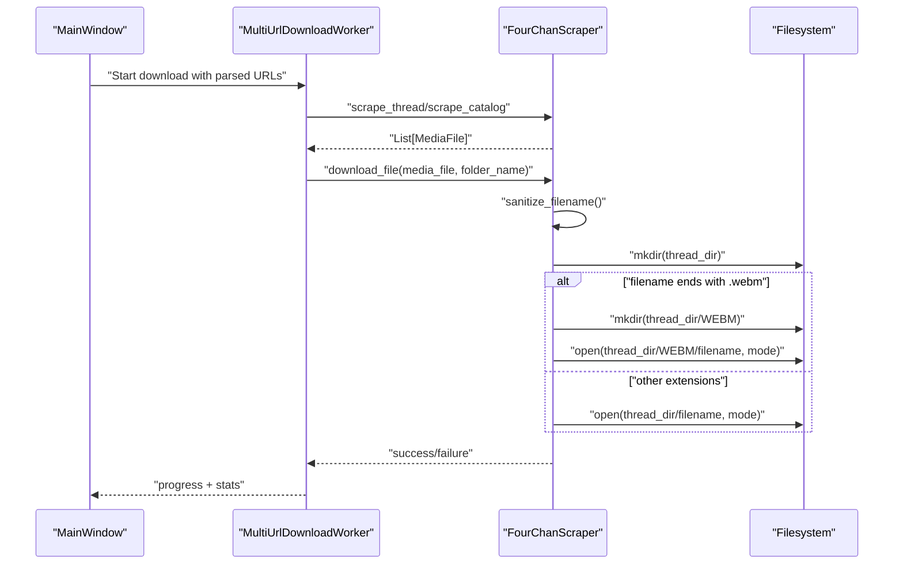
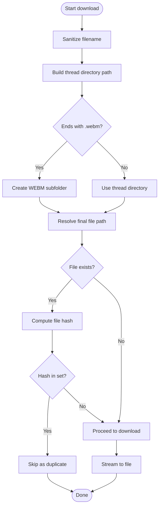
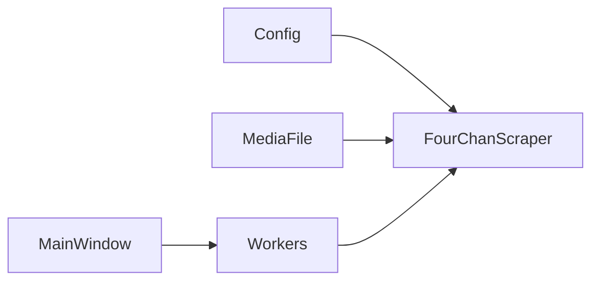

# File Organization

<cite>
**Referenced Files in This Document**
- [models.py](file://4Charm/src/four_charm/core/models.py)
- [scraper.py](file://4Charm/src/four_charm/core/scraper.py)
- [config.py](file://4Charm/src/four_charm/config.py)
- [main_window.py](file://4Charm/src/four_charm/gui/main_window.py)
- [workers.py](file://4Charm/src/four_charm/gui/workers.py)
</cite>

## Table of Contents
1. [Introduction](#introduction)
2. [Project Structure](#project-structure)
3. [Core Components](#core-components)
4. [Architecture Overview](#architecture-overview)
5. [Detailed Component Analysis](#detailed-component-analysis)
6. [Dependency Analysis](#dependency-analysis)
7. [Performance Considerations](#performance-considerations)
8. [Troubleshooting Guide](#troubleshooting-guide)
9. [Conclusion](#conclusion)

## Introduction
This document explains the File Organization sub-feature that organizes downloaded media into per-thread folders and separates WEBM files into a dedicated subfolder. It details how the MediaFile class participates in path resolution, how filenames are sanitized, and how the system handles path length limits and special characters. It also connects the domain model for file metadata to the download pipeline and provides practical guidance for common issues.

## Project Structure
The File Organization feature spans the core downloader logic, configuration, and GUI integration:
- Core downloader and path resolution live in the scraper module.
- Domain model for file metadata is defined in the models module.
- Configuration constants for path limits and extensions live in config.
- GUI wires URLs to the downloader and displays progress and stats.

**Diagram sources**
- [config.py](file://4Charm/src/four_charm/config.py#L1-L48)
- [models.py](file://4Charm/src/four_charm/core/models.py#L92-L113)
- [scraper.py](file://4Charm/src/four_charm/core/scraper.py#L19-L176)
- [main_window.py](file://4Charm/src/four_charm/gui/main_window.py#L391-L516)
- [workers.py](file://4Charm/src/four_charm/gui/workers.py#L143-L330)

**Section sources**
- [config.py](file://4Charm/src/four_charm/config.py#L1-L48)
- [models.py](file://4Charm/src/four_charm/core/models.py#L92-L113)
- [scraper.py](file://4Charm/src/four_charm/core/scraper.py#L19-L176)
- [main_window.py](file://4Charm/src/four_charm/gui/main_window.py#L391-L516)
- [workers.py](file://4Charm/src/four_charm/gui/workers.py#L143-L330)

## Core Components
- MediaFile: Holds metadata for a downloadable file, including filename, board, thread_id, and provides a hash calculation method used for duplicate detection.
- FourChanScraper: Implements filename sanitization, builds thread/session folder names, and resolves the final file path for each download. It creates per-thread directories and a WEBM subfolder when appropriate.
- Config: Defines filename and folder name length limits, supported media extensions, and other tuning constants.
- Workers: Orchestrates multi-URL scraping and downloads, passing folder names to the downloader.
- MainWindow: Prompts for the download directory, validates URLs, and displays statistics.

**Section sources**
- [models.py](file://4Charm/src/four_charm/core/models.py#L92-L113)
- [scraper.py](file://4Charm/src/four_charm/core/scraper.py#L133-L176)
- [scraper.py](file://4Charm/src/four_charm/core/scraper.py#L194-L209)
- [config.py](file://4Charm/src/four_charm/config.py#L1-L48)
- [workers.py](file://4Charm/src/four_charm/gui/workers.py#L143-L330)
- [main_window.py](file://4Charm/src/four_charm/gui/main_window.py#L391-L516)

## Architecture Overview
The downloader orchestrates URL parsing, media extraction, and file path resolution. The GUI sets the download directory and coordinates concurrent downloads.

**Diagram sources**
- [workers.py](file://4Charm/src/four_charm/gui/workers.py#L143-L330)
- [scraper.py](file://4Charm/src/four_charm/core/scraper.py#L365-L547)
- [scraper.py](file://4Charm/src/four_charm/core/scraper.py#L133-L176)
- [main_window.py](file://4Charm/src/four_charm/gui/main_window.py#L391-L516)

## Detailed Component Analysis

### MediaFile and Domain Model for File Metadata
MediaFile encapsulates the essential metadata for a downloadable file:
- Identity: url, filename, board, thread_id
- Runtime: size, downloaded flag, download_speed, start_time, hash
- Behavior: calculate_hash(file_path) for duplicate detection

This model ties into the download pipeline by enabling duplicate detection via hashing and by carrying thread context used for folder naming.

**Section sources**
- [models.py](file://4Charm/src/four_charm/core/models.py#L92-L113)

### Filename Sanitization and Path Resolution
Filename sanitization ensures safe filesystem usage:
- Removes or replaces invalid characters for the platform.
- Prevents reserved names and enforces a maximum filename length.
- Produces a fallback unnamed_file when necessary.

Folder component sanitization is used to build stable directory names from thread titles and session identifiers.

Per-thread folder creation:
- Thread-scoped directories are created under the user-selected download_dir.
- If a folder name is provided (e.g., derived from URL), it is used; otherwise, a misc fallback is used.

WEBM separation:
- For files ending with .webm, a dedicated WEBM subfolder is created inside the thread directory.
- Other media types are saved directly into the thread directory.

**Diagram sources**
- [scraper.py](file://4Charm/src/four_charm/core/scraper.py#L133-L176)
- [scraper.py](file://4Charm/src/four_charm/core/scraper.py#L365-L547)

**Section sources**
- [scraper.py](file://4Charm/src/four_charm/core/scraper.py#L133-L176)
- [scraper.py](file://4Charm/src/four_charm/core/scraper.py#L365-L547)

### Thread and Session Folder Naming
The system builds meaningful folder names:
- Session base name: derived from board and type (thread/catalog/board), sanitized and truncated to a maximum length.
- Thread folder name: derived from thread title when available, otherwise falls back to thread_id; sanitized and truncated.

These names are passed into the download pipeline to create per-thread directories.

**Section sources**
- [scraper.py](file://4Charm/src/four_charm/core/scraper.py#L178-L209)
- [config.py](file://4Charm/src/four_charm/config.py#L1-L48)

### GUI Integration and Statistics
The GUI:
- Prompts for the download directory and ensures it exists.
- Parses and validates URLs, then starts concurrent downloads.
- Emits progress and speed updates and periodically refreshes folder, file, and size statistics.

Statistics are computed by walking the download directory and using the macOS du command for accuracy.

**Section sources**
- [main_window.py](file://4Charm/src/four_charm/gui/main_window.py#L391-L516)
- [main_window.py](file://4Charm/src/four_charm/gui/main_window.py#L657-L711)
- [workers.py](file://4Charm/src/four_charm/gui/workers.py#L143-L330)

## Dependency Analysis
The downloader depends on configuration constants for limits and extensions, constructs paths using pathlib, and uses threading for concurrency. The GUI integrates with the downloader via worker threads.

**Diagram sources**
- [config.py](file://4Charm/src/four_charm/config.py#L1-L48)
- [models.py](file://4Charm/src/four_charm/core/models.py#L92-L113)
- [scraper.py](file://4Charm/src/four_charm/core/scraper.py#L19-L176)
- [workers.py](file://4Charm/src/four_charm/gui/workers.py#L143-L330)
- [main_window.py](file://4Charm/src/four_charm/gui/main_window.py#L391-L516)

**Section sources**
- [config.py](file://4Charm/src/four_charm/config.py#L1-L48)
- [models.py](file://4Charm/src/four_charm/core/models.py#L92-L113)
- [scraper.py](file://4Charm/src/four_charm/core/scraper.py#L19-L176)
- [workers.py](file://4Charm/src/four_charm/gui/workers.py#L143-L330)
- [main_window.py](file://4Charm/src/four_charm/gui/main_window.py#L391-L516)

## Performance Considerations
- Concurrency: Downloads are executed concurrently using a thread pool sized by configuration.
- Disk space checks: Before writing, the system checks available space to avoid partial writes and failures.
- Resume support: Range requests enable resuming partial downloads when applicable.
- Hash-based deduplication: Reduces redundant I/O by skipping files with matching hashes.

[No sources needed since this section provides general guidance]

## Troubleshooting Guide
Common issues and their solutions:
- Invalid characters in filenames: The sanitizer replaces or removes invalid characters and prevents reserved names. If a filename becomes empty, a fallback name is used.
- Filename too long: Filenames exceeding the configured maximum are truncated to fit within the extension length limit.
- WEBM not appearing in a separate folder: Ensure the filename ends with the expected extension; otherwise, it will be placed in the thread directory.
- Insufficient disk space: The system checks available space before writing and fails early with a clear error.
- Pausing/cancelling: The GUI toggles pause/resume and cancellation flags; downloads respect these states during loops and retries.

**Section sources**
- [scraper.py](file://4Charm/src/four_charm/core/scraper.py#L133-L176)
- [scraper.py](file://4Charm/src/four_charm/core/scraper.py#L431-L439)
- [main_window.py](file://4Charm/src/four_charm/gui/main_window.py#L551-L578)

## Conclusion
The File Organization sub-feature cleanly separates WEBM files into a dedicated subfolder while organizing all other media into per-thread directories. The MediaFile domain model carries thread context and enables hash-based deduplication. Filename sanitization and configurable path limits ensure robustness across platforms. The GUI integrates seamlessly with the downloader to provide progress and statistics, while concurrency and disk-space checks improve reliability.