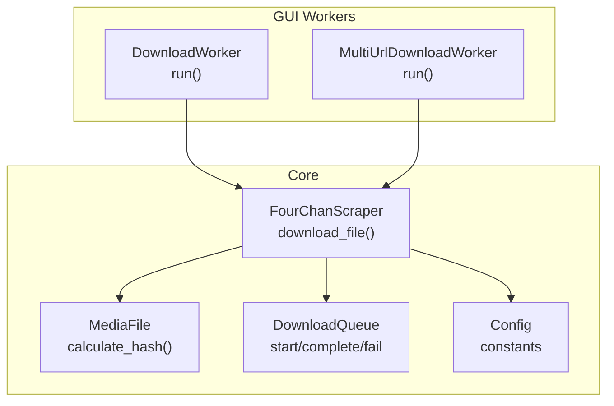
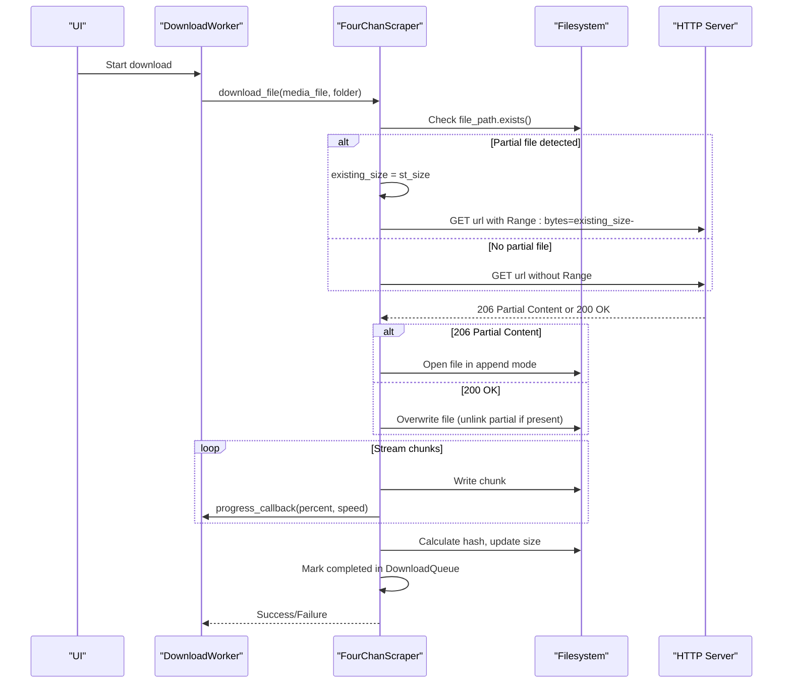
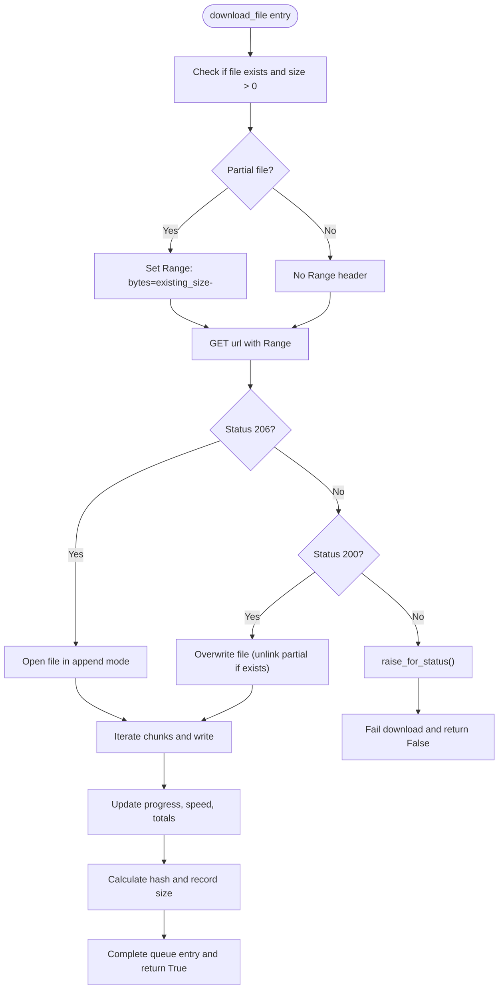
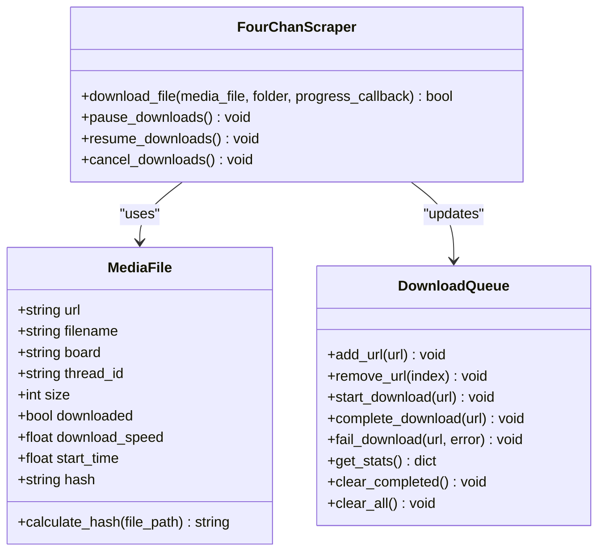
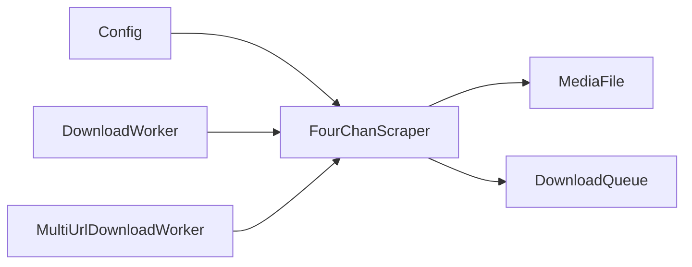

# Resume Capability

<cite>
**Referenced Files in This Document**
- [scraper.py](file://4Charm/src/four_charm/core/scraper.py)
- [workers.py](file://4Charm/src/four_charm/gui/workers.py)
- [models.py](file://4Charm/src/four_charm/core/models.py)
- [config.py](file://4Charm/src/four_charm/config.py)
</cite>

## Table of Contents
1. [Introduction](#introduction)
2. [Project Structure](#project-structure)
3. [Core Components](#core-components)
4. [Architecture Overview](#architecture-overview)
5. [Detailed Component Analysis](#detailed-component-analysis)
6. [Dependency Analysis](#dependency-analysis)
7. [Performance Considerations](#performance-considerations)
8. [Troubleshooting Guide](#troubleshooting-guide)
9. [Conclusion](#conclusion)

## Introduction
This document explains the Resume Capability sub-feature that enables downloads to continue from where they left off using HTTP Range requests and partial file detection. It covers how the FourChanScraper class checks for existing partial or complete files, constructs Range requests, and manages progress state during interrupted transfers. It also documents how the DownloadWorker coordinates concurrent downloads and integrates with the FourChanScraper’s resume logic. Domain models for tracking progress and queue state are described, along with practical guidance for handling server-side range support and filesystem inconsistencies.

## Project Structure
The resume capability spans three primary modules:
- Core downloader and HTTP logic: FourChanScraper
- Worker orchestration: DownloadWorker and MultiUrlDownloadWorker
- Domain models for progress and queue state: MediaFile and DownloadQueue
- Configuration constants: Config

**Diagram sources**
- [scraper.py](file://4Charm/src/four_charm/core/scraper.py#L365-L547)
- [workers.py](file://4Charm/src/four_charm/gui/workers.py#L27-L141)
- [models.py](file://4Charm/src/four_charm/core/models.py#L11-L113)
- [config.py](file://4Charm/src/four_charm/config.py#L1-L48)

**Section sources**
- [scraper.py](file://4Charm/src/four_charm/core/scraper.py#L1-L120)
- [workers.py](file://4Charm/src/four_charm/gui/workers.py#L1-L141)
- [models.py](file://4Charm/src/four_charm/core/models.py#L1-L113)
- [config.py](file://4Charm/src/four_charm/config.py#L1-L48)

## Core Components
- FourChanScraper.download_file(): Implements partial file detection, HTTP Range request construction, resume handling, progress reporting, and completion tracking.
- MediaFile: Holds per-file metadata (size, speed, hash) and calculates file hashes for duplicate detection.
- DownloadQueue: Tracks active, completed, and failed downloads and maintains history.
- DownloadWorker/MultiUrlDownloadWorker: Orchestrates concurrent downloads and emits progress updates.

Key resume-related responsibilities:
- Detect existing partial or complete files and skip or resume accordingly.
- Send Range: bytes=<start>- headers when resuming.
- Handle 206 Partial Content vs 200 Full Content responses.
- Update progress callbacks with current and cumulative sizes.
- Manage cancellation and pause/resume signals.

**Section sources**
- [scraper.py](file://4Charm/src/four_charm/core/scraper.py#L365-L547)
- [models.py](file://4Charm/src/four_charm/core/models.py#L92-L113)
- [workers.py](file://4Charm/src/four_charm/gui/workers.py#L14-L141)

## Architecture Overview
The resume flow is initiated by the GUI worker, which submits MediaFile objects to FourChanScraper.download_file(). The scraper checks for existing files, decides whether to resume or overwrite, sends a Range request if needed, streams chunks, updates progress, and marks completion.

**Diagram sources**
- [scraper.py](file://4Charm/src/four_charm/core/scraper.py#L441-L501)
- [workers.py](file://4Charm/src/four_charm/gui/workers.py#L55-L115)

## Detailed Component Analysis

### FourChanScraper.download_file(): Resume and Progress Management
Responsibilities:
- Partial file detection: Checks if a file exists and has nonzero size.
- Range request construction: Adds Range header when resuming.
- Response handling: Treats 206 Partial Content as append mode; 200 OK as overwrite.
- Streaming and progress: Iterates response chunks, updates downloaded size, computes speed, and invokes progress callback.
- Completion: Calculates hash, records size, increments stats, and completes queue entry.

Important implementation points:
- Partial detection and resume header: [headers and Range construction](file://4Charm/src/four_charm/core/scraper.py#L441-L450)
- Response handling and file mode selection: [206 vs 200 logic](file://4Charm/src/four_charm/core/scraper.py#L461-L471)
- Streaming loop and progress callback: [chunk iteration and progress](file://4Charm/src/four_charm/core/scraper.py#L479-L501)
- Post-download hashing and stats: [hash calculation and stats update](file://4Charm/src/four_charm/core/scraper.py#L508-L526)

**Diagram sources**
- [scraper.py](file://4Charm/src/four_charm/core/scraper.py#L441-L526)

**Section sources**
- [scraper.py](file://4Charm/src/four_charm/core/scraper.py#L365-L547)

### DownloadWorker: Concurrent Orchestration and Progress Emission
Responsibilities:
- Scrape media files from threads/catalogs.
- Submit downloads to FourChanScraper with ThreadPoolExecutor.
- Emit progress updates and final statistics.
- Propagate pause/resume/cancel signals to the scraper.

Resume integration:
- Uses FourChanScraper.download_file() for each MediaFile.
- Receives per-file speed from MediaFile and computes average speed.

Key paths:
- Worker run and progress emission: [worker run and progress](file://4Charm/src/four_charm/gui/workers.py#L27-L115)
- Pause/resume/cancel delegation: [signals](file://4Charm/src/four_charm/gui/workers.py#L133-L141)

**Section sources**
- [workers.py](file://4Charm/src/four_charm/gui/workers.py#L14-L141)

### Domain Model: MediaFile and DownloadQueue
MediaFile:
- Stores per-file metadata: url, filename, board, thread_id, size, downloaded flag, download_speed, start_time, hash.
- Provides calculate_hash(file_path) for duplicate detection.

DownloadQueue:
- Manages queue lifecycle: add/remove, start/complete/fail, history, and stats.
- Used by FourChanScraper to track per-URL state during resume and completion.

Key paths:
- MediaFile definition and hash calculation: [MediaFile](file://4Charm/src/four_charm/core/models.py#L92-L113)
- DownloadQueue operations: [DownloadQueue](file://4Charm/src/four_charm/core/models.py#L11-L91)

**Diagram sources**
- [models.py](file://4Charm/src/four_charm/core/models.py#L11-L113)
- [scraper.py](file://4Charm/src/four_charm/core/scraper.py#L365-L547)

**Section sources**
- [models.py](file://4Charm/src/four_charm/core/models.py#L11-L113)

## Dependency Analysis
- FourChanScraper depends on:
  - requests.Session for HTTP operations and streaming.
  - Config constants for timeouts, retries, chunk size, and limits.
  - MediaFile for hashing and progress metadata.
  - DownloadQueue for lifecycle tracking.
- DownloadWorker depends on FourChanScraper and emits Qt signals for progress and completion.
- MediaFile and DownloadQueue are pure domain models with no external dependencies.

**Diagram sources**
- [scraper.py](file://4Charm/src/four_charm/core/scraper.py#L22-L63)
- [config.py](file://4Charm/src/four_charm/config.py#L1-L48)
- [models.py](file://4Charm/src/four_charm/core/models.py#L11-L113)
- [workers.py](file://4Charm/src/four_charm/gui/workers.py#L14-L141)

**Section sources**
- [scraper.py](file://4Charm/src/four_charm/core/scraper.py#L22-L63)
- [config.py](file://4Charm/src/four_charm/config.py#L1-L48)
- [models.py](file://4Charm/src/four_charm/core/models.py#L11-L113)
- [workers.py](file://4Charm/src/four_charm/gui/workers.py#L14-L141)

## Performance Considerations
- Chunk size: Config.CHUNK_SIZE controls streaming throughput and memory footprint. Larger chunks improve throughput but increase latency for UI updates.
- Concurrency: Config.MAX_WORKERS sets the thread pool size for concurrent downloads. Tune based on CPU and network capacity.
- Retries and backoff: Config.MAX_RETRIES and exponential backoff reduce load on servers and improve resilience.
- Progress cadence: Config.PROGRESS_UPDATE_INTERVAL influences UI responsiveness; adjust to balance smoothness and overhead.

Practical tips:
- Increase chunk size for large files to reduce overhead.
- Limit MAX_WORKERS to avoid saturating local disk or network.
- Monitor server-side rate limiting and adapt retry delays.

**Section sources**
- [config.py](file://4Charm/src/four_charm/config.py#L1-L48)
- [scraper.py](file://4Charm/src/four_charm/core/scraper.py#L22-L63)

## Troubleshooting Guide

Common issues and resolutions:
- Server does not support Range requests
  - Symptom: Always receives 200 OK; resume header ignored.
  - Behavior: FourChanScraper overwrites the partial file and starts from scratch.
  - Resolution: Continue using the same logic; ensure the server supports Range. If not, the system gracefully falls back to full downloads.

- Partial file exists but zero bytes
  - Symptom: File exists with size 0.
  - Behavior: The file is deleted and an exception is raised, marking the download as failed.
  - Resolution: Delete the zero-byte file manually and retry. Verify storage permissions and disk health.

- Disk space insufficient
  - Symptom: Early failure before initiating transfer.
  - Behavior: The download is marked failed with “Insufficient disk space”.
  - Resolution: Free up space or change the download directory.

- Interrupted mid-transfer (pause/resume)
  - Behavior: FourChanScraper honors paused state by sleeping until resumed. Progress is paused until resumed.
  - Resolution: Use the worker’s pause/resume controls to manage transfers.

- Duplicate detection
  - Behavior: If a complete file exists and matches a previously downloaded hash, the download is skipped and counted as a duplicate.
  - Resolution: This is expected behavior to avoid redundant downloads.

- Empty or corrupted file after resume
  - Behavior: If the final file size is 0, it is removed and the download fails.
  - Resolution: Retry the download; check network stability and server availability.

Where to look in code:
- Partial detection and Range header: [partial detection and Range](file://4Charm/src/four_charm/core/scraper.py#L441-L450)
- Response handling and mode selection: [206/200 handling](file://4Charm/src/four_charm/core/scraper.py#L461-L471)
- Streaming and progress: [chunk loop and progress](file://4Charm/src/four_charm/core/scraper.py#L479-L501)
- Zero-size file handling: [empty file check](file://4Charm/src/four_charm/core/scraper.py#L503-L507)
- Pause/resume/cancel propagation: [worker signals](file://4Charm/src/four_charm/gui/workers.py#L133-L141)

**Section sources**
- [scraper.py](file://4Charm/src/four_charm/core/scraper.py#L441-L507)
- [workers.py](file://4Charm/src/four_charm/gui/workers.py#L133-L141)

## Conclusion
The Resume Capability is implemented robustly around HTTP Range requests and partial file detection. FourChanScraper intelligently resumes downloads when a partial file exists, selects the correct file mode based on server responses, streams efficiently, and updates progress continuously. The domain models and workers coordinate seamlessly to provide reliable, observable, and recoverable downloads. While server-side Range support is not guaranteed, the system gracefully handles fallback scenarios and provides clear diagnostics for common issues.