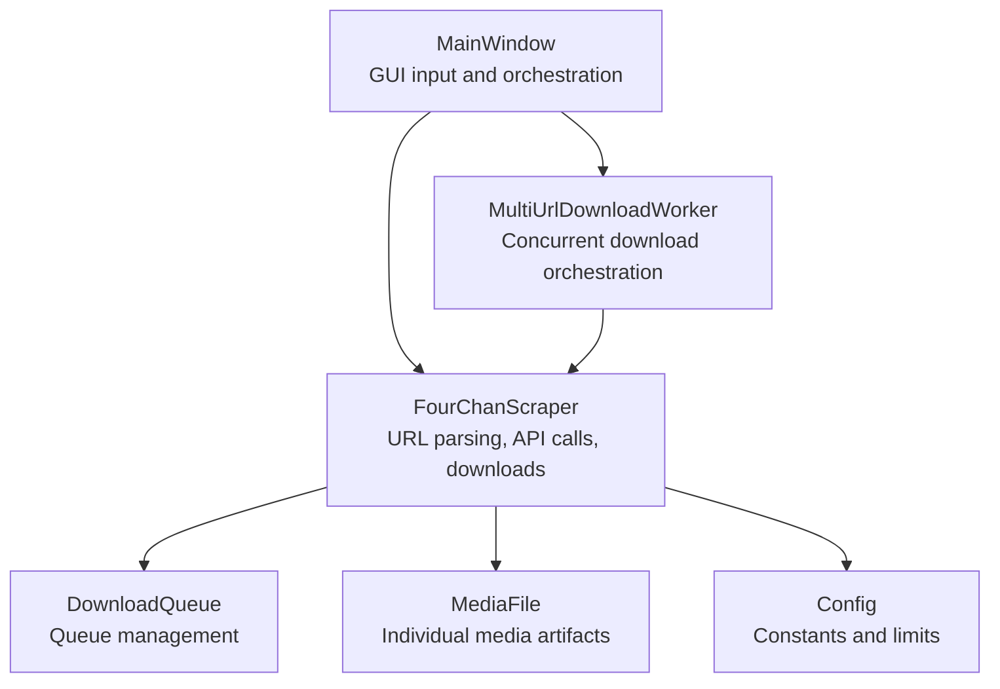
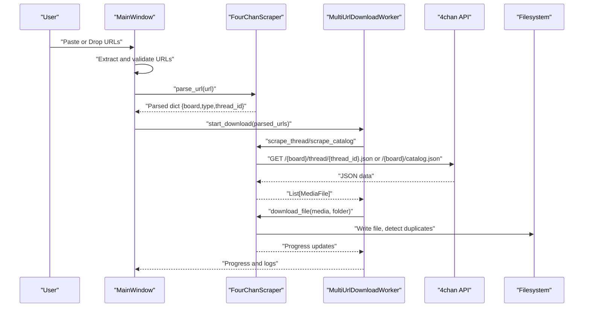
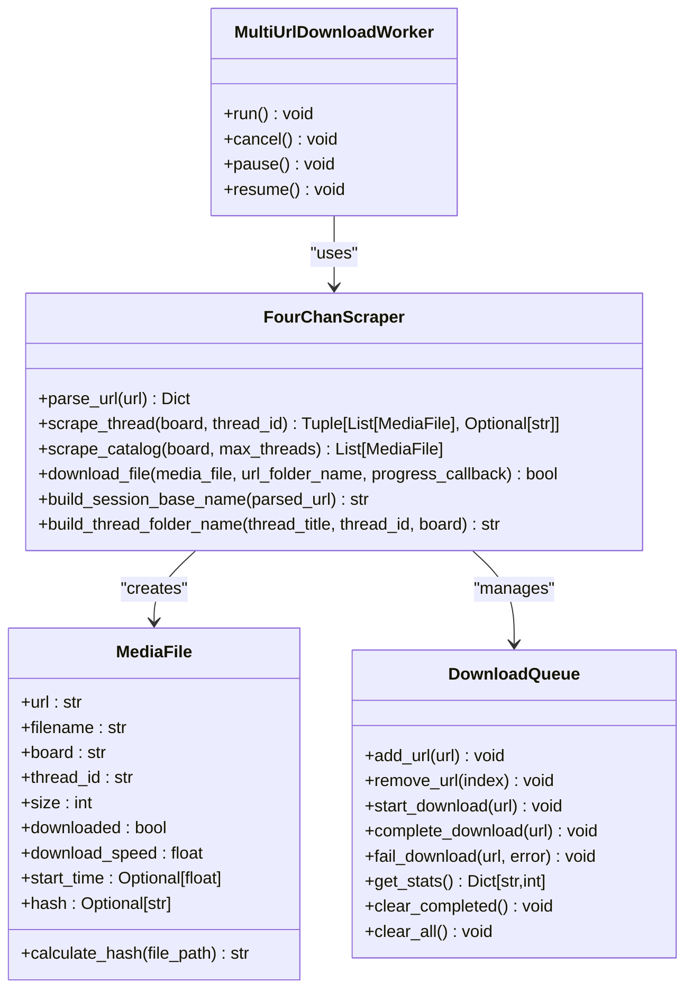
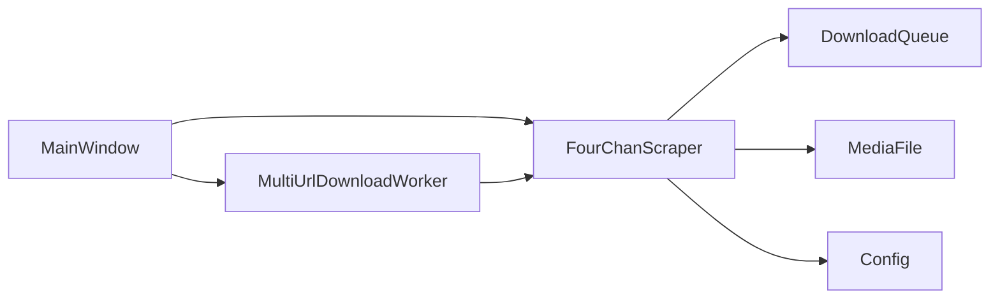

# URL Processing

<cite>
**Referenced Files in This Document**
- [main_window.py](file://4Charm/src/four_charm/gui/main_window.py)
- [scraper.py](file://4Charm/src/four_charm/core/scraper.py)
- [models.py](file://4Charm/src/four_charm/core/models.py)
- [workers.py](file://4Charm/src/four_charm/gui/workers.py)
- [config.py](file://4Charm/src/four_charm/config.py)
</cite>

## Table of Contents
1. [Introduction](#introduction)
2. [Project Structure](#project-structure)
3. [Core Components](#core-components)
4. [Architecture Overview](#architecture-overview)
5. [Detailed Component Analysis](#detailed-component-analysis)
6. [Dependency Analysis](#dependency-analysis)
7. [Performance Considerations](#performance-considerations)
8. [Troubleshooting Guide](#troubleshooting-guide)
9. [Conclusion](#conclusion)

## Introduction
This document explains the URL Processing sub-feature of the application. It covers how user input is captured via paste and drag-and-drop, how URLs are validated and parsed, and how the system delegates URL extraction and download orchestration to the FourChanScraper. It also documents the domain model for URL types and their relationship to download tasks, along with practical examples of supported 4chan URL patterns (thread, catalog, board). Finally, it addresses common issues such as malformed URLs and rate limiting responses, and provides solutions grounded in the codebase.

## Project Structure
The URL Processing feature spans several modules:
- GUI layer: MainWindow manages user input, paste/drop events, validation, and starts/stops downloads.
- Core layer: FourChanScraper parses URLs, interacts with 4chan APIs, extracts media, and performs downloads.
- Workers layer: MultiUrlDownloadWorker orchestrates concurrent downloads from multiple parsed URLs.
- Models: DownloadQueue and MediaFile define the domain model for queued downloads and individual media artifacts.
- Configuration: Config centralizes constants for timeouts, retries, concurrency, and rate-limiting behavior.

**Diagram sources**
- [main_window.py](file://4Charm/src/four_charm/gui/main_window.py#L40-L120)
- [scraper.py](file://4Charm/src/four_charm/core/scraper.py#L19-L64)
- [workers.py](file://4Charm/src/four_charm/gui/workers.py#L143-L210)
- [models.py](file://4Charm/src/four_charm/core/models.py#L11-L91)
- [config.py](file://4Charm/src/four_charm/config.py#L4-L48)

**Section sources**
- [main_window.py](file://4Charm/src/four_charm/gui/main_window.py#L40-L120)
- [scraper.py](file://4Charm/src/four_charm/core/scraper.py#L19-L64)
- [workers.py](file://4Charm/src/four_charm/gui/workers.py#L143-L210)
- [models.py](file://4Charm/src/four_charm/core/models.py#L11-L91)
- [config.py](file://4Charm/src/four_charm/config.py#L4-L48)

## Core Components
- MainWindow: Provides the UI, captures paste/drag-and-drop, validates URLs, and starts/stops downloads. It delegates URL parsing to FourChanScraper and uses MultiUrlDownloadWorker for concurrent processing.
- FourChanScraper: Parses URLs into structured types (board, thread, catalog), fetches 4chan JSON APIs, extracts media, and performs downloads with adaptive rate limiting and duplicate detection.
- MultiUrlDownloadWorker: Orchestrates scraping and downloading across multiple URLs concurrently, emitting progress and logs.
- DownloadQueue and MediaFile: Domain model for managing queued downloads and representing individual media files with hashing and metadata.
- Config: Centralized constants for timeouts, retries, concurrency, and rate-limiting behavior.

**Section sources**
- [main_window.py](file://4Charm/src/four_charm/gui/main_window.py#L40-L120)
- [scraper.py](file://4Charm/src/four_charm/core/scraper.py#L19-L64)
- [workers.py](file://4Charm/src/four_charm/gui/workers.py#L143-L210)
- [models.py](file://4Charm/src/four_charm/core/models.py#L11-L91)
- [config.py](file://4Charm/src/four_charm/config.py#L4-L48)

## Architecture Overview
The URL Processing pipeline:
1. User input: Paste URLs from clipboard or drop text containing URLs.
2. Validation: URLs are extracted and validated against 4chan domains and patterns.
3. Parsing: FourChanScraper.parse_url converts URLs into structured dictionaries with board, type, and thread_id.
4. Scraping: Based on URL type, the system fetches thread or catalog JSON and extracts media.
5. Downloading: Concurrent downloads are scheduled and executed with adaptive rate limiting and duplicate detection.
6. Progress and logs: Signals update UI progress, speed, and activity logs.

**Diagram sources**
- [main_window.py](file://4Charm/src/four_charm/gui/main_window.py#L488-L550)
- [scraper.py](file://4Charm/src/four_charm/core/scraper.py#L222-L306)
- [workers.py](file://4Charm/src/four_charm/gui/workers.py#L158-L210)
- [models.py](file://4Charm/src/four_charm/core/models.py#L92-L113)

## Detailed Component Analysis

### URL Validation and Parsing
- Paste handling: Extracts candidate URLs from clipboard text using a simple scheme and filters to 4chan domains.
- Drag-and-drop handling: Extracts candidate URLs from dropped text and filters to 4chan domains.
- Real-time validation: Removes existing numbering prefixes, auto-numbers entries, enforces a maximum URL count, and enables/disables the Start button based on validity.
- URL parsing: Ensures protocol presence, checks domain presence, parses path segments, and determines URL type (board, thread, catalog).

Supported 4chan URL patterns recognized by the parser:
- Thread: https://boards.4chan.org/{board}/thread/{thread_id}
- Catalog: https://boards.4chan.org/{board}/catalog
- Board: https://boards.4chan.org/{board}

Notes:
- The parser accepts both boards.4chan.org and 4chan.org variants.
- Thread IDs must be numeric; otherwise, the URL is considered invalid for thread type.
- Catalog URLs are recognized by the presence of a “catalog” segment.
- Board URLs are treated as “board” type when no thread or catalog segment is present.

**Section sources**
- [main_window.py](file://4Charm/src/four_charm/gui/main_window.py#L712-L749)
- [main_window.py](file://4Charm/src/four_charm/gui/main_window.py#L757-L772)
- [main_window.py](file://4Charm/src/four_charm/gui/main_window.py#L404-L480)
- [scraper.py](file://4Charm/src/four_charm/core/scraper.py#L222-L246)

### Batch Processing from Multiple Inputs
- Paste: Extracts all URLs from clipboard text, filters to 4chan domains, inserts them into the input area, and triggers validation.
- Drag-and-drop: Extracts URLs from dropped text, filters to 4chan domains, auto-numbers them, and triggers validation.
- Validation and counting: Updates the URL counter label and disables the Start button when no valid URLs are present or when exceeding the maximum allowed count.

**Section sources**
- [main_window.py](file://4Charm/src/four_charm/gui/main_window.py#L712-L749)
- [main_window.py](file://4Charm/src/four_charm/gui/main_window.py#L757-L772)
- [main_window.py](file://4Charm/src/four_charm/gui/main_window.py#L404-L480)

### Delegation to FourChanScraper
- MainWindow delegates URL parsing to FourChanScraper.parse_url and uses the parsed dictionaries to decide scraping behavior.
- For each URL, the system builds a session base name or thread-specific folder name depending on URL type.
- The MultiUrlDownloadWorker orchestrates scraping and downloading across multiple URLs concurrently.

**Section sources**
- [main_window.py](file://4Charm/src/four_charm/gui/main_window.py#L488-L550)
- [workers.py](file://4Charm/src/four_charm/gui/workers.py#L158-L210)
- [scraper.py](file://4Charm/src/four_charm/core/scraper.py#L178-L209)

### Domain Model for URL Types and Download Tasks
The domain model centers around:
- Parsed URL dictionary: Contains board, type (“board”, “thread”, or “catalog”), and thread_id when applicable.
- MediaFile: Represents a downloadable media artifact with URL, filename, board, thread_id, size, download speed, timestamps, and hash for duplicate detection.
- DownloadQueue: Manages queue state, history, and statistics for URLs.

Relationships:
- FourChanScraper.parse_url produces a parsed URL dictionary used by MultiUrlDownloadWorker to determine scraping strategy.
- MultiUrlDownloadWorker constructs MediaFile instances from scraped data and schedules downloads.
- DownloadQueue tracks active, completed, failed, and queued URLs and maintains history.

**Diagram sources**
- [scraper.py](file://4Charm/src/four_charm/core/scraper.py#L222-L306)
- [workers.py](file://4Charm/src/four_charm/gui/workers.py#L143-L210)
- [models.py](file://4Charm/src/four_charm/core/models.py#L11-L113)

**Section sources**
- [scraper.py](file://4Charm/src/four_charm/core/scraper.py#L222-L306)
- [workers.py](file://4Charm/src/four_charm/gui/workers.py#L143-L210)
- [models.py](file://4Charm/src/four_charm/core/models.py#L11-L113)

### Concrete Examples of Supported URL Patterns
- Thread URL: Recognized by the presence of a “thread” segment with a numeric thread_id.
- Catalog URL: Recognized by the presence of a “catalog” segment.
- Board URL: Treated as “board” type when no “thread” or “catalog” segment is present.

These patterns are enforced by the URL parsing logic that inspects path segments and numeric thread IDs.

**Section sources**
- [scraper.py](file://4Charm/src/four_charm/core/scraper.py#L222-L246)

### Rate Limiting and Network Error Handling
The system implements adaptive rate limiting and robust error handling:
- Adaptive delay: Adjusts delay between requests based on success or failure.
- Explicit handling for rate limiting (429): Increases delay and retries once.
- Access errors (403, 404): Logs and reduces delay on failure.
- Other HTTP errors: Logged and retried with exponential backoff.
- Redirects and connection errors: Handled with adaptive delay and retries.

**Section sources**
- [scraper.py](file://4Charm/src/four_charm/core/scraper.py#L65-L132)
- [scraper.py](file://4Charm/src/four_charm/core/scraper.py#L248-L306)

## Dependency Analysis
- MainWindow depends on FourChanScraper for URL parsing and on MultiUrlDownloadWorker for concurrent downloads.
- MultiUrlDownloadWorker depends on FourChanScraper for scraping and downloading.
- FourChanScraper depends on Config for timeouts, retries, concurrency, and rate-limiting behavior.
- FourChanScraper uses DownloadQueue and MediaFile for queue management and media representation.

**Diagram sources**
- [main_window.py](file://4Charm/src/four_charm/gui/main_window.py#L40-L120)
- [workers.py](file://4Charm/src/four_charm/gui/workers.py#L143-L210)
- [scraper.py](file://4Charm/src/four_charm/core/scraper.py#L19-L64)
- [models.py](file://4Charm/src/four_charm/core/models.py#L11-L91)
- [config.py](file://4Charm/src/four_charm/config.py#L4-L48)

**Section sources**
- [main_window.py](file://4Charm/src/four_charm/gui/main_window.py#L40-L120)
- [workers.py](file://4Charm/src/four_charm/gui/workers.py#L143-L210)
- [scraper.py](file://4Charm/src/four_charm/core/scraper.py#L19-L64)
- [models.py](file://4Charm/src/four_charm/core/models.py#L11-L91)
- [config.py](file://4Charm/src/four_charm/config.py#L4-L48)

## Performance Considerations
- Concurrency: Config.MAX_WORKERS controls the number of concurrent downloads.
- Adaptive rate limiting: Base delay, backoff multiplier, and maximum delay are tuned to balance throughput and server politeness.
- Chunk size and timeouts: CHUNK_SIZE and DOWNLOAD_TIMEOUT/ API_TIMEOUT influence responsiveness and reliability.
- Disk space checks: Prevent unnecessary downloads when storage is low.
- Duplicate detection: Hash-based duplicate detection avoids redundant downloads.

**Section sources**
- [config.py](file://4Charm/src/four_charm/config.py#L4-L48)
- [scraper.py](file://4Charm/src/four_charm/core/scraper.py#L210-L221)
- [scraper.py](file://4Charm/src/four_charm/core/scraper.py#L408-L439)
- [scraper.py](file://4Charm/src/four_charm/core/scraper.py#L508-L527)

## Troubleshooting Guide
Common issues and solutions:

- Malformed URLs
  - Symptom: Start button disabled or invalid URL warnings.
  - Cause: Non-4chan domains, missing “boards.4chan.org” or “4chan.org”, or non-numeric thread IDs.
  - Solution: Ensure URLs use supported domains and numeric thread IDs for thread URLs. The parser strips protocol and validates domain presence and path segments.

- Exceeding maximum URL count
  - Symptom: Warning message indicating a maximum URL limit and Start button disabled.
  - Cause: Validation enforces a maximum URL count.
  - Solution: Reduce the number of URLs to within the allowed limit.

- Rate limiting (429)
  - Symptom: Delays and retries; logs indicate rate limiting.
  - Cause: 4chan servers rate limit requests.
  - Solution: The system increases delay and retries once automatically. If persistent, reduce concurrent load or wait.

- Access denied (403) or not found (404)
  - Symptom: Errors logged and reduced delay on failure.
  - Cause: Invalid thread IDs or restricted content.
  - Solution: Verify thread IDs and ensure the content is accessible.

- Insufficient disk space
  - Symptom: Download fails with insufficient space.
  - Cause: Free space below configured threshold.
  - Solution: Free up disk space or change the download directory.

- Empty or corrupted files
  - Symptom: Zero-byte files or failed downloads.
  - Cause: Network interruptions or server issues.
  - Solution: Retries are attempted; check logs for details.

- Duplicate files
  - Symptom: Skipped duplicates detected by hash.
  - Cause: Identical files already downloaded.
  - Solution: Duplicates are skipped automatically.

**Section sources**
- [main_window.py](file://4Charm/src/four_charm/gui/main_window.py#L438-L480)
- [scraper.py](file://4Charm/src/four_charm/core/scraper.py#L65-L132)
- [scraper.py](file://4Charm/src/four_charm/core/scraper.py#L248-L306)
- [scraper.py](file://4Charm/src/four_charm/core/scraper.py#L431-L440)
- [scraper.py](file://4Charm/src/four_charm/core/scraper.py#L508-L527)

## Conclusion
The URL Processing sub-feature integrates paste and drag-and-drop input with robust URL validation and parsing. MainWindow coordinates user actions and delegates URL extraction and download orchestration to FourChanScraper and MultiUrlDownloadWorker. The domain model cleanly separates concerns between parsed URLs, media artifacts, and queue management. The system handles malformed URLs, rate limiting, and disk constraints gracefully, with adaptive rate limiting and duplicate detection to optimize performance and reliability.