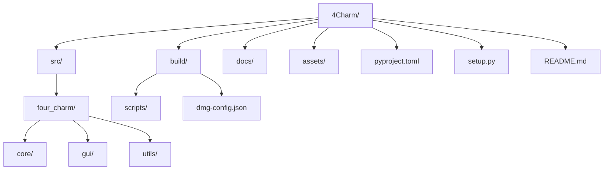
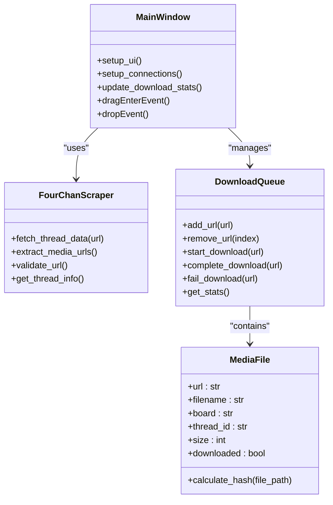

# Development

<cite>
**Referenced Files in This Document**   
- [pyproject.toml](file://pyproject.toml)
- [setup.py](file://setup.py)
- [build/dmg-config.json](file://build/dmg-config.json)
- [build/scripts/build-dmg.sh](file://build/scripts/build-dmg.sh)
- [build/scripts/build.sh](file://build/scripts/build.sh)
- [src/four_charm/main.py](file://src/four_charm/main.py)
- [src/four_charm/gui/main_window.py](file://src/four_charm/gui/main_window.py)
- [src/four_charm/core/models.py](file://src/four_charm/core/models.py)
- [docs/BUILD.md](file://docs/BUILD.md)
- [docs/DMG_BUILD_README.md](file://docs/DMG_BUILD_README.md)
</cite>

## Table of Contents
1. [Project Structure](#project-structure)
2. [Build Configuration](#build-configuration)
3. [Building the macOS DMG Package](#building-the-macos-dmg-package)
4. [Development Environment Setup](#development-environment-setup)
5. [Running from Source](#running-from-source)
6. [Code Structure and Organization](#code-structure-and-organization)
7. [Testing Practices](#testing-practices)
8. [Contribution Workflow](#contribution-workflow)
9. [Packaging Process](#packaging-process)
10. [Platform-Specific Considerations](#platform-specific-considerations)
11. [Versioning and Release Procedures](#versioning-and-release-procedures)

## Project Structure

The 4Charm project follows a standard Python package structure with clear separation of concerns. The main components are organized as follows:



The `src/` directory contains the application source code organized into core functionality, GUI components, and utility modules. The `build/` directory houses scripts and configuration for building the application and creating the DMG installer. Documentation is maintained in the `docs/` directory, while assets such as icons are stored in the `assets/` directory.

**Diagram sources**
- [pyproject.toml](file://pyproject.toml)
- [setup.py](file://setup.py)

**Section sources**
- [pyproject.toml](file://pyproject.toml)
- [setup.py](file://setup.py)

## Build Configuration

4Charm uses both `pyproject.toml` and `setup.py` for build configuration, following modern Python packaging standards while maintaining compatibility with py2app for macOS application bundling.

### pyproject.toml Configuration

The `pyproject.toml` file serves as the primary source of package metadata and defines project-level configuration:

```toml
[project]
name = "4Charm"
version = "5.2.0"
description = "4Charm - Advanced 4chan Media Downloader"
authors = [
    {name = "RazorBackRoar"}
]
requires-python = ">=3.9"

[tool.setuptools.packages.find]
where = ["src"]
include = ["four_charm*"]
```

This configuration specifies the package name, version, description, author information, Python version requirements, and package discovery settings.

### setup.py Configuration

The `setup.py` file provides py2app-specific configuration for creating the macOS application bundle:

```python
setup(
    app=[APP_SCRIPT],
    name=APP_NAME,
    author=AUTHOR_NAME,
    data_files=DATA_FILES,
    options={"py2app": OPTIONS},
    setup_requires=["py2app"],
    packages=find_packages(where="src"),
    package_dir={"": "src"},
)
```

Key configuration elements include:
- Application entry point (`APP_SCRIPT`)
- Bundle identifier (`BUNDLE_ID`)
- Code signing settings
- Dependency inclusion/exclusion lists
- Architecture specification (arm64)
- Info.plist configuration for macOS integration

The configuration excludes unnecessary packages like PyQt6, numpy, and pandas to reduce bundle size, while explicitly including required PySide6 components.

**Section sources**
- [pyproject.toml](file://pyproject.toml#L1-L13)
- [setup.py](file://setup.py#L1-L137)

## Building the macOS DMG Package

The build process for creating the macOS DMG package is automated through shell scripts in the `build/scripts/` directory, with configuration managed in `dmg-config.json`.

### Build Scripts

The primary build script `build/scripts/build.sh` orchestrates the complete build process:

1. **Dependency Installation**: Installs required Python packages from requirements.txt
2. **Cleanup**: Removes previous build artifacts and temporary files
3. **Application Bundling**: Uses py2app to create the .app bundle with arm64 architecture
4. **Code Signing**: Applies ad-hoc code signing to the application
5. **DMG Creation**: Packages the application into a compressed DMG file
6. **Cleanup**: Removes intermediate build artifacts

The script uses Python 3.13 from Homebrew and includes comprehensive error handling and progress reporting.

### DMG Configuration

The `dmg-config.json` file controls the appearance and behavior of the DMG installer:

```json
{
  "app_name": "4Charm",
  "version": "5.2.0",
  "volume_name": "4Charm Installer",
  "source_app": "./build/dist/4Charm.app",
  "window": {
    "x": 200,
    "y": 200,
    "width": 500,
    "height": 320
  },
  "icon_settings": {
    "size": 100,
    "text_size": 12
  },
  "volume_icon": "./assets/icons/4Charm.icns",
  "icon_positions": {
    "4Charm.app": {
      "x": 140,
      "y": 130
    },
    "Applications": {
      "x": 400,
      "y": 130
    }
  }
}
```

This configuration specifies the DMG window dimensions, icon positions, volume name, and source application path. The visual layout places the application icon and Applications symlink in a user-friendly arrangement.

### DMG Build Process

The `build-dmg.sh` script serves as a wrapper that invokes a universal DMG creation script with the configuration file:

```bash
#!/bin/bash
set -euo pipefail

SCRIPT_DIR="$(cd "$(dirname "${BASH_SOURCE[0]}")" && pwd)"
UNIVERSAL_SCRIPT=".dev-tools/universal_dmg.sh"
CONFIG_FILE="$SCRIPT_DIR/../dmg-config.json"

if [[ ! -x "$UNIVERSAL_SCRIPT" ]]; then
  echo "Universal DMG script not found at $UNIVERSAL_SCRIPT" >&2
  exit 1
fi

exec "$UNIVERSAL_SCRIPT" "$CONFIG_FILE"
```

This approach allows for consistent DMG creation across multiple projects while maintaining project-specific configuration.

**Section sources**
- [build/scripts/build.sh](file://build/scripts/build.sh#L1-L122)
- [build/scripts/build-dmg.sh](file://build/scripts/build-dmg.sh#L1-L15)
- [build/dmg-config.json](file://build/dmg-config.json#L1-L31)

## Development Environment Setup

To set up a development environment for 4Charm, follow these steps:

### Prerequisites

1. **Python 3.13**: Install via Homebrew:
   ```bash
   brew install python@3.13
   ```

2. **Required Tools**:
   ```bash
   brew install create-dmg
   xcode-select --install
   ```

3. **Python Dependencies**: Install required packages:
   ```bash
   pip install PySide6 requests urllib3 certifi bs4
   ```

### Repository Setup

1. Clone the repository:
   ```bash
   git clone https://github.com/RazorBackRoar/4Charm.git
   cd 4Charm
   ```

2. Verify the project structure and required files are present.

3. Install development dependencies as specified in the project configuration.

The build process uses system Python 3.13 directly without a virtual environment, ensuring consistency with the production build environment.

**Section sources**
- [build/scripts/build.sh](file://build/scripts/build.sh#L7-L13)
- [setup.py](file://setup.py#L59-L60)

## Running from Source

To run 4Charm directly from source code:

1. **Install Dependencies**:
   ```bash
   pip install -r requirements.txt
   ```

2. **Run the Application**:
   ```bash
   python src/four_charm/main.py
   ```

The application entry point in `src/four_charm/main.py` initializes the Qt application, sets up logging, and creates the main window. Version information is read from `pyproject.toml` at runtime, ensuring consistency between development and production versions.

The application uses relative path resolution to locate assets and configuration files, making it portable across different development environments.

**Section sources**
- [src/four_charm/main.py](file://src/four_charm/main.py#L1-L55)
- [build/scripts/build.sh](file://build/scripts/build.sh#L43-L45)

## Code Structure and Organization

4Charm follows a modular architecture with clear separation between core functionality, GUI components, and utility functions.

### Core Components

The application is organized into three main modules:



### Module Organization

- **core/**: Contains business logic, data models, and scraper functionality
- **gui/**: Implements the user interface and event handling
- **utils/**: Provides shared utility functions like logging setup

The `MainWindow` class serves as the central controller, coordinating between the scraper, download queue, and UI components. The `FourChanScraper` handles all interactions with 4chan's API, while the `DownloadQueue` manages the download lifecycle and maintains download statistics.

**Diagram sources**
- [src/four_charm/gui/main_window.py](file://src/four_charm/gui/main_window.py#L40-L85)
- [src/four_charm/core/models.py](file://src/four_charm/core/models.py#L11-L90)
- [src/four_charm/core/models.py](file://src/four_charm/core/models.py#L92-L113)

**Section sources**
- [src/four_charm/gui/main_window.py](file://src/four_charm/gui/main_window.py#L1-L200)
- [src/four_charm/core/models.py](file://src/four_charm/core/models.py#L1-L113)

## Testing Practices

While the project does not include explicit test files in the provided structure, the codebase demonstrates several testing-friendly practices:

- **Modular Design**: Clear separation of concerns enables unit testing of individual components
- **Dependency Injection**: The application structure allows for mocking external dependencies
- **Error Handling**: Comprehensive error handling and logging facilitate debugging
- **Configuration Management**: Externalized configuration enables testing different scenarios

For effective testing, contributors should:
1. Create unit tests for core functionality in the `core/` module
2. Implement integration tests for the scraper and download pipeline
3. Develop UI tests for the main window and user interactions
4. Use the existing logging infrastructure to verify application behavior

The build process includes cleanup steps that remove temporary files and caches, ensuring a clean testing environment.

**Section sources**
- [build/scripts/build.sh](file://build/scripts/build.sh#L51-L57)
- [src/four_charm/utils/logging_setup.py](file://src/four_charm/utils/logging_setup.py)

## Contribution Workflow

The contribution workflow for 4Charm follows standard Git practices with a focus on maintaining code quality and consistency.

### Development Process

1. **Fork the Repository**: Create a personal fork of the 4Charm repository
2. **Create a Branch**: Use descriptive branch names for new features or bug fixes
3. **Make Changes**: Implement the desired functionality or fix
4. **Test Locally**: Verify changes by running the application from source
5. **Build and Test**: Use the build scripts to create a DMG and test the packaged application
6. **Submit a Pull Request**: Request review and merge into the main branch

### Code Quality

The project maintains high code quality through:
- Consistent coding style and formatting
- Comprehensive error handling
- Detailed logging
- Clear separation of concerns
- Efficient resource management

Contributors should ensure their changes adhere to these principles and do not introduce unnecessary dependencies or bloat.

**Section sources**
- [build/scripts/build.sh](file://build/scripts/build.sh)
- [README.md](file://README.md)

## Packaging Process

The packaging process creates a standalone Python application with all dependencies bundled, using py2app to generate a macOS application bundle.

### Application Bundling

The process begins with py2app analyzing the application's dependencies and creating a self-contained bundle:

1. **Dependency Analysis**: py2app scans the code to identify required packages
2. **Resource Bundling**: Python interpreter, libraries, and assets are packaged together
3. **Info.plist Generation**: Creates the macOS application metadata file
4. **Architecture Specification**: Builds for arm64 architecture to support Apple Silicon

The resulting application bundle includes PySide6, requests, urllib3, certifi, and bs4, while excluding unnecessary packages to minimize size.

### Standalone Application Features

The packaged application:
- Contains a complete Python runtime
- Includes all required dependencies
- Is code-signed with ad-hoc signing
- Has a custom application icon
- Supports dark mode and Retina displays
- Runs natively on Apple Silicon (M1/M2/M3)

The build process optimizes the bundle by excluding test modules, documentation, and unused Qt components, resulting in a lean distribution package.

**Section sources**
- [setup.py](file://setup.py#L57-L124)
- [build/scripts/build.sh](file://build/scripts/build.sh#L59-L61)

## Platform-Specific Considerations

4Charm is specifically designed for macOS with several platform-specific optimizations and requirements.

### macOS Requirements

- **Minimum Version**: macOS 11.0 (Big Sur)
- **Architecture**: Optimized for arm64 (Apple Silicon)
- **System Integration**: Proper Info.plist configuration for Gatekeeper compatibility
- **UI Guidelines**: Follows macOS Human Interface Guidelines

### Apple Silicon Optimization

The application is built specifically for Apple Silicon with:
- arm64 architecture compilation
- Native performance without Rosetta translation
- Optimized for M1/M2/M3 chip performance characteristics
- Efficient memory usage patterns

### Code Signing and Security

The application uses ad-hoc code signing to satisfy macOS security requirements:
- `codesign --force --deep --sign "$CODESIGN_IDENTITY"` applies the signature
- Ad-hoc signing allows the app to run without a paid Apple Developer account
- Users may need to right-click and select "Open" on first launch due to the lack of notarization

The Info.plist includes necessary entitlements for network access and system appearance:
- `NSAppTransportSecurity` allows arbitrary loads for 4chan API access
- `NSRequiresAquaSystemAppearance` is set to false for dark mode support
- `LSMinimumSystemVersion` ensures compatibility with supported macOS versions

**Section sources**
- [setup.py](file://setup.py#L38-L54)
- [build/scripts/build.sh](file://build/scripts/build.sh#L64-L66)

## Versioning and Release Procedures

4Charm follows a structured versioning and release process to ensure consistent and reliable distribution.

### Version Management

Version information is maintained in `pyproject.toml` and synchronized across the codebase:
- `pyproject.toml` contains the single source of truth for version
- `setup.py` reads the version from pyproject.toml
- The application runtime reads version from pyproject.toml
- DMG configuration includes version for installer naming

This approach ensures version consistency across all components and prevents version drift.

### Release Process

The release process is automated through the build scripts:
1. **Version Bump**: Update version in pyproject.toml
2. **Clean Build**: Remove previous artifacts and perform fresh build
3. **Package Creation**: Generate the DMG installer with proper versioning
4. **Verification**: Test the packaged application
5. **Distribution**: Upload to GitHub Releases

The build script automatically extracts the version from pyproject.toml and incorporates it into the DMG filename, ensuring traceability.

### Build Artifacts

The build process generates the following artifacts:
- `build/dist/4Charm.app`: The application bundle
- `build/dist/4Charm.dmg`: The compressed installer
- `build/build.log`: Build process log for troubleshooting

The final DMG includes the application, a symlink to Applications, and is styled with custom window dimensions and icon positioning for optimal user experience.

**Section sources**
- [pyproject.toml](file://pyproject.toml#L3)
- [setup.py](file://setup.py#L29)
- [build/dmg-config.json](file://build/dmg-config.json#L3)
- [build/scripts/build.sh](file://build/scripts/build.sh#L28)