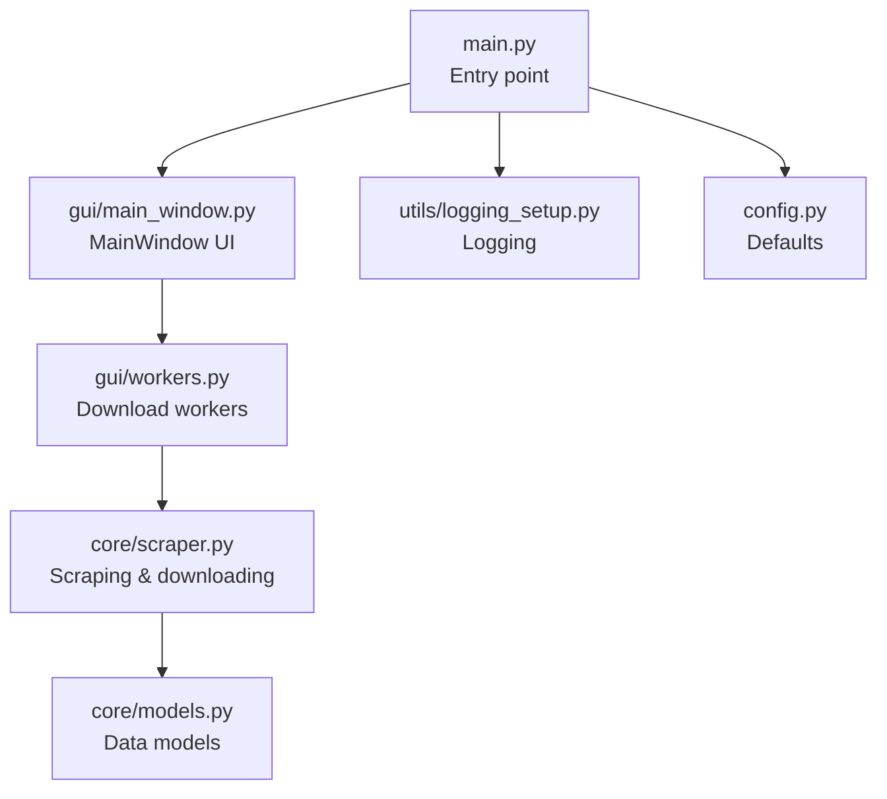
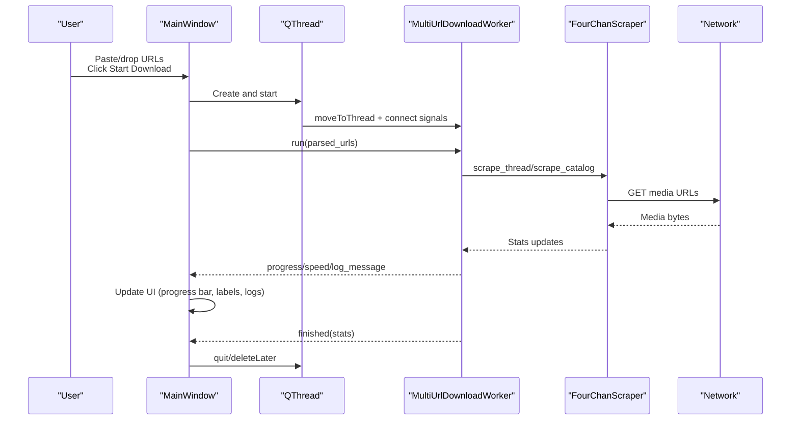
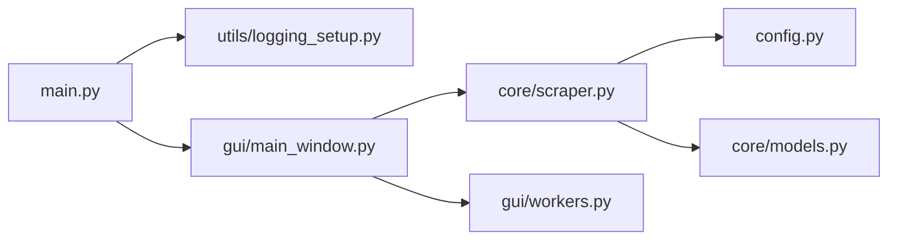

# Getting Started

<cite>
**Referenced Files in This Document**
- [main.py](file://4Charm/src/four_charm/main.py)
- [main_window.py](file://4Charm/src/four_charm/gui/main_window.py)
- [workers.py](file://4Charm/src/four_charm/gui/workers.py)
- [scraper.py](file://4Charm/src/four_charm/core/scraper.py)
- [models.py](file://4Charm/src/four_charm/core/models.py)
- [logging_setup.py](file://4Charm/src/four_charm/utils/logging_setup.py)
- [config.py](file://4Charm/src/four_charm/config.py)
- [README.md](file://4Charm/README.md)
- [BUILD.md](file://4Charm/docs/BUILD.md)
- [dmg-config.json](file://4Charm/build/dmg-config.json)
</cite>

## Table of Contents
1. [Introduction](#introduction)
2. [Project Structure](#project-structure)
3. [Core Components](#core-components)
4. [Architecture Overview](#architecture-overview)
5. [Detailed Component Analysis](#detailed-component-analysis)
6. [Dependency Analysis](#dependency-analysis)
7. [Performance Considerations](#performance-considerations)
8. [Troubleshooting Guide](#troubleshooting-guide)
9. [Conclusion](#conclusion)

## Introduction
This Getting Started guide helps you install and use 4Charm on macOS. It covers:
- Installing via the official DMG (recommended for most users)
- Building from source using pyproject.toml (for developers)
- First launch experience, UI layout, and initial configuration
- Basic usage workflow: pasting or dragging 4chan URLs, choosing a download directory, and starting downloads
- Monitoring progress and accessing logs
- Default configuration and download organization
- Common beginner issues and resolutions

## Project Structure
4Charm is a native macOS application written in Python with a Qt GUI. The core runtime starts in the main entry point and initializes the UI and logging subsystems.

**Diagram sources**
- [main.py](file://4Charm/src/four_charm/main.py#L1-L55)
- [main_window.py](file://4Charm/src/four_charm/gui/main_window.py#L1-L120)
- [workers.py](file://4Charm/src/four_charm/gui/workers.py#L1-L60)
- [scraper.py](file://4Charm/src/four_charm/core/scraper.py#L1-L60)
- [models.py](file://4Charm/src/four_charm/core/models.py#L1-L40)
- [logging_setup.py](file://4Charm/src/four_charm/utils/logging_setup.py#L1-L40)
- [config.py](file://4Charm/src/four_charm/config.py#L1-L48)

**Section sources**
- [main.py](file://4Charm/src/four_charm/main.py#L1-L55)
- [README.md](file://4Charm/README.md#L45-L67)

## Core Components
- Application entry point: Initializes logging, sets application metadata, loads the icon, and launches the main window.
- Main window: Provides the UI for URL input, controls, progress, and logs.
- Workers: Manage concurrent downloads and emit progress/log signals.
- Scraper: Handles parsing 4chan URLs, scraping media, and downloading files.
- Models: Defines data structures like the download queue and media file representation.
- Logging: Sets up rotating file logs under the user’s home directory.
- Config: Centralizes defaults for concurrency, timeouts, retries, and supported media.

**Section sources**
- [main.py](file://4Charm/src/four_charm/main.py#L1-L55)
- [main_window.py](file://4Charm/src/four_charm/gui/main_window.py#L1-L120)
- [workers.py](file://4Charm/src/four_charm/gui/workers.py#L1-L60)
- [scraper.py](file://4Charm/src/four_charm/core/scraper.py#L1-L60)
- [models.py](file://4Charm/src/four_charm/core/models.py#L1-L40)
- [logging_setup.py](file://4Charm/src/four_charm/utils/logging_setup.py#L1-L40)
- [config.py](file://4Charm/src/four_charm/config.py#L1-L48)

## Architecture Overview
The application follows a Qt-based desktop architecture:
- The main process creates a QApplication and MainWindow.
- User actions trigger signals handled by MainWindow.
- MainWindow spawns a QThread and a MultiUrlDownloadWorker.
- Worker uses FourChanScraper to scrape and download concurrently.
- Signals update the UI (progress, speed, logs) and stats.

**Diagram sources**
- [main_window.py](file://4Charm/src/four_charm/gui/main_window.py#L480-L560)
- [workers.py](file://4Charm/src/four_charm/gui/workers.py#L143-L200)
- [scraper.py](file://4Charm/src/four_charm/core/scraper.py#L1-L120)

## Detailed Component Analysis

### Installation on macOS

#### Option A: Install from DMG (Recommended)
- Download the latest DMG from the Releases page.
- Mount the DMG and drag 4Charm.app into Applications.
- On first launch, if prompted, right-click the app and choose Open, or run the xattr command to clear quarantine attributes.

Notes:
- The DMG configuration defines the Finder layout and icon used during installation.

**Section sources**
- [README.md](file://4Charm/README.md#L45-L67)
- [dmg-config.json](file://4Charm/build/dmg-config.json#L1-L31)

#### Option B: Build from Source (for developers)
- Ensure Python 3.9+ is installed.
- Install dependencies: PySide6, requests, urllib3, certifi.
- Build the app bundle and DMG using the provided build scripts and documentation.

Tip:
- The pyproject.toml defines the package metadata and includes the four_charm package.

**Section sources**
- [BUILD.md](file://4Charm/docs/BUILD.md#L18-L74)
- [BUILD.md](file://4Charm/docs/BUILD.md#L104-L121)
- [BUILD.md](file://4Charm/docs/BUILD.md#L130-L154)
- [BUILD.md](file://4Charm/docs/BUILD.md#L169-L193)
- [pyproject.toml](file://4Charm/pyproject.toml#L1-L13)

### First Launch Experience
- The application sets its icon and version from pyproject.toml.
- The MainWindow initializes the UI, registers keyboard shortcuts, and sets up drag-and-drop.
- On first run, the download directory is not set until you choose one or start a download.

UI highlights:
- Header and subtitle
- URL input area with placeholder examples
- Controls: Choose Folder, Start Download, Clear, Pause/Resume
- Progress group: progress bar and speed label
- Activity Log: scrollable log area
- Stats: folders, files, size

Keyboard shortcuts:
- Enter validates URLs
- Ctrl+Enter starts downloads
- Escape cancels or closes

**Section sources**
- [main.py](file://4Charm/src/four_charm/main.py#L37-L55)
- [main_window.py](file://4Charm/src/four_charm/gui/main_window.py#L89-L120)
- [main_window.py](file://4Charm/src/four_charm/gui/main_window.py#L241-L270)
- [main_window.py](file://4Charm/src/four_charm/gui/main_window.py#L272-L300)
- [main_window.py](file://4Charm/src/four_charm/gui/main_window.py#L299-L356)
- [main_window.py](file://4Charm/src/four_charm/gui/main_window.py#L362-L385)

### Basic Usage Workflow
- Paste or drop multiple 4chan URLs (one per line). The app auto-numbers them and validates up to 10 URLs.
- Choose a download folder using the “Choose Folder” button.
- Click “Start Download” or press Ctrl+Enter to begin.
- Monitor progress in the progress bar and speed label; logs appear in the Activity Log.
- Use Pause/Resume to control downloads; Clear removes all URLs.

Supported URL formats:
- Thread: https://boards.4chan.org/{board}/thread/{thread_id}
- Catalog: https://boards.4chan.org/{board}/catalog
- Board: https://boards.4chan.org/{board}/ (limited catalog scraping)

**Section sources**
- [main_window.py](file://4Charm/src/four_charm/gui/main_window.py#L404-L481)
- [main_window.py](file://4Charm/src/four_charm/gui/main_window.py#L488-L560)
- [main_window.py](file://4Charm/src/four_charm/gui/main_window.py#L391-L403)
- [README.md](file://4Charm/README.md#L60-L67)

### Monitoring Progress and Logs
- Progress bar shows overall completion percentage.
- Speed label displays instantaneous and average speeds.
- Activity Log shows timestamps and messages for each file and operation.
- Stats labels show folders, files, and total size under the chosen download directory.

Logs are written to a rotating log file under the user’s home directory.

**Section sources**
- [main_window.py](file://4Charm/src/four_charm/gui/main_window.py#L627-L656)
- [main_window.py](file://4Charm/src/four_charm/gui/main_window.py#L657-L711)
- [logging_setup.py](file://4Charm/src/four_charm/utils/logging_setup.py#L1-L40)

### Default Configuration and Download Organization
Defaults:
- Concurrency: up to 5 workers (based on CPU count)
- Timeout and retries: configured for robust network handling
- Supported media: images, videos, and documents
- Rate limiting: adaptive delay to avoid server throttling

Download organization:
- Per-thread folders named with board and thread identifiers
- Media stored in per-thread directories; video clips may be grouped under a WEBM subfolder

**Section sources**
- [config.py](file://4Charm/src/four_charm/config.py#L1-L48)
- [README.md](file://4Charm/README.md#L68-L84)
- [scraper.py](file://4Charm/src/four_charm/core/scraper.py#L178-L200)

## Dependency Analysis
The main entry point depends on logging and the GUI window. The window composes the scraper and workers for downloads. The scraper encapsulates networking and file handling.

**Diagram sources**
- [main.py](file://4Charm/src/four_charm/main.py#L1-L55)
- [main_window.py](file://4Charm/src/four_charm/gui/main_window.py#L1-L120)
- [workers.py](file://4Charm/src/four_charm/gui/workers.py#L1-L60)
- [scraper.py](file://4Charm/src/four_charm/core/scraper.py#L1-L60)
- [models.py](file://4Charm/src/four_charm/core/models.py#L1-L40)
- [logging_setup.py](file://4Charm/src/four_charm/utils/logging_setup.py#L1-L40)
- [config.py](file://4Charm/src/four_charm/config.py#L1-L48)

**Section sources**
- [main.py](file://4Charm/src/four_charm/main.py#L1-L55)
- [main_window.py](file://4Charm/src/four_charm/gui/main_window.py#L1-L120)
- [workers.py](file://4Charm/src/four_charm/gui/workers.py#L1-L60)
- [scraper.py](file://4Charm/src/four_charm/core/scraper.py#L1-L60)
- [models.py](file://4Charm/src/four_charm/core/models.py#L1-L40)
- [logging_setup.py](file://4Charm/src/four_charm/utils/logging_setup.py#L1-L40)
- [config.py](file://4Charm/src/four_charm/config.py#L1-L48)

## Performance Considerations
- Concurrency is capped to a small number of workers to balance throughput and stability.
- Adaptive rate limiting reduces server pressure and improves reliability.
- Progress updates are throttled to reduce UI overhead.

[No sources needed since this section provides general guidance]

## Troubleshooting Guide
Common issues and resolutions:
- App is damaged or cannot be opened: Use the Gatekeeper override described in the README.
- Slow downloads: 4chan rate limits apply; the app adapts automatically.
- No media found: The thread may be dead, the URL malformed, or the thread contains no assets.
- Permission errors or network connectivity problems: Check your internet connection and firewall settings; the app handles network errors gracefully with adaptive delays.

Logs:
- Review the rotating log file under the user’s home directory for detailed diagnostics.

**Section sources**
- [README.md](file://4Charm/README.md#L97-L103)
- [logging_setup.py](file://4Charm/src/four_charm/utils/logging_setup.py#L1-L40)
- [scraper.py](file://4Charm/src/four_charm/core/scraper.py#L65-L132)

## Conclusion
You are now ready to install 4Charm, configure your download directory, and start downloading media from 4chan threads and catalogs. Use the UI to paste or drag URLs, monitor progress, and review logs. If you encounter issues, consult the troubleshooting section and logs.