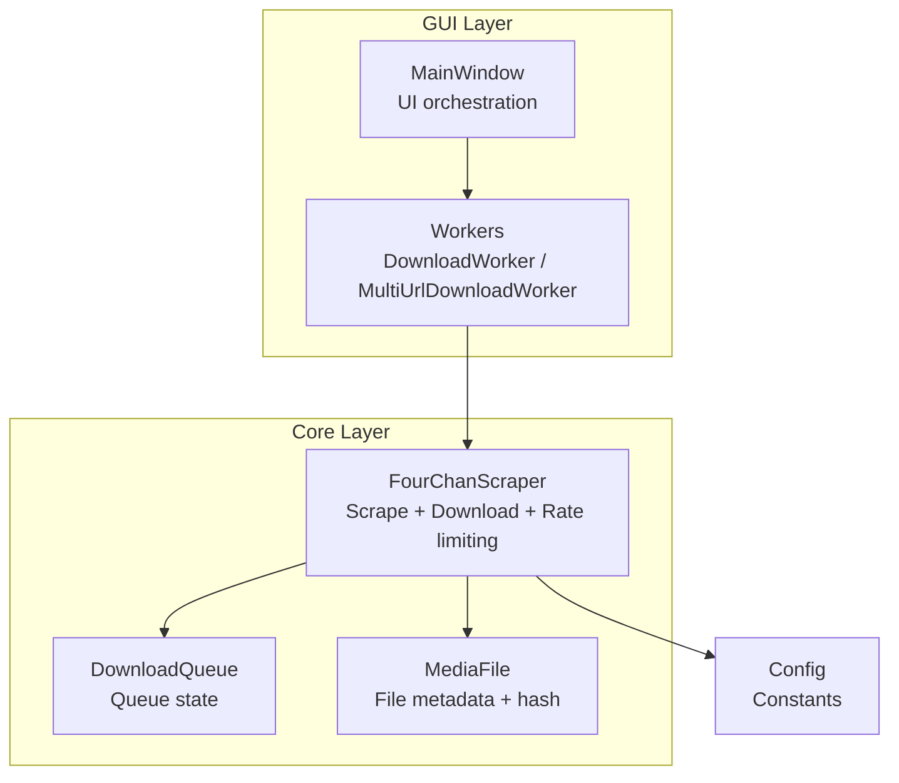
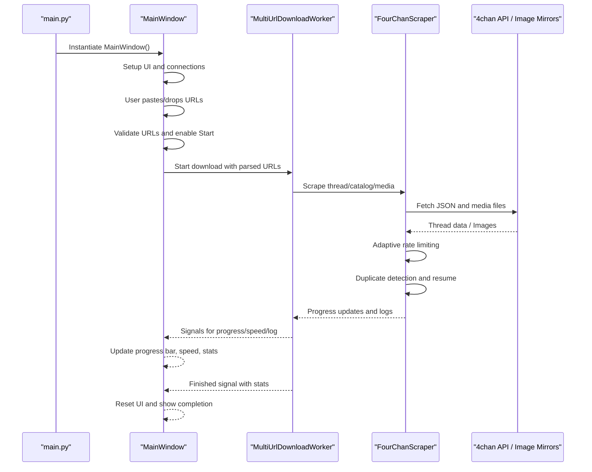
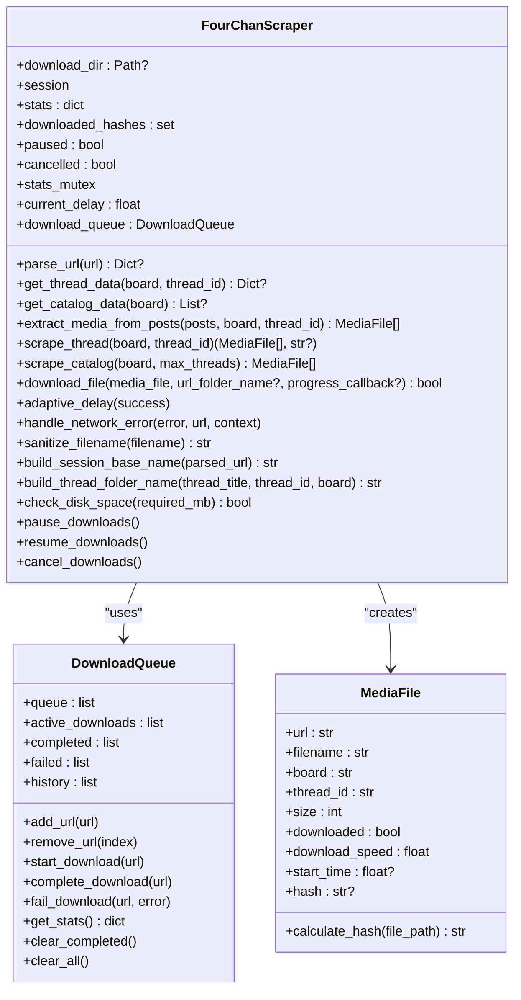
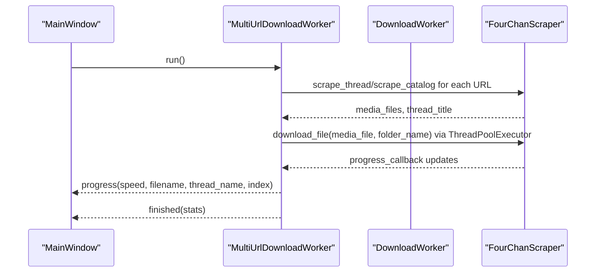
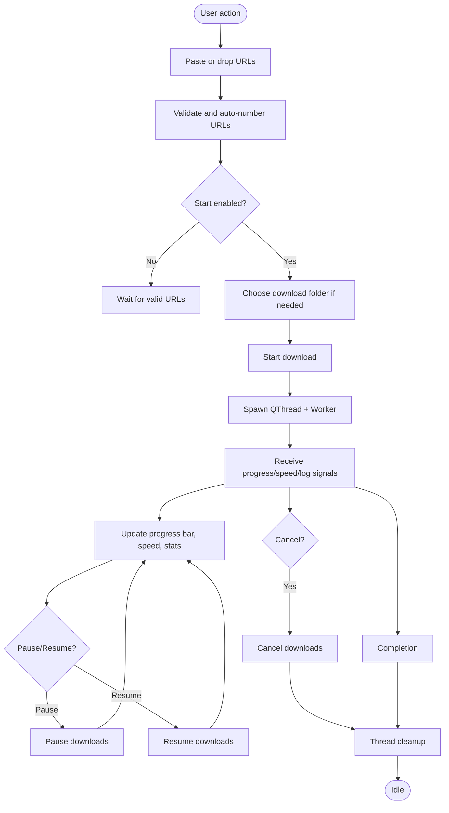
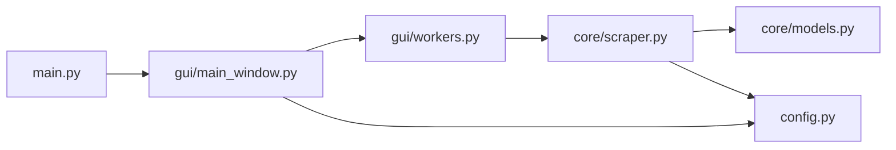

# Introduction

<cite>
**Referenced Files in This Document**
- [README.md](file://README.md)
- [main.py](file://4Charm/src/four_charm/main.py)
- [main_window.py](file://4Charm/src/four_charm/gui/main_window.py)
- [scraper.py](file://4Charm/src/four_charm/core/scraper.py)
- [models.py](file://4Charm/src/four_charm/core/models.py)
- [workers.py](file://4Charm/src/four_charm/gui/workers.py)
- [config.py](file://4Charm/src/four_charm/config.py)
</cite>

## Table of Contents
1. [Introduction](#introduction)
2. [Project Structure](#project-structure)
3. [Core Components](#core-components)
4. [Architecture Overview](#architecture-overview)
5. [Detailed Component Analysis](#detailed-component-analysis)
6. [Dependency Analysis](#dependency-analysis)
7. [Performance Considerations](#performance-considerations)
8. [Troubleshooting Guide](#troubleshooting-guide)
9. [Conclusion](#conclusion)
10. [Appendices](#appendices)

## Introduction
4Charm is a high-performance media downloader for 4chan designed for bulk downloading of images, videos, and documents. It emphasizes intelligent organization, duplicate detection, and robust reliability. Its core value proposition includes:
- Concurrent downloading across multiple URLs with a configurable worker pool
- Pause/resume capability during downloads
- WEBM separation into dedicated subfolders for organized storage
- Adaptive rate limiting to help avoid IP bans by dynamically adjusting delays based on server feedback

The application targets 4chan users who want to efficiently collect media from threads, catalogs, and boards with minimal friction. It integrates with macOS systems for folder selection and disk space checks, and provides a modern, dark-mode GUI with real-time progress monitoring.

Practical use cases include:
- Downloading an entire thread by pasting a single thread URL
- Bulk downloading recent threads from a catalog or board
- Collecting media from multiple threads simultaneously by pasting several URLs

Primary entry points:
- Application bootstrap: [main.py](file://4Charm/src/four_charm/main.py)
- GUI controller and orchestrator: [main_window.py](file://4Charm/src/four_charm/gui/main_window.py)
- Data model and queue abstractions: [models.py](file://4Charm/src/four_charm/core/models.py)
- Core scraping and download engine: [scraper.py](file://4Charm/src/four_charm/core/scraper.py)
- Worker orchestration for concurrent downloads: [workers.py](file://4Charm/src/four_charm/gui/workers.py)
- Configuration constants and tunables: [config.py](file://4Charm/src/four_charm/config.py)

Scope and limitations:
- Focuses on supported media types (images, videos, documents) as defined by configuration
- Operates against 4chan’s public API and image mirrors
- Designed for macOS with native Apple Silicon support
- Relies on user-selected download directories and available disk space

Context within the 4chan ecosystem:
- 4Charm complements manual browsing by automating media collection from threads and catalogs
- It reduces the burden of repeated manual downloads and organizes content into predictable folder structures

**Section sources**
- [README.md](file://README.md#L12-L34)
- [README.md](file://README.md#L60-L67)
- [README.md](file://README.md#L68-L84)
- [main.py](file://4Charm/src/four_charm/main.py#L37-L55)
- [main_window.py](file://4Charm/src/four_charm/gui/main_window.py#L40-L120)

## Project Structure
The application follows an MVC-like separation:
- View (GUI): MainWindow manages UI widgets, drag-and-drop, keyboard shortcuts, progress bars, logs, and system integration for folder selection and disk space reporting
- Controller (Workers): DownloadWorker and MultiUrlDownloadWorker coordinate scraping and concurrent downloads, emitting signals for progress, speed updates, and log messages
- Model (Core): FourChanScraper encapsulates URL parsing, API calls, media extraction, adaptive rate limiting, duplicate detection, resume capability, and file organization; DownloadQueue and MediaFile represent queue state and individual media items

**Diagram sources**
- [main_window.py](file://4Charm/src/four_charm/gui/main_window.py#L40-L120)
- [workers.py](file://4Charm/src/four_charm/gui/workers.py#L143-L330)
- [scraper.py](file://4Charm/src/four_charm/core/scraper.py#L19-L64)
- [models.py](file://4Charm/src/four_charm/core/models.py#L11-L113)
- [config.py](file://4Charm/src/four_charm/config.py#L4-L48)

**Section sources**
- [main_window.py](file://4Charm/src/four_charm/gui/main_window.py#L40-L120)
- [workers.py](file://4Charm/src/four_charm/gui/workers.py#L143-L330)
- [scraper.py](file://4Charm/src/four_charm/core/scraper.py#L19-L64)
- [models.py](file://4Charm/src/four_charm/core/models.py#L11-L113)
- [config.py](file://4Charm/src/four_charm/config.py#L4-L48)

## Core Components
- FourChanScraper: Central engine for URL parsing, thread/catalog fetching, media extraction, adaptive rate limiting, duplicate detection via SHA-256 hashing, resume capability, and file organization into per-thread folders with a dedicated WEBM subfolder for video files
- DownloadQueue: Tracks queued, active, completed, and failed downloads; maintains history and provides statistics
- MediaFile: Represents a downloadable item with filename, URL, board/thread context, size, speed, timing, and hash calculation
- DownloadWorker and MultiUrlDownloadWorker: Execute scraping and concurrent downloads using a thread pool; emit progress, speed, and log signals; support pause/resume/cancel
- MainWindow: Provides drag-and-drop URL support, real-time progress monitoring, system integration for folder selection, and disk space reporting

Key capabilities:
- Concurrent downloads across multiple URLs with a configurable worker pool
- Pause/resume and cancellation controls
- Intelligent organization: per-thread folders and WEBM separation
- Duplicate detection using file hashes
- Adaptive rate limiting to mitigate server-side throttling
- Real-time logging and progress display

**Section sources**
- [scraper.py](file://4Charm/src/four_charm/core/scraper.py#L19-L64)
- [scraper.py](file://4Charm/src/four_charm/core/scraper.py#L365-L547)
- [models.py](file://4Charm/src/four_charm/core/models.py#L11-L113)
- [workers.py](file://4Charm/src/four_charm/gui/workers.py#L14-L141)
- [workers.py](file://4Charm/src/four_charm/gui/workers.py#L143-L330)
- [main_window.py](file://4Charm/src/four_charm/gui/main_window.py#L391-L550)
- [main_window.py](file://4Charm/src/four_charm/gui/main_window.py#L551-L591)

## Architecture Overview
The runtime flow begins at the application entry point, initializes the GUI, and delegates to workers for scraping and downloading. The GUI remains responsive by moving heavy work onto background threads and using signals to update the UI.

**Diagram sources**
- [main.py](file://4Charm/src/four_charm/main.py#L37-L55)
- [main_window.py](file://4Charm/src/four_charm/gui/main_window.py#L488-L550)
- [workers.py](file://4Charm/src/four_charm/gui/workers.py#L143-L330)
- [scraper.py](file://4Charm/src/four_charm/core/scraper.py#L248-L307)

## Detailed Component Analysis

### FourChanScraper
Responsibilities:
- URL parsing and classification (board, thread, catalog)
- Fetching thread and catalog JSON via 4chan’s public API with timeouts and retries
- Extracting media files from posts and building MediaFile instances
- Adaptive rate limiting using exponential backoff and server feedback
- Duplicate detection via SHA-256 hashing and resume capability using HTTP Range
- File organization into per-thread folders with a dedicated WEBM subfolder
- Disk space checks and queue state management

Concurrency and threading:
- Uses a shared requests Session with pooled connections
- Uses a QMutex to protect shared stats across threads
- Pausing and cancellation flags coordinate worker lifecycle

**Diagram sources**
- [scraper.py](file://4Charm/src/four_charm/core/scraper.py#L19-L64)
- [scraper.py](file://4Charm/src/four_charm/core/scraper.py#L308-L547)
- [models.py](file://4Charm/src/four_charm/core/models.py#L11-L113)

**Section sources**
- [scraper.py](file://4Charm/src/four_charm/core/scraper.py#L19-L64)
- [scraper.py](file://4Charm/src/four_charm/core/scraper.py#L222-L247)
- [scraper.py](file://4Charm/src/four_charm/core/scraper.py#L248-L307)
- [scraper.py](file://4Charm/src/four_charm/core/scraper.py#L308-L364)
- [scraper.py](file://4Charm/src/four_charm/core/scraper.py#L365-L547)
- [models.py](file://4Charm/src/four_charm/core/models.py#L11-L113)

### DownloadWorker and MultiUrlDownloadWorker
Responsibilities:
- DownloadWorker handles a single URL (thread or catalog)
- MultiUrlDownloadWorker coordinates multiple URLs, aggregates totals, and emits per-file progress with thread context
- Both use ThreadPoolExecutor to run downloads concurrently and report progress and speed updates

**Diagram sources**
- [workers.py](file://4Charm/src/four_charm/gui/workers.py#L143-L330)
- [workers.py](file://4Charm/src/four_charm/gui/workers.py#L14-L141)
- [scraper.py](file://4Charm/src/four_charm/core/scraper.py#L365-L547)

**Section sources**
- [workers.py](file://4Charm/src/four_charm/gui/workers.py#L143-L330)
- [workers.py](file://4Charm/src/four_charm/gui/workers.py#L14-L141)

### MainWindow (GUI)
Responsibilities:
- Drag-and-drop URL support with validation and auto-numbering
- Keyboard shortcuts for paste, validate, and start
- Folder selection dialog and disk space reporting using macOS commands
- Real-time progress updates, speed display, and activity log
- Pause/resume and cancel controls wired to worker lifecycle

**Diagram sources**
- [main_window.py](file://4Charm/src/four_charm/gui/main_window.py#L391-L550)
- [main_window.py](file://4Charm/src/four_charm/gui/main_window.py#L551-L591)
- [main_window.py](file://4Charm/src/four_charm/gui/main_window.py#L657-L711)

**Section sources**
- [main_window.py](file://4Charm/src/four_charm/gui/main_window.py#L391-L550)
- [main_window.py](file://4Charm/src/four_charm/gui/main_window.py#L551-L591)
- [main_window.py](file://4Charm/src/four_charm/gui/main_window.py#L657-L711)

## Dependency Analysis
- main.py depends on the GUI module to instantiate MainWindow and sets up logging and application metadata
- MainWindow depends on FourChanScraper and MultiUrlDownloadWorker to orchestrate downloads
- Workers depend on FourChanScraper for scraping and downloading
- FourChanScraper depends on MediaFile and DownloadQueue for modeling and queue state
- FourChanScraper and workers depend on Config for tunables like worker count, timeouts, and media extensions

**Diagram sources**
- [main.py](file://4Charm/src/four_charm/main.py#L37-L55)
- [main_window.py](file://4Charm/src/four_charm/gui/main_window.py#L40-L120)
- [workers.py](file://4Charm/src/four_charm/gui/workers.py#L143-L330)
- [scraper.py](file://4Charm/src/four_charm/core/scraper.py#L19-L64)
- [models.py](file://4Charm/src/four_charm/core/models.py#L11-L113)
- [config.py](file://4Charm/src/four_charm/config.py#L4-L48)

**Section sources**
- [main.py](file://4Charm/src/four_charm/main.py#L37-L55)
- [main_window.py](file://4Charm/src/four_charm/gui/main_window.py#L40-L120)
- [workers.py](file://4Charm/src/four_charm/gui/workers.py#L143-L330)
- [scraper.py](file://4Charm/src/four_charm/core/scraper.py#L19-L64)
- [models.py](file://4Charm/src/four_charm/core/models.py#L11-L113)
- [config.py](file://4Charm/src/four_charm/config.py#L4-L48)

## Performance Considerations
- Concurrency: MAX_WORKERS determines the number of parallel downloads; adjust based on CPU and network conditions
- Adaptive rate limiting: BASE_DELAY, BACKOFF_MULTIPLIER, and MAX_DELAY tune throttling behavior to reduce rate-limiting events
- Chunk size and timeouts: CHUNK_SIZE and DOWNLOAD_TIMEOUT balance responsiveness and stability
- Disk space checks: MIN_FREE_SPACE_MB ensures safe operation; consider available disk headroom
- Organization: WEBM separation reduces clutter and improves indexing; per-thread folders improve navigation

[No sources needed since this section provides general guidance]

## Troubleshooting Guide
Common issues and remedies:
- App opens but shows “No media found”: Verify URLs are valid 4chan links and not dead threads; ensure the board exists
- Slow downloads: 4chan rate limits apply; adaptive rate limiting adjusts automatically, but patience may be required
- Insufficient disk space: Increase available space or change the download directory
- “App is damaged / Cannot be opened”: Use the Gatekeeper override steps described in the README
- Paused/resume behavior: Use the Pause/Resume button; downloads will resume from where they left off

**Section sources**
- [README.md](file://README.md#L97-L103)
- [main_window.py](file://4Charm/src/four_charm/gui/main_window.py#L551-L591)
- [scraper.py](file://4Charm/src/four_charm/core/scraper.py#L431-L440)

## Conclusion
4Charm delivers a fast, reliable, and user-friendly solution for bulk 4chan media collection. Its MVC-like architecture cleanly separates concerns: the GUI remains responsive while the core engine handles scraping, concurrent downloads, adaptive rate limiting, and intelligent organization. Features like pause/resume, duplicate detection, and WEBM separation enhance usability and reliability. By integrating with macOS for folder selection and disk space checks, it provides a seamless native experience tailored for macOS users.

[No sources needed since this section summarizes without analyzing specific files]

## Appendices
- Supported media types and organization patterns are documented in the project README
- Configuration constants define tunables for concurrency, timeouts, and rate limiting

**Section sources**
- [README.md](file://README.md#L37-L42)
- [README.md](file://README.md#L68-L84)
- [config.py](file://4Charm/src/four_charm/config.py#L4-L48)