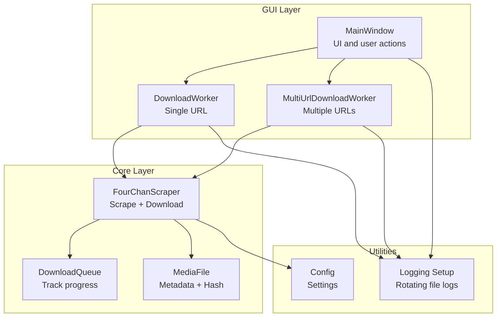

# Troubleshooting

<cite>
**Referenced Files in This Document**
- [scraper.py](file://4Charm/src/four_charm/core/scraper.py)
- [config.py](file://4Charm/src/four_charm/config.py)
- [models.py](file://4Charm/src/four_charm/core/models.py)
- [workers.py](file://4Charm/src/four_charm/gui/workers.py)
- [main_window.py](file://4Charm/src/four_charm/gui/main_window.py)
- [logging_setup.py](file://4Charm/src/four_charm/utils/logging_setup.py)
- [main.py](file://4Charm/src/four_charm/main.py)
</cite>

## Table of Contents
1. [Introduction](#introduction)
2. [Project Structure](#project-structure)
3. [Core Components](#core-components)
4. [Architecture Overview](#architecture-overview)
5. [Detailed Component Analysis](#detailed-component-analysis)
6. [Dependency Analysis](#dependency-analysis)
7. [Performance Considerations](#performance-considerations)
8. [Troubleshooting Guide](#troubleshooting-guide)
9. [Conclusion](#conclusion)

## Introduction
This document provides a comprehensive troubleshooting guide for 4Charm users. It focuses on diagnosing and resolving common issues such as network connectivity problems, download failures, rate limiting errors, file permission issues, and disk space warnings. It also explains error messages you may encounter, their root causes, and practical steps to fix them. The guide includes step-by-step diagnostics, configuration adjustments, and performance tips for slow downloads and memory usage.

## Project Structure
4Charm is a desktop application built with Python and PySide6. The core logic for scraping and downloading lives in the core module, while the GUI handles user interactions and threading. Logging is centralized to help diagnose issues.

**Diagram sources**
- [main_window.py](file://4Charm/src/four_charm/gui/main_window.py#L1-L120)
- [workers.py](file://4Charm/src/four_charm/gui/workers.py#L1-L120)
- [scraper.py](file://4Charm/src/four_charm/core/scraper.py#L1-L120)
- [models.py](file://4Charm/src/four_charm/core/models.py#L1-L60)
- [config.py](file://4Charm/src/four_charm/config.py#L1-L48)
- [logging_setup.py](file://4Charm/src/four_charm/utils/logging_setup.py#L1-L40)

**Section sources**
- [main.py](file://4Charm/src/four_charm/main.py#L1-L55)
- [logging_setup.py](file://4Charm/src/four_charm/utils/logging_setup.py#L1-L40)

## Core Components
- FourChanScraper: Handles URL parsing, API calls, media extraction, and file downloads with retries, adaptive delays, and duplicate detection.
- DownloadQueue: Tracks queued, active, completed, and failed downloads.
- MediaFile: Holds metadata and calculates file hashes for deduplication.
- Workers: Run scraping and downloading in background threads and emit progress and log signals.
- Config: Centralized settings for timeouts, retries, concurrency, and limits.
- Logging: Rotating file logs under the user’s home directory for diagnostics.

**Section sources**
- [scraper.py](file://4Charm/src/four_charm/core/scraper.py#L1-L120)
- [models.py](file://4Charm/src/four_charm/core/models.py#L1-L113)
- [workers.py](file://4Charm/src/four_charm/gui/workers.py#L1-L120)
- [config.py](file://4Charm/src/four_charm/config.py#L1-L48)

## Architecture Overview
The GUI triggers workers that coordinate scraping and downloading. The scraper manages sessions, retries, rate limiting, and disk checks. Logs are written to rotating files for later inspection.

**Diagram sources**
- [main_window.py](file://4Charm/src/four_charm/gui/main_window.py#L480-L560)
- [workers.py](file://4Charm/src/four_charm/gui/workers.py#L120-L220)
- [scraper.py](file://4Charm/src/four_charm/core/scraper.py#L248-L364)
- [scraper.py](file://4Charm/src/four_charm/core/scraper.py#L365-L547)

## Detailed Component Analysis

### FourChanScraper: Error Handling and Diagnostics
- Network errors are categorized and handled with adaptive delays. Specific handling includes:
  - ConnectionError: logs and backs off.
  - Timeout: logs and backs off.
  - HTTPError: status 429 (Too Many Requests) increases delay; 403/404 logs and backs off; others log and back off.
  - TooManyRedirects: logs and backs off.
  - Unknown: logs and backs off.
- Rate limiting: adaptive delay reduces or increases delay depending on success/failure; special handling for 429 doubles delay up to a cap.
- Disk space: checks free space before writing; logs and fails if below threshold.
- Duplicate detection: compares SHA256 hashes; skips if duplicate.
- Resume support: uses Range headers to continue partial downloads.

**Diagram sources**
- [scraper.py](file://4Charm/src/four_charm/core/scraper.py#L65-L131)

**Section sources**
- [scraper.py](file://4Charm/src/four_charm/core/scraper.py#L65-L131)
- [scraper.py](file://4Charm/src/four_charm/core/scraper.py#L210-L221)

### DownloadQueue: Tracking Progress and Failures
- Maintains queue, active downloads, completed, and failed lists.
- Records history with timestamps and error messages for each URL.
- Provides statistics for UI and diagnostics.

**Section sources**
- [models.py](file://4Charm/src/four_charm/core/models.py#L1-L90)

### MediaFile: Deduplication and Metadata
- Stores URL, filename, board, thread_id, size, speed, start time, and hash.
- Calculates SHA256 hash for duplicate detection.

**Section sources**
- [models.py](file://4Charm/src/four_charm/core/models.py#L92-L113)

### Workers: Threading and Progress
- DownloadWorker and MultiUrlDownloadWorker run scraping and downloading concurrently.
- Emits progress, speed, and log signals; handles cancellation and pause/resume.
- Uses Config.MAX_WORKERS for thread pool sizing.

**Section sources**
- [workers.py](file://4Charm/src/four_charm/gui/workers.py#L1-L120)
- [workers.py](file://4Charm/src/four_charm/gui/workers.py#L120-L220)
- [workers.py](file://4Charm/src/four_charm/gui/workers.py#L220-L330)

## Dependency Analysis
- FourChanScraper depends on Config for timeouts, retries, delays, and limits.
- Workers depend on FourChanScraper and Config.
- Logging is configured globally and used throughout.

**Diagram sources**
- [config.py](file://4Charm/src/four_charm/config.py#L1-L48)
- [scraper.py](file://4Charm/src/four_charm/core/scraper.py#L1-L64)
- [workers.py](file://4Charm/src/four_charm/gui/workers.py#L1-L60)
- [main_window.py](file://4Charm/src/four_charm/gui/main_window.py#L1-L120)
- [logging_setup.py](file://4Charm/src/four_charm/utils/logging_setup.py#L1-L40)

**Section sources**
- [config.py](file://4Charm/src/four_charm/config.py#L1-L48)
- [scraper.py](file://4Charm/src/four_charm/core/scraper.py#L1-L64)
- [workers.py](file://4Charm/src/four_charm/gui/workers.py#L1-L60)
- [logging_setup.py](file://4Charm/src/four_charm/utils/logging_setup.py#L1-L40)

## Performance Considerations
- Concurrency: Adjust Config.MAX_WORKERS to balance throughput and system load. Higher values increase CPU and network usage.
- Chunk size: Config.CHUNK_SIZE controls streaming buffer size; larger chunks can improve throughput but increase memory usage.
- Retries and timeouts: Config.MAX_RETRIES and DOWNLOAD_TIMEOUT influence resilience vs. runtime. Tune for your network stability.
- Rate limiting: The scraper adapts automatically; if downloads stall frequently, consider reducing MAX_WORKERS or increasing BASE_DELAY.

[No sources needed since this section provides general guidance]

## Troubleshooting Guide

### 1) Network Connectivity Problems
Symptoms:
- Long delays or repeated failures when scraping catalogs or threads.
- Errors logged for connection failures or timeouts.

Common causes:
- Local firewall or proxy blocking outbound requests.
- DNS resolution issues.
- Unstable Wi-Fi or ISP throttling.

Diagnostic steps:
- Verify internet access outside 4Charm.
- Test accessing 4chan APIs directly in a browser or curl.
- Check system proxy settings.
- Temporarily disable VPN/firewall to test.

Fixes:
- Configure system proxy if required.
- Switch networks or devices to isolate the issue.
- Reduce concurrency by lowering Config.MAX_WORKERS if the system is overloaded.

**Section sources**
- [scraper.py](file://4Charm/src/four_charm/core/scraper.py#L65-L131)

### 2) Download Failures (Partial or Empty Files)
Symptoms:
- Files appear but are zero bytes.
- Frequent retries and “Max retries exceeded” in logs.

Root causes:
- Interrupted downloads (network drops).
- Server-side issues returning unexpected responses.
- Disk write errors.

Diagnostic steps:
- Check the Activity Log for “Empty file” or “Max retries exceeded.”
- Inspect the target folder for partial files (temporary files may remain).
- Re-run with fewer concurrent workers.

Fixes:
- Enable resume support: the scraper resumes partial downloads automatically using Range headers.
- Increase Config.DOWNLOAD_TIMEOUT and Config.MAX_RETRIES moderately.
- Reduce Config.MAX_WORKERS to lower contention.

**Section sources**
- [scraper.py](file://4Charm/src/four_charm/core/scraper.py#L431-L547)

### 3) Rate Limiting Errors (429 Too Many Requests)
Symptoms:
- Periodic stalls during downloads.
- Logs indicating rate limiting.

Root causes:
- 4chan servers enforcing rate limits.

Diagnostic steps:
- Look for warnings about rate limiting in the Activity Log.
- Observe increased delays between requests.

Fixes:
- The scraper automatically doubles the delay on 429 up to a cap; no manual action usually needed.
- If still slow, reduce Config.MAX_WORKERS or increase Config.BASE_DELAY slightly.

**Section sources**
- [scraper.py](file://4Charm/src/four_charm/core/scraper.py#L96-L119)
- [scraper.py](file://4Charm/src/four_charm/core/scraper.py#L65-L74)
- [config.py](file://4Charm/src/four_charm/config.py#L16-L24)

### 4) File Permission Issues
Symptoms:
- “Permission denied” errors when writing files.
- Downloads stuck at 0% or fail immediately.

Root causes:
- Writing to protected directories (e.g., system folders).
- Read-only filesystems.

Fixes:
- Choose a writable folder using the “Choose Folder” button.
- Ensure the folder is not mounted read-only.
- On macOS, avoid saving to locations requiring elevated permissions.

**Section sources**
- [main_window.py](file://4Charm/src/four_charm/gui/main_window.py#L391-L403)
- [scraper.py](file://4Charm/src/four_charm/core/scraper.py#L390-L410)

### 5) Disk Space Warnings
Symptoms:
- “Insufficient disk space” errors.
- Downloads failing early.

Root causes:
- Free space below Config.MIN_FREE_SPACE_MB.

Fixes:
- Free up disk space or change the download folder to a drive with more space.
- Lower Config.MIN_FREE_SPACE_MB cautiously if you must operate near capacity.

**Section sources**
- [scraper.py](file://4Charm/src/four_charm/core/scraper.py#L210-L221)
- [config.py](file://4Charm/src/four_charm/config.py#L10-L12)

### 6) Verifying URL Formats
Symptoms:
- “No media files found” or validation errors.
- Start button disabled.

Root causes:
- Non-4chan URLs or malformed links.
- Exceeding the URL limit.

Fixes:
- Paste only valid 4chan URLs (boards.4chan.org or 4chan.org).
- Limit to 10 URLs at a time.
- Use Ctrl+Enter to start after validating.

**Section sources**
- [main_window.py](file://4Charm/src/four_charm/gui/main_window.py#L438-L480)
- [scraper.py](file://4Charm/src/four_charm/core/scraper.py#L222-L247)

### 7) Testing Network Access
Steps:
- Open Terminal and run curl against a 4chan endpoint to confirm connectivity.
- Try the same URL inside 4Charm to compare behavior.
- Temporarily disable antivirus/proxy to test.

**Section sources**
- [scraper.py](file://4Charm/src/four_charm/core/scraper.py#L248-L306)

### 8) Checking Logs
Where logs are stored:
- Under the user’s home directory in a rotating log file.

How to inspect:
- Open the Activity Log in the app.
- Navigate to the log file location and review recent entries.

What to look for:
- Error categories (connection, timeout, http, rate_limited, redirects).
- Timestamps around failures.
- Duplicate or resume activity.

**Section sources**
- [logging_setup.py](file://4Charm/src/four_charm/utils/logging_setup.py#L1-L40)
- [main.py](file://4Charm/src/four_charm/main.py#L12-L20)

### 9) Configuration-Related Problems
Adjustable settings:
- MAX_WORKERS: Number of concurrent downloads.
- MAX_RETRIES: Attempts per file.
- DOWNLOAD_TIMEOUT: Connect/read timeouts.
- CHUNK_SIZE: Streaming buffer size.
- BASE_DELAY/MAX_DELAY: Adaptive delay bounds.
- MIN_FREE_SPACE_MB: Minimum free space threshold.
- MAX_FILENAME_LENGTH and MAX_FOLDER_NAME_LENGTH: Filename and folder safety limits.

Guidance:
- Increase MAX_RETRIES for unstable networks.
- Raise CHUNK_SIZE for faster throughput on fast disks.
- Lower MAX_WORKERS if CPU or network becomes saturated.
- Increase MIN_FREE_SPACE_MB if you want stricter safety.

**Section sources**
- [config.py](file://4Charm/src/four_charm/config.py#L1-L48)

### 10) Known Limitations and Workarounds
- Duplicate detection relies on SHA256 hashing; very large files take time to hash.
- Resume only works if the server supports Range requests.
- Catalog scraping is limited by 4chan’s API and rate limits.
- macOS-specific stats rely on external commands; fallback to Python calculation if unavailable.

Workarounds:
- Reduce concurrency to minimize CPU/memory spikes.
- Use smaller batch sizes (fewer URLs) to avoid server-side throttling.
- Manually verify resume behavior by checking partial files.

**Section sources**
- [scraper.py](file://4Charm/src/four_charm/core/scraper.py#L431-L547)
- [main_window.py](file://4Charm/src/four_charm/gui/main_window.py#L657-L711)

### 11) Slow Downloads and Memory Usage Optimization
Tips:
- Lower MAX_WORKERS to reduce CPU and memory usage.
- Increase CHUNK_SIZE moderately for throughput; monitor memory.
- Reduce MAX_RETRIES to cut retry overhead.
- Pause/resume to temporarily halt heavy loads.

**Section sources**
- [config.py](file://4Charm/src/four_charm/config.py#L1-L24)
- [workers.py](file://4Charm/src/four_charm/gui/workers.py#L55-L120)

## Conclusion
By following the diagnostic steps and applying the targeted fixes outlined above, most 4Charm issues can be resolved quickly. Use the Activity Log to pinpoint root causes, adjust configuration settings to match your environment, and leverage built-in features like adaptive delays, retries, and resume support. For persistent problems, reduce concurrency, verify network access, and ensure adequate disk space and permissions.