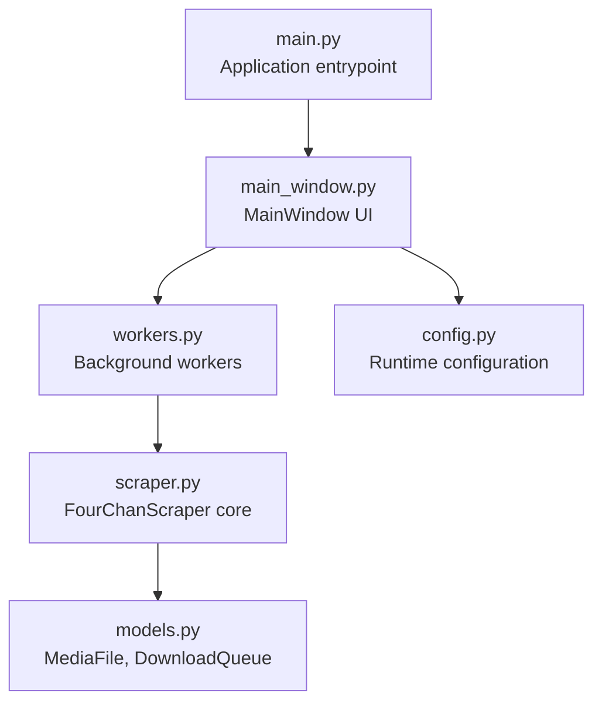
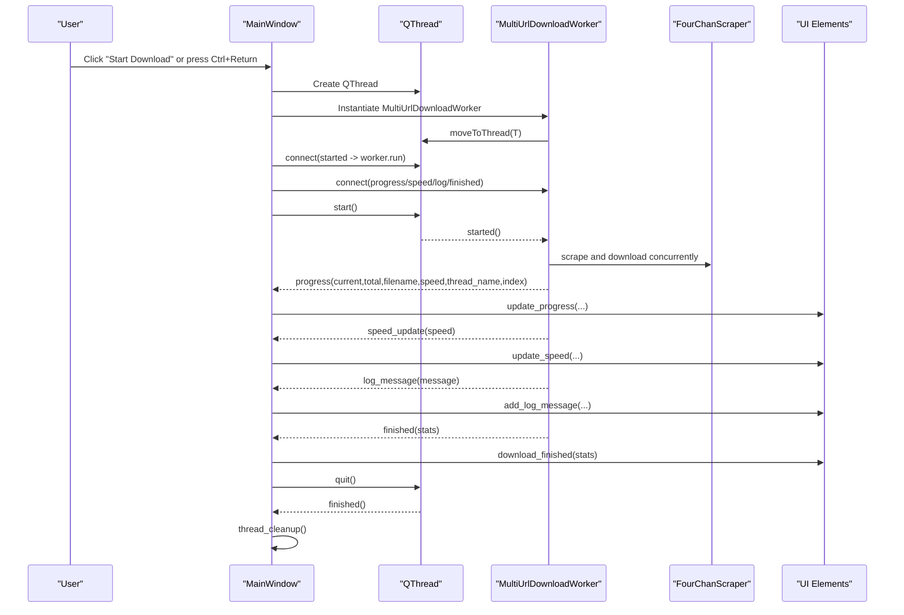
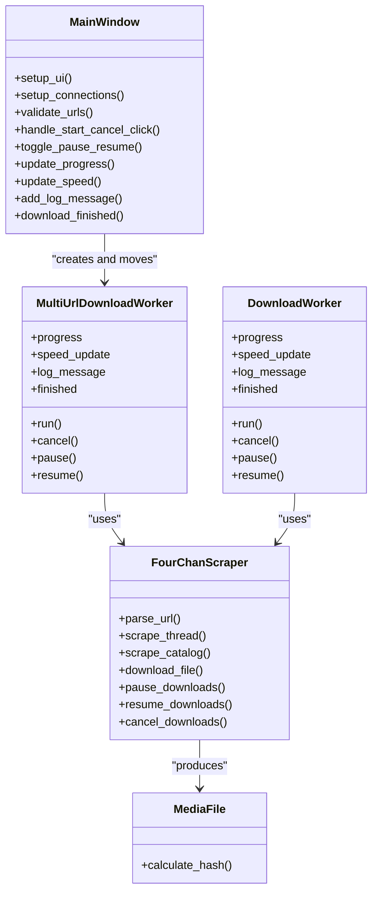

# User Interface

<cite>
**Referenced Files in This Document**
- [main.py](file://4Charm/src/four_charm/main.py)
- [main_window.py](file://4Charm/src/four_charm/gui/main_window.py)
- [workers.py](file://4Charm/src/four_charm/gui/workers.py)
- [scraper.py](file://4Charm/src/four_charm/core/scraper.py)
- [models.py](file://4Charm/src/four_charm/core/models.py)
- [config.py](file://4Charm/src/four_charm/config.py)
- [README.md](file://4Charm/README.md)
</cite>

## Table of Contents
1. [Introduction](#introduction)
2. [Project Structure](#project-structure)
3. [Core Components](#core-components)
4. [Architecture Overview](#architecture-overview)
5. [Detailed Component Analysis](#detailed-component-analysis)
6. [Dependency Analysis](#dependency-analysis)
7. [Performance Considerations](#performance-considerations)
8. [Troubleshooting Guide](#troubleshooting-guide)
9. [Conclusion](#conclusion)

## Introduction
This document describes the User Interface components of 4Charm, focusing on the MainWindow layout, input areas, progress displays, log viewer, and status indicators. It explains user interaction patterns (keyboard shortcuts, drag-and-drop, and button actions), the signal/slot architecture connecting UI events to background operations, and the props/events for key UI components. It also covers accessibility and responsive behavior, how the UI reflects system state, and performance optimizations for smooth UI updates during heavy downloads. Finally, it details the composition between the main window and worker threads that handle background processing.

## Project Structure
The GUI is implemented with PySide6 and organized into:
- Application entrypoint that creates the main window and starts the Qt event loop
- MainWindow that defines the visual layout and user interactions
- Worker classes that encapsulate background processing and emit signals for UI updates
- Core scraper that performs URL parsing, scraping, and downloading with concurrency and rate limiting
- Shared configuration and data models

**Diagram sources**
- [main.py](file://4Charm/src/four_charm/main.py#L37-L51)
- [main_window.py](file://4Charm/src/four_charm/gui/main_window.py#L40-L120)
- [workers.py](file://4Charm/src/four_charm/gui/workers.py#L143-L200)
- [scraper.py](file://4Charm/src/four_charm/core/scraper.py#L19-L64)
- [models.py](file://4Charm/src/four_charm/core/models.py#L11-L20)
- [config.py](file://4Charm/src/four_charm/config.py#L4-L14)

**Section sources**
- [main.py](file://4Charm/src/four_charm/main.py#L37-L51)
- [README.md](file://4Charm/README.md#L60-L67)

## Core Components
- MainWindow: Central widget with a dark theme, structured sections for URL input, controls, progress, logs, and statistics. Provides drag-and-drop, keyboard shortcuts, and state-driven UI updates.
- Workers: MultiUrlDownloadWorker and DownloadWorker encapsulate concurrent scraping and downloading, emitting signals for progress, speed, logs, and completion.
- Scraper: FourChanScraper handles URL parsing, thread/catalog scraping, media extraction, concurrent downloads with adaptive rate limiting, duplicate detection, and stats aggregation.
- Models: MediaFile and DownloadQueue represent data structures for downloads and queue management.
- Config: Defines runtime constants for concurrency, timeouts, retries, and rate limiting.

**Section sources**
- [main_window.py](file://4Charm/src/four_charm/gui/main_window.py#L40-L120)
- [workers.py](file://4Charm/src/four_charm/gui/workers.py#L143-L200)
- [scraper.py](file://4Charm/src/four_charm/core/scraper.py#L19-L64)
- [models.py](file://4Charm/src/four_charm/core/models.py#L92-L113)
- [config.py](file://4Charm/src/four_charm/config.py#L4-L14)

## Architecture Overview
The UI follows a Qt signal/slot pattern:
- UI events (button clicks, shortcuts, drag-and-drop) trigger MainWindow methods
- MainWindow starts a QThread and moves a worker instance onto it
- Worker emits signals (progress, speed_update, log_message, finished)
- MainWindow slots update the UI (progress bar, labels, log, status bar)
- Cleanup ensures thread and worker references are safely released

**Diagram sources**
- [main_window.py](file://4Charm/src/four_charm/gui/main_window.py#L481-L569)
- [workers.py](file://4Charm/src/four_charm/gui/workers.py#L143-L200)
- [scraper.py](file://4Charm/src/four_charm/core/scraper.py#L365-L547)

## Detailed Component Analysis

### MainWindow Layout and Controls
- Visual layout:
  - Header and slogan labels
  - Group box "URLs to Download" containing:
    - QTextEdit for multi-line URL input with placeholder text and scrollbars
    - URL counter label
  - Control row with buttons:
    - Choose Folder
    - Start Download (toggles to Cancel during download)
    - Clear
    - Pause/Resume
  - Group box "Download Progress" with:
    - QProgressBar
    - Progress label (shows current file and optional thread context)
    - Speed label
  - Group box "Activity Log" with:
    - QTextEdit log viewer (read-only)
    - Statistics labels: Folders, Files, Size
  - QStatusBar for status messages and color-coded feedback
- Styling:
  - Dark theme with accent colors for highlights
  - Custom stylesheets for widgets, buttons, progress bar, and status bar
- Responsiveness:
  - Minimum sizes and expanding layouts
  - Scrollbar policies configured for consistent UX
  - Ensures cursor visibility and autoscroll after paste/drop

**Section sources**
- [main_window.py](file://4Charm/src/four_charm/gui/main_window.py#L40-L120)
- [main_window.py](file://4Charm/src/four_charm/gui/main_window.py#L121-L240)
- [main_window.py](file://4Charm/src/four_charm/gui/main_window.py#L241-L359)
- [main_window.py](file://4Charm/src/four_charm/gui/main_window.py#L358-L361)

### Drag-and-Drop for URL Input
- Behavior:
  - Accepts plain text drops
  - Extracts candidate URLs from dropped text
  - Filters to 4chan domains
  - Numbers URLs automatically ("1. ", "2. ", ...)
  - Validates URLs and scrolls to the end to show new entries
- Interaction pattern:
  - Users can drag URLs from browsers or text editors into the URL input area
  - The input area auto-formats and validates immediately after drop

**Section sources**
- [main_window.py](file://4Charm/src/four_charm/gui/main_window.py#L757-L787)
- [main_window.py](file://4Charm/src/four_charm/gui/main_window.py#L405-L480)

### Keyboard Shortcuts and Paste Handling
- Shortcuts:
  - Enter in URL input triggers validation and enables Start Download when valid
  - Ctrl+Return triggers download start
  - Escape cancels ongoing download or closes the app
  - Paste shortcut pastes and formats URLs from clipboard
- Paste behavior:
  - Extracts URLs using regex and filters to 4chan domains
  - Inserts formatted URLs at cursor position
  - Validates and scrolls to end to show new entries

**Section sources**
- [main_window.py](file://4Charm/src/four_charm/gui/main_window.py#L362-L385)
- [main_window.py](file://4Charm/src/four_charm/gui/main_window.py#L712-L750)

### Button Interactions and State Transitions
- Start/Cancel button:
  - Starts a new download when disabled (idle) or cancels when enabled (downloading)
  - Switches text and styling dynamically
- Pause/Resume button:
  - Toggles pause/resume on the worker and updates UI visibility
- Clear button:
  - Clears URL input and re-validates
- Choose Folder button:
  - Opens a directory chooser and sets the download directory

**Section sources**
- [main_window.py](file://4Charm/src/four_charm/gui/main_window.py#L481-L569)
- [main_window.py](file://4Charm/src/four_charm/gui/main_window.py#L580-L609)
- [main_window.py](file://4Charm/src/four_charm/gui/main_window.py#L386-L403)

### Progress Bar and Real-Time Updates
- Progress updates:
  - Percentage computed from current/total files
  - Progress label shows current file and optional thread context
  - Speed label shows instantaneous speed per file and average speed across all downloads
- Worker-to-UI signals:
  - progress(current,total,filename,speed,thread_name,thread_index)
  - speed_update(speed)
- UI updates:
  - MainWindow.update_progress() and update_speed() update the progress bar and labels
  - Stats labels (folders, files, size) are refreshed after each log message

**Section sources**
- [main_window.py](file://4Charm/src/four_charm/gui/main_window.py#L627-L656)
- [workers.py](file://4Charm/src/four_charm/gui/workers.py#L143-L200)
- [workers.py](file://4Charm/src/four_charm/gui/workers.py#L234-L303)

### Log Viewer and Activity Stream
- Log viewer:
  - Read-only QTextEdit with monospaced font and dark background
  - Appends timestamped messages with append() and moves cursor to end
  - Stats are updated after each log message
- Messages include:
  - Found files, download progress, successes/failures, cancellations, duplicates, and completion summaries

**Section sources**
- [main_window.py](file://4Charm/src/four_charm/gui/main_window.py#L650-L656)
- [workers.py](file://4Charm/src/four_charm/gui/workers.py#L143-L200)
- [workers.py](file://4Charm/src/four_charm/gui/workers.py#L234-L303)

### Status Indicators and Notifications
- Status bar:
  - Color-coded messages for valid/invalid/partial/idle states
  - Shows current operation (ready, downloading, paused, completion summary)
- URL counter:
  - Reflects number of valid URLs after validation
- Download stats:
  - Folders, Files, Size labels updated via macOS “du” command or fallback Python calculation

**Section sources**
- [main_window.py](file://4Charm/src/four_charm/gui/main_window.py#L613-L626)
- [main_window.py](file://4Charm/src/four_charm/gui/main_window.py#L405-L480)
- [main_window.py](file://4Charm/src/four_charm/gui/main_window.py#L657-L711)

### Signal/Slot Architecture and Props/Events
- MainWindow signals/slots:
  - url_input.textChanged -> validate_urls()
  - start_cancel_btn.clicked -> handle_start_cancel_click()
  - pause_resume_btn.clicked -> toggle_pause_resume()
  - clear_btn.clicked -> clear_urls()
  - folder_btn.clicked -> choose_download_folder()
  - paste_shortcut -> paste_from_clipboard()
  - start_shortcut -> validate_urls()
  - download_shortcut -> handle_start_cancel_click()
  - escape_shortcut -> cancel_or_close()
- Worker signals:
  - progress(current,total,filename,speed,thread_name,thread_index)
  - speed_update(speed)
  - log_message(message)
  - finished(stats)
- Props/events for key UI components:
  - QTextEdit (URL input): acceptRichText=false, placeholder text, scrollbars, custom stylesheet
  - QPushButton (controls): styling via stylesheet, dynamic text and enabled state
  - QProgressBar: percentage updates, themed appearance
  - QTextEdit (log): read-only, monospaced, styled
  - QStatusBar: color-coded messages, dynamic text

**Section sources**
- [main_window.py](file://4Charm/src/four_charm/gui/main_window.py#L362-L385)
- [workers.py](file://4Charm/src/four_charm/gui/workers.py#L143-L200)

### Accessibility and Responsive Behavior
- Accessibility:
  - Clear focus states and keyboard navigation support
  - Sufficient color contrast for readability
  - Read-only log viewer for screen readers
- Responsive behavior:
  - Minimum and maximum heights for input area
  - Expanding layouts and spacing for consistent sizing
  - Ensures cursor visibility and autoscroll after paste/drop

**Section sources**
- [main_window.py](file://4Charm/src/four_charm/gui/main_window.py#L146-L228)
- [main_window.py](file://4Charm/src/four_charm/gui/main_window.py#L229-L240)
- [main_window.py](file://4Charm/src/four_charm/gui/main_window.py#L742-L750)

### Cross-Browser Compatibility
- N/A for desktop: The UI targets macOS and does not rely on browser APIs.

[No sources needed since this section provides general guidance]

### Component Composition Patterns
- Thread composition:
  - MainWindow creates QThread and moves MultiUrlDownloadWorker onto it
  - Worker communicates via signals; MainWindow updates UI in slots
  - Thread cleanup releases references after finished()

**Section sources**
- [main_window.py](file://4Charm/src/four_charm/gui/main_window.py#L532-L549)
- [main_window.py](file://4Charm/src/four_charm/gui/main_window.py#L573-L578)
- [workers.py](file://4Charm/src/four_charm/gui/workers.py#L143-L200)

## Dependency Analysis
- MainWindow depends on:
  - FourChanScraper for URL parsing and download directory management
  - MultiUrlDownloadWorker for background processing
  - Config for runtime constants
- Workers depend on:
  - FourChanScraper for scraping and downloading
  - MediaFile for file metadata and hashing
- Scraper depends on:
  - Config for timeouts, retries, and rate limiting
  - DownloadQueue for internal queue management

**Diagram sources**
- [main_window.py](file://4Charm/src/four_charm/gui/main_window.py#L481-L569)
- [workers.py](file://4Charm/src/four_charm/gui/workers.py#L143-L200)
- [scraper.py](file://4Charm/src/four_charm/core/scraper.py#L365-L547)
- [models.py](file://4Charm/src/four_charm/core/models.py#L92-L113)

**Section sources**
- [main_window.py](file://4Charm/src/four_charm/gui/main_window.py#L481-L569)
- [workers.py](file://4Charm/src/four_charm/gui/workers.py#L143-L200)
- [scraper.py](file://4Charm/src/four_charm/core/scraper.py#L365-L547)
- [models.py](file://4Charm/src/four_charm/core/models.py#L92-L113)

## Performance Considerations
- Concurrency:
  - Config.MAX_WORKERS determines thread pool size for downloads
  - Adaptive rate limiting reduces server pressure and improves stability
- UI responsiveness:
  - Signals emitted from worker thread are processed on the main thread
  - Progress updates are throttled by Config.PROGRESS_UPDATE_INTERVAL
- Disk and memory:
  - macOS “du” command used for accurate size calculation with fallback to Python iteration
  - Duplicate detection via SHA-256 prevents redundant writes
- Network:
  - HTTPAdapter pools connections proportional to worker count
  - Backoff strategy increases delay on failures and reduces on success

**Section sources**
- [config.py](file://4Charm/src/four_charm/config.py#L4-L14)
- [scraper.py](file://4Charm/src/four_charm/core/scraper.py#L19-L64)
- [scraper.py](file://4Charm/src/four_charm/core/scraper.py#L548-L557)
- [main_window.py](file://4Charm/src/four_charm/gui/main_window.py#L657-L711)

## Troubleshooting Guide
- No media found:
  - Verify URLs are valid and point to supported boards/threads
  - Check logs for warnings about skipping invalid URLs
- Slow downloads:
  - 4chan rate limiting is handled automatically; consider pausing/resuming or reducing concurrent workers
- Insufficient disk space:
  - Ensure adequate free space in the chosen download directory
- Cancel or pause:
  - Use Cancel button or Pause/Resume; Escape cancels if downloading or closes otherwise

**Section sources**
- [main_window.py](file://4Charm/src/four_charm/gui/main_window.py#L481-L569)
- [workers.py](file://4Charm/src/four_charm/gui/workers.py#L143-L200)
- [scraper.py](file://4Charm/src/four_charm/core/scraper.py#L210-L221)

## Conclusion
The MainWindow provides a robust, responsive UI for managing 4Charm downloads. Its layout organizes input, controls, progress, logs, and statistics clearly. The signal/slot architecture cleanly separates UI concerns from background processing, enabling smooth real-time updates and reliable cancellation/pause/resume. The combination of concurrency, adaptive rate limiting, and duplicate detection ensures efficient and stable downloads, while the dark theme and accessible design improve usability.